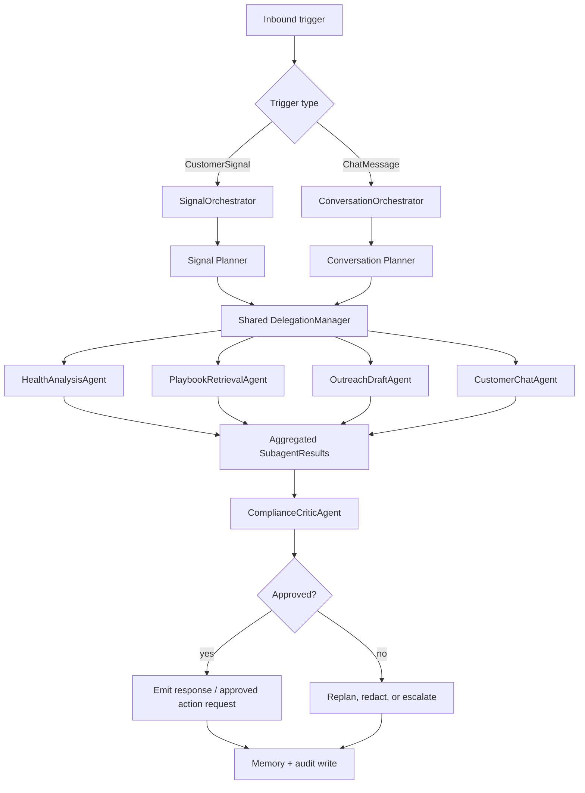

# Agent Implementation Plan

> This document maps the agent engine design onto the existing Python-based CustomerAgent codebase.
> It is the implementation blueprint for the `apps/agent-service/` and `packages/agent/` packages. Read this alongside `README.md` for full system context.

---

## 1. Scope

The agent engine handles **all AI-driven decision-making and action execution** in the platform.
Its responsibilities:

- Classify incoming customer signals (usage drops, support tickets, NPS changes, renewal dates)
- Decide what action to take (send email, post Slack, schedule meeting, update CRM, generate QBR)
- Execute tools safely (sandboxed external API calls via tool-gateway)
- Evaluate outcomes and follow up or escalate
- Persist execution state for long-running workflows (48-hour waits, human-in-the-loop approvals)

**What is NOT in scope here** (handled by other packages/docs):

- The HTTP gateway that receives webhooks and enqueues jobs (`apps/api-gateway`)
- The LLM gateway that routes/limits/caches LLM calls (`packages/llm-gateway`)
- The tool sandbox that actually runs external API calls (`apps/tool-gateway`, `packages/tool-system`)
- The session state machine (`packages/session`)
- The observability layer (`packages/observability`)

---

## 2. Architecture Decision: Split Top-Level Agent Systems on a Shared P-E-R Runtime

### Decision Summary

The platform uses **two top-level agent systems** because signal automation and customer conversation have different latency, memory, safety, and output requirements:


| Top-level system           | Primary input                            | Primary purpose                          | Runtime style                   |
| -------------------------- | ---------------------------------------- | ---------------------------------------- | ------------------------------- |
| `SignalOrchestrator`       | `SignalAgentInput` / `CustomerSignal`    | Proactive customer-success automation    | Async/background P-E-R run      |
| `ConversationOrchestrator` | `ConversationAgentInput` / `ChatMessage` | Interactive customer-facing conversation | Low-latency/streaming P-E-R run |


They are separate orchestration systems, but they **share the same runtime primitives**:

- `OrchestratorPlan`
- `SubagentTask`
- `SubagentResult`
- `DelegationManager`
- ephemeral subagent `ReActLoop`
- `ComplianceCriticAgent`
- tool dispatcher
- memory and audit infrastructure
- Langfuse tracing conventions

This avoids a confusing generic orchestrator while also avoiding duplicated agent infrastructure.

### Layered Multi-Agent Pattern

Both top-level systems run the same **Planner → Executor → Reflector (P-E-R)** lifecycle:


| P-E-R phase | Signal system owner     | Conversation system owner  | Shared responsibility                                                            |
| ----------- | ----------------------- | -------------------------- | -------------------------------------------------------------------------------- |
| Planner     | `SignalOrchestrator`    | `ConversationOrchestrator` | Build an `OrchestratorPlan` of role-based `SubagentTask` objects                 |
| Executor    | `DelegationManager`     | `DelegationManager`        | Spin up scoped ephemeral subagents with local ReAct loops                        |
| Reflector   | `ComplianceCriticAgent` | `ComplianceCriticAgent`    | Evaluate `SubagentResult` objects before output, writes, or streaming completion |


The top-level orchestrator owns the request from start to finish. It is the master brain and synchronization coordinator for:

- tenant configuration and multi-tenant global constraints;
- memory selection and durable memory writes;
- planning, dependency management, and subagent sequencing;
- cross-subagent context packing and result reduction;
- final approval, emission, and persistence decisions.

Subagents are **not durable agents** and do not own the customer outcome. They are lightweight, single-turn workers created only during the Executor phase.

### Why Two Top-Level Systems


| Dimension            | `SignalOrchestrator`                                                                                       | `ConversationOrchestrator`                      |
| -------------------- | ---------------------------------------------------------------------------------------------------------- | ----------------------------------------------- |
| Trigger              | Backend/system event                                                                                       | Customer message or chat turn                   |
| Sender               | Webhook, scheduled detector, CRM/billing sync, analytics job, CSM dashboard, or conversation-derived event | Authenticated chat endpoint                     |
| Latency target       | Seconds to minutes                                                                                         | Sub-second first token when streaming           |
| Memory               | Account memory and signal history; conversation memory optional                                            | Conversation memory required                    |
| Output               | Draft outreach, Slack alert, CRM update request, escalation, QBR/refund workflow                           | Customer-facing chat response                   |
| Side-effect risk     | Wrong proactive action or external mutation                                                                | Bad customer-facing answer or unsafe disclosure |
| Long-running support | Common; can hand off to LangGraph/Temporal                                                                 | Rare; should stay bounded and responsive        |


### Subagent Isolation and Skill Prompts

Neither top-level orchestrator executes raw low-level script tools from its own context window. During the Executor phase it delegates work to dedicated sub-nodes via customized **Skill Prompts**. Each `SubagentTask` specifies a role, objective, allowed tools, local input, dependency IDs, and output contract.


| Subagent role            | Used by signal? | Used by conversation? | Example purpose                                                    |
| ------------------------ | --------------- | --------------------- | ------------------------------------------------------------------ |
| `HealthAnalysisAgent`    | Yes             | Sometimes             | Analyze account health, usage trend, tickets, NPS, renewal risk    |
| `PlaybookRetrievalAgent` | Yes             | Sometimes             | Retrieve and rank relevant CS playbooks, policies, and KB docs     |
| `OutreachDraftAgent`     | Yes             | Rarely                | Draft customer-safe proactive email/Slack/CRM text                 |
| `CustomerChatAgent`      | Rarely          | Yes                   | Interpret chat intent and compose conversational answer candidates |
| `ComplianceCriticAgent`  | Yes             | Yes                   | Review aggregated results before writes or customer-visible output |


A conversation run can use subagents beyond `CustomerChatAgent`. For example, a customer asking “why did our usage drop before renewal?” may trigger `HealthAnalysisAgent` and `PlaybookRetrievalAgent`, then return to `CustomerChatAgent` for final conversational wording.

### Context Boundaries

Subagents are **spin-up, tear-down entities**:

1. The top-level orchestrator builds a scoped `SubagentTask` and tenant-safe context packet.
2. A subagent receives only the task objective, local params, allowed tool list, memory slice, and dependency markdown selected by the orchestrator.
3. The subagent runs an internal ReAct loop on local parameters only.
4. The subagent returns a structured `SubagentResult`.
5. The subagent instance and transient scratchpad are immediately garbage-collected.

Subagents must not write long-term memory, emit final customer-visible output, mutate external services directly, or access unrelated tenant/global context. All durable side effects are gated by the top-level orchestrator and the Reflector phase.




### Domain Boundary Decision

`CustomerSignal` and `ChatMessage` stay as **separate domain objects**:

- `CustomerSignal` = business event / automation trigger / async workflow input.
- `ChatMessage` = customer conversation turn / synchronous chat input / memory-backed thread.

They should not be merged. The dispatch layer may expose a union type for routing, but after routing the system should call either `SignalOrchestrator` or `ConversationOrchestrator`.

### Runtime Decision Matrix


| Scenario                                               | Runtime                                                                           | Reason                                                            |
| ------------------------------------------------------ | --------------------------------------------------------------------------------- | ----------------------------------------------------------------- |
| Usage drop, renewal risk, NPS drop, support escalation | `SignalOrchestrator` P-E-R                                                        | Async proactive automation with account-memory and action policy  |
| Customer-facing chat turn                              | `ConversationOrchestrator` P-E-R                                                  | Low-latency conversational loop with required memory              |
| Chat asks account-health question                      | `ConversationOrchestrator` → `CustomerChatAgent` + `HealthAnalysisAgent` → critic | Conversation remains top-level owner; specialists supply evidence |
| Proactive outreach from signal                         | `SignalOrchestrator` → health/playbook/draft subagents → critic                   | Specialist work is isolated; final action is centrally approved   |
| Complex multi-step QBR generation                      | LangGraph nodes call `SignalOrchestrator`/subagents for bounded work              | Needs checkpoint, long-running execution, replay                  |
| Human-in-the-loop refund approval                      | LangGraph + orchestrator-approved action packets                                  | Interrupt + checkpoint required                                   |
| Long wait steps ("wait 48h for reply")                 | Temporal owns wait; `SignalOrchestrator` handles active steps                     | Process crash resilience                                          |


### Shared Runtime Stack

For normal agent execution, we use direct Python components without Mastra:

```text
SignalOrchestrator / ConversationOrchestrator
  ├─ Planner phase
  │    ├─ loads tenant config + appropriate memory slices
  │    ├─ applies global tenant constraints
  │    └─ creates OrchestratorPlan[list[SubagentTask]]
  ├─ Executor phase
  │    ├─ DelegationManager spins up ephemeral role subagents
  │    ├─ each subagent runs a scoped ReActLoop
  │    └─ collects SubagentResult objects
  ├─ Reflector phase
  │    ├─ ComplianceCriticAgent reviews aggregated results
  │    ├─ validates PII, security, and business policy
  │    └─ blocks, redacts, replans, escalates, or approves
  └─ emits final response/action request, writes memory + audit log

Ephemeral subagent
  ├─ receives Skill Prompt + SubagentTask + scoped context packet
  ├─ may call only allowed tools through its local ReActLoop
  └─ returns SubagentResult, then is discarded
```

The shared ReAct loop is a **subagent runtime primitive**, not the top-level architecture.

We deliberately **do not** use Mastra Python. The P-E-R runtime, delegation manager, and ReAct loop are implemented directly with Python + `openai` SDK, keeping the system explicit and auditable.

### LangGraph Python Stack

For workflows requiring **checkpoint + interrupt**, we use `langgraph` (the official LangGraph Python SDK). LangGraph owns durability; it does not replace the P-E-R control loop for active reasoning steps.

```text
langgraph StateGraph
  └─ node: "gather_data" → calls SignalOrchestrator or shared subagents for bounded work
  └─ node: "wait_for_approval" → interrupt
  └─ node: "execute_action" → submits orchestrator-approved action packet
```

### Decision Tree (from input to runtime)

```text
Input arrives
├── CustomerSignal?
│   └── SignalOrchestrator P-E-R
│       ├── Planner: signal-specific OrchestratorPlan[SubagentTask]
│       ├── Executor: ephemeral specialist subagents
│       └── Reflector: ComplianceCriticAgent before emission/mutation
├── ChatMessage?
│   └── ConversationOrchestrator P-E-R
│       ├── Planner: conversation-specific OrchestratorPlan[SubagentTask]
│       ├── Executor: CustomerChatAgent plus optional specialist subagents
│       └── Reflector: ComplianceCriticAgent before final/streamed response
└── Long-running / approval / replay needed?
    └── LangGraph or Temporal owns durability; orchestrators do bounded active work inside steps
```

---

## 3. File Layout

```
apps/agent-service/
├── src/
│   ├── __init__.py
│   ├── rq_worker.py           # RQ worker entry point (existing)
│   │
│   ├── agent/                 # NEW — shared Orchestrator/Subagent runtime (Python-first)
│   │   ├── __init__.py
│   │   │
│   │   ├── types.py          # Shared Pydantic types (SessionContext, AgentResponse, etc.)
│   │   │
│   │   ├── signal/           # SignalOrchestrator and signal-specific planner/reducer
│   │   ├── conversation/     # ConversationOrchestrator, chat planner, streaming coordination
│   │   ├── orchestrator/     # Shared base orchestrator, reducer, policy helpers
│   │   ├── subagents/        # Health, playbook, outreach, chat, compliance specialists
│   │   ├── runtime/          # ReAct loop, delegation manager, context packing, tool caller
│   │   │
│   │   ├── chat.py           # Backward-compatible chat integration wrapper during migration
│   │   └── registry.py       # Orchestrator/subagent registry
│   │
│   ├── workflow/
│   │   ├── __init__.py
│   │   ├── orchestrate.py    # Top-level: decides Orchestrator-Subagent vs LangGraph per task
│   │   │
│   │   └── langgraph/        # LangGraph Python workflows
│   │       ├── __init__.py
│   │       ├── refund.py     # Refund approval workflow (interrupt)
│   │       ├── qbr.py        # QBR generation workflow (checkpoint)
│   │       └── types.py      # Shared LangGraph state types

packages/agent/                # NEW — shared agent primitives (imported by agent-service)
├── src/
│   ├── __init__.py
│   ├── types.py              # SessionContext, AgentResponse, CustomerSignal
│   ├── config.py             # AgentConfig per tenant (system prompt, tool list, model)
│   ├── chat_types.py         # ChatMessage, ChatRequest, ChatResponse (Target Phase)
│   └── memory.py             # Tenant-scoped conversation memory (Target Phase)

packages/session/
├── src/
│   ├── state.py              # SessionState types (existing, may need extension)
│   └── workflow.py           # Temporal workflow definitions (existing)
│       ├── outreach.py       # Outreach + wait-for-reply + escalate workflow
│       └── refund.py          # Refund approval workflow (existing; may delegate to LangGraph)
```

### Orchestrator-Subagent Layout Target

The current flat `agent/` layout should evolve into this structure during the Target Phase:

```text
apps/agent-service/src/agent/
├── signal/
│   ├── signal_orchestrator.py      # SignalOrchestrator: async CustomerSignal workflows
│   ├── signal_planner.py           # Signal-specific plan creation
│   └── signal_reducer.py           # Builds proactive action candidates
├── conversation/
│   ├── conversation_orchestrator.py # ConversationOrchestrator: chat/message workflows
│   ├── conversation_planner.py      # Chat-specific plan creation
│   └── streaming.py                 # Streaming-safe response emission
├── orchestrator/
│   ├── base.py                      # Shared P-E-R orchestration base/protocols
│   ├── reducer.py                   # Shared SubagentResult aggregation helpers
│   └── policy.py                    # Approval/guardrail rules
├── subagents/
│   ├── base.py              # BaseSubagent protocol
│   ├── health_analysis.py   # HealthAnalysisAgent
│   ├── playbook_retrieval.py
│   ├── outreach_draft.py
│   ├── customer_chat.py
│   └── compliance_critic.py
├── runtime/
│   ├── react_loop.py        # Shared ReAct primitive used by subagents
│   ├── delegation.py        # Orchestrator → subagent dispatch
│   ├── context.py           # Context packing and subagent memory slices
│   └── tool_caller.py       # Tool call dispatcher
├── chat.py                  # Customer chat integration wrapper
└── registry.py              # Orchestrator/subagent registry

packages/agent/src/
├── types.py                 # CustomerSignal and shared primitives
├── chat_types.py            # ChatMessage, ChatRequest, ChatResponse
├── orchestration_types.py   # AgentInput, OrchestratorPlan, FinalDecision
├── subagent_types.py        # AgentRole, SubagentTask, SubagentResult
├── config.py
└── memory.py
```

**Domain rule:** `CustomerSignal` lives in `types.py`; `ChatMessage` lives in `chat_types.py`.
They are separate domain objects and meet only through `AgentInput` in `orchestration_types.py`.

### Key Changes to Existing Files


| File                                         | Change                                                                                                         |
| -------------------------------------------- | -------------------------------------------------------------------------------------------------------------- |
| `packages/db/src/schema.sql`                 | Add `task_history`, `subagent_calls`, `orchestrator_runs`, and memory tables for audit                         |
| `apps/agent-service/src/rq_worker.py`        | Import and call `orchestrate()` instead of inline logic                                                        |
| `apps/agent-service/src/agent/signal/`       | New `SignalOrchestrator`, signal planner, and signal reducer for proactive workflows                           |
| `apps/agent-service/src/agent/conversation/` | New `ConversationOrchestrator`, conversation planner, and streaming coordinator                                |
| `apps/agent-service/src/agent/orchestrator/` | Shared base orchestration, reducer helpers, and policy layer                                                   |
| `apps/agent-service/src/agent/subagents/`    | Shared specialist subagents: health, playbook, outreach draft, chat, compliance critic                         |
| `packages/agent/src/orchestration_types.py`  | Add `SignalAgentInput`, `ConversationAgentInput`, optional dispatch union, `OrchestratorPlan`, `FinalDecision` |
| `packages/agent/src/subagent_types.py`       | Add `AgentRole`, `SubagentTask`, `SubagentResult`                                                              |
| `packages/llm-gateway/src/router.py`         | Future plan: add `model_for_agent_task()` method for Orchestrator/Subagent routing                             |
| `apps/tool-gateway/src/index.py`             | Future plan: sandboxed execution backend for approved tool calls                                               |
| `requirements.txt`                           | Add `openai`, `langgraph`, `pydantic`, `httpx`                                                                 |


---

## 4. Data Models

All types use **Pydantic v2** for validation, serialization, and JSON Schema generation
(which is passed to the LLM for tool-calling parameter validation).

> **Import-path caveat (resolve before Phase 1 coding):** the code samples below import from
> `packages.llm_gateway`, `packages.tool_system`, `packages.agent`, and `apps.agent_service`
> (underscores), but the real directories are hyphenated (`packages/llm-gateway`,
> `packages/tool-system`, `apps/agent-service`) and `packages/agent/` does not exist yet.
> Hyphens are **not valid** in Python module names, so these imports will not work as written.
> See Open Question #6 for the two resolution options.

### Agent Domain Separation

The plan keeps the two input domains separate at the top-level orchestrator boundary:

- `CustomerSignal` is a business event that triggers `SignalOrchestrator`.
- `ChatMessage` is a conversation turn that triggers `ConversationOrchestrator`.
- `AgentDispatchInput` is optional glue at the API/worker routing layer only. Business logic should operate on `SignalAgentInput` or `ConversationAgentInput`, not a vague generic input.

```python
# packages/agent/src/orchestration_types.py
from __future__ import annotations

from enum import Enum
from pydantic import BaseModel, ConfigDict, Field, model_validator
from packages.agent.types import CustomerSignal
from packages.agent.chat_types import ChatMessage


class AgentInputType(str, Enum):
    SIGNAL = "signal"
    CONVERSATION = "conversation"


class SignalAgentInput(BaseModel):
    model_config = ConfigDict(extra="forbid")

    tenant_id: str
    customer_id: str
    signal: CustomerSignal
    requested_by_user_id: str | None = None


class ConversationAgentInput(BaseModel):
    model_config = ConfigDict(extra="forbid")

    tenant_id: str
    customer_id: str
    session_id: str
    message: ChatMessage
    stream: bool = True


class AgentDispatchInput(BaseModel):
    model_config = ConfigDict(extra="forbid")

    type: AgentInputType
    signal_input: SignalAgentInput | None = None
    conversation_input: ConversationAgentInput | None = None

    @model_validator(mode="after")
    def exactly_one_routed_input(self):
        if self.type == AgentInputType.SIGNAL and not self.signal_input:
            raise ValueError("signal dispatch requires SignalAgentInput")
        if self.type == AgentInputType.CONVERSATION and not self.conversation_input:
            raise ValueError("conversation dispatch requires ConversationAgentInput")
        if self.signal_input and self.conversation_input:
            raise ValueError("dispatch input cannot include both signal and conversation inputs")
        return self
```

### Orchestrator/Subagent Types

The Planner phase produces an `OrchestratorPlan`, not a flat list of raw tool tasks. Each task describes a **subagent role** and a bounded handoff contract. The Executor phase turns these tasks into ephemeral subagent runs, and the Reflector phase evaluates the aggregated results before any write or customer-visible emission.


| Model                   | Created by           | Consumed by                   | Purpose                                                 |
| ----------------------- | -------------------- | ----------------------------- | ------------------------------------------------------- |
| `OrchestratorPlan`      | Planner phase        | Delegation manager            | Ordered role-based subagent sequence                    |
| `SubagentTask`          | Orchestrator planner | Ephemeral subagent            | Scoped objective, tool boundary, dependency contract    |
| `SubagentContextPacket` | Delegation manager   | Ephemeral subagent            | Tenant-safe local context and previous markdown outputs |
| `SubagentResult`        | Ephemeral subagent   | Orchestrator reducer + critic | Structured result, markdown summary, tool evidence      |
| `ComplianceReview`      | Reflector phase      | Orchestrator                  | Approval, redactions, policy findings, blocked writes   |
| `FinalDecision`         | Orchestrator         | API/workflow caller           | Approved response/action payload only                   |


```python
# packages/agent/src/subagent_types.py
from __future__ import annotations

from enum import Enum
from typing import Any, Literal
from pydantic import BaseModel, ConfigDict, Field


class AgentRole(str, Enum):
    HEALTH_ANALYSIS = "health_analysis"
    PLAYBOOK_RETRIEVAL = "playbook_retrieval"
    OUTREACH_DRAFT = "outreach_draft"
    CUSTOMER_CHAT = "customer_chat"
    COMPLIANCE_CRITIC = "compliance_critic"
    ACTION_EXECUTION = "action_execution"


class SubagentTask(BaseModel):
    model_config = ConfigDict(extra="forbid", frozen=True)

    id: str = Field(description="Stable task ID generated by the Orchestrator planner")
    role: AgentRole = Field(description="Specialist subagent role to instantiate")
    objective: str = Field(description="Single bounded outcome for this subagent")
    skill_prompt: str = Field(description="Role-specific prompt template selected by Orchestrator")
    input: dict[str, Any] = Field(default_factory=dict)
    allowed_tools: list[str] = Field(default_factory=list)
    depends_on: list[str] = Field(default_factory=list)
    max_react_steps: int = Field(default=6, ge=1, le=12)
    max_tokens: int = Field(default=2000, ge=256, le=8000)
    output_format: Literal["markdown_and_json"] = "markdown_and_json"

    def is_ready(self, completed: set[str]) -> bool:
        return all(task_id in completed for task_id in self.depends_on)


class SubagentContextPacket(BaseModel):
    model_config = ConfigDict(extra="forbid", frozen=True)

    tenant_id: str
    customer_id: str
    trace_id: str | None = None
    task: SubagentTask
    tenant_constraints: list[str] = Field(default_factory=list)
    memory_excerpt: str | None = None
    dependency_markdown: dict[str, str] = Field(default_factory=dict)
    dependency_data: dict[str, dict[str, Any]] = Field(default_factory=dict)


class ToolCallRecord(BaseModel):
    model_config = ConfigDict(extra="forbid")

    tool_name: str
    success: bool
    arguments_redacted: dict[str, Any] = Field(default_factory=dict)
    result_redacted: dict[str, Any] = Field(default_factory=dict)


class SubagentResult(BaseModel):
    model_config = ConfigDict(extra="forbid")

    task_id: str
    role: AgentRole
    success: bool
    markdown: str = Field(description="Human-readable summary safe for downstream prompt injection")
    data: dict[str, Any] = Field(default_factory=dict)
    tool_calls: list[ToolCallRecord] = Field(default_factory=list)
    tokens_used: int = 0
    error: str | None = None
```

```python
# packages/agent/src/orchestration_types.py
from __future__ import annotations

from enum import Enum
from typing import Any, Literal
from pydantic import BaseModel, ConfigDict, Field
from packages.agent.subagent_types import SubagentResult, SubagentTask


class OrchestratorPhase(str, Enum):
    PLANNER = "planner"
    EXECUTOR = "executor"
    REFLECTOR = "reflector"


class OrchestratorPlan(BaseModel):
    model_config = ConfigDict(extra="forbid")

    goal: str
    tasks: list[SubagentTask] = Field(min_length=1, max_length=8)
    requires_critic: bool = True
    global_constraints: list[str] = Field(default_factory=list)
    reasoning_summary: str = Field(description="Brief non-sensitive planning rationale")


class ComplianceFinding(BaseModel):
    model_config = ConfigDict(extra="forbid")

    code: str
    severity: Literal["low", "medium", "high", "blocker"]
    message: str
    affected_task_ids: list[str] = Field(default_factory=list)


class ComplianceReview(BaseModel):
    model_config = ConfigDict(extra="forbid")

    approved: bool
    findings: list[ComplianceFinding] = Field(default_factory=list)
    pii_detected: bool = False
    redactions: dict[str, str] = Field(default_factory=dict)
    blocked_external_writes: list[dict[str, Any]] = Field(default_factory=list)
    feedback: str


class FinalDecision(BaseModel):
    model_config = ConfigDict(extra="forbid")

    action: str
    response_text: str
    approved_external_writes: list[dict[str, Any]] = Field(default_factory=list)
    subagent_results: list[SubagentResult] = Field(default_factory=list)
    compliance_review: ComplianceReview
    reasoning_summary: str
```

### Core Types

`TaskPlan`/`TaskResult` should not be the primary runtime contract for the Target Phase. Keep low-level tool schemas in the tool system, but the agent runtime exchanges `OrchestratorPlan`, `SubagentTask`, `SubagentResult`, `ComplianceReview`, and `FinalDecision`.

```python
# packages/agent/src/types.py
from __future__ import annotations

import uuid
from datetime import datetime
from typing import Any
from pydantic import BaseModel, ConfigDict, Field
from packages.agent.orchestration_types import FinalDecision
from packages.agent.subagent_types import SubagentResult


class CustomerSignal(BaseModel):
    model_config = ConfigDict(extra="forbid")

    id: str = Field(default_factory=lambda: str(uuid.uuid4()))
    tenant_id: str
    customer_id: str
    type: str
    payload: dict[str, Any] = Field(default_factory=dict)
    created_at: datetime = Field(default_factory=datetime.utcnow)

    @property
    def health_score(self) -> float | None:
        return self.payload.get("health_score")

    @property
    def signal_text(self) -> str:
        type_labels = {
            "usage_drop": f"Usage dropped {self.payload.get('pct', '?')}% week-over-week",
            "nps_change": f"NPS score changed from {self.payload.get('from_nps')} to {self.payload.get('to_nps')}",
            "renewal_due": f"Renewal in {self.payload.get('days', '?')} days, health score {self.payload.get('health_score')}",
            "support_ticket": f"New support ticket: {self.payload.get('subject', '')}",
        }
        return type_labels.get(self.type, str(self.payload))


class LLMUsage(BaseModel):
    model_config = ConfigDict(extra="forbid")

    prompt_tokens: int = 0
    completion_tokens: int = 0

    @property
    def total(self) -> int:
        return self.prompt_tokens + self.completion_tokens


class AgentResponse(BaseModel):
    model_config = ConfigDict(extra="forbid")

    text: str
    subagent_results: list[SubagentResult] = Field(default_factory=list)
    planner_tokens: int = 0
    executor_tokens: int = 0
    critic_tokens: int = 0
    approved: bool = False
    final_decision: FinalDecision | None = None
    feedback: str | None = None


class SessionContext(BaseModel):
    model_config = ConfigDict(extra="forbid")

    tenant_id: str
    user_id: str
    session_id: str
    signal_id: str
    trace_id: str | None = None
```

### AgentConfig per Tenant

```python
# packages/agent/src/config.py
from pydantic import BaseModel, Field


class AgentConfig(BaseModel):
    """Per-tenant agent configuration. Loaded from tenants DB table, cached in Redis."""
    tenant_id: str
    name: str
    instructions: str                       # system prompt
    model: str                              # e.g. "claude-sonnet-4-7-2025-06-09"
    planner_model: str                       # model for Orchestrator/critic (can differ from subagents)
    tools: list[str]                        # list of available tool names
    skip_critic_for_simple: bool = True     # auto-skip for single-query tasks
    max_replan_attempts: int = 2           # max critic → delegation planner retry cycles
    memory_enabled: bool = True             # conversation memory (Target Phase; required for chat)
    pii_masking_enabled: bool = True       # mask PII before LLM calls
```

Config is loaded from `tenants` DB table at startup and cached in Redis with a 5-minute TTL.

---

## 5. Tool Definitions

Tools live in `packages/tool-system/src/tools/` and are registered in the tool-gateway registry.
The Orchestrator/Subagent runtime references them by name and dispatches via HTTP to tool-gateway.

### 5.1 Core CS Tools (Phase 1 — MVP)


| Tool ID            | Description                                                                      | External Call                  |
| ------------------ | -------------------------------------------------------------------------------- | ------------------------------ |
| `query_health`     | Query a customer's health score, usage trend, support tickets, NPS, MRR, renewal | Internal DB call               |
| `query_playbooks`  | Retrieve the most relevant playbook(s) for a given signal type                   | Internal DB + vector search    |
| `send_email`       | Send a personalized email via SendGrid                                           | tool-gateway → SendGrid        |
| `send_slack`       | Send a Slack DM to a CSM                                                         | tool-gateway → Slack API       |
| `update_crm`       | Write a note/update to Salesforce                                                | tool-gateway → Salesforce      |
| `schedule_meeting` | Send a Google Calendar invite                                                    | tool-gateway → Google Calendar |


### 5.2 Advanced Tools (Phase 2)


| Tool ID                | Description                                                            |
| ---------------------- | ---------------------------------------------------------------------- |
| `query_order`          | Query tenant's order/usage system for account-level data               |
| `generate_qbr`         | Draft a QBR presentation (calls LLM + PDF generator)                   |
| `query_knowledge_base` | Semantic search over tenant's playbooks/documents via pgvector         |
| `escalate_to_csm`      | Mark a customer as escalated, assign to a human CSM                    |
| `initiate_refund`      | Submit a refund request (→ LangGraph approval workflow if > threshold) |


### Tool Schema Definition

Each tool is defined as a Pydantic model with a JSON Schema. The JSON Schema is extracted
and passed to the LLM for tool-calling.

```python
# packages/tool-system/src/tools/query_health.py
from pydantic import BaseModel, Field
from typing import Optional
import httpx


class QueryHealthInput(BaseModel):
    """Input schema for query_health tool."""
    customer_id: str = Field(description="Customer UUID from the platform")
    tenant_id: str = Field(description="Tenant UUID for data isolation (auto-injected by executor)")


class QueryHealthOutput(BaseModel):
    """Output schema for query_health tool."""
    found: bool
    customer_id: Optional[str] = None
    health_score: Optional[float] = None
    usage_trend: Optional[dict] = None          # {"current": 40, "previous": 60, "pct_change": -33}
    support_ticket_count: Optional[int] = None
    nps: Optional[int] = None
    mrr: Optional[float] = None
    renewal_date: Optional[str] = None
    error: Optional[str] = None


TOOL_DEFINITION = {
    "type": "function",
    "function": {
        "name": "query_health",
        "description": (
            "Query a customer's health profile. Returns health score, usage trend, "
            "support ticket count, NPS, MRR, and renewal date. "
            "Call this first to understand the customer's situation before taking action."
        ),
        "parameters": QueryHealthInput.model_json_schema(),
    },
}


async def execute_query_health(
    params: QueryHealthInput,
    ctx: "SessionContext",   # forward reference, injected by caller
) -> QueryHealthOutput:
    """
    Implementation: calls internal DB for customer health data.
    Returns QueryHealthOutput matching the schema above.
    """
    # Internal DB call (use packages/db/ SQLAlchemy session)
    ...


# packages/tool-system/src/tools/send_email.py
class SendEmailInput(BaseModel):
    recipient_email: str = Field(description="Recipient email address")
    subject: str = Field(description="Email subject line")
    body: str = Field(description="Email body in markdown format")
    sender_name: str = Field(description="Display name of the sender (e.g. 'Acme CS Team')")
    customer_id: str = Field(description="Customer UUID for tracking")


TOOL_DEFINITION = {
    "type": "function",
    "function": {
        "name": "send_email",
        "description": (
            "Send a personalized email to a customer. "
            "Requires: recipient_email, subject, body (markdown), sender_name. "
            "Do not call with raw PII — use masked values from the customer profile."
        ),
        "parameters": SendEmailInput.model_json_schema(),
    },
}
```

### Tool Registry

```python
# packages/tool-system/src/registry.py
from dataclasses import dataclass
from typing import Callable, Any
from .tools.query_health import TOOL_DEFINITION as QUERY_HEALTH, execute_query_health
from .tools.send_email import TOOL_DEFINITION as SEND_EMAIL, execute_send_email
# ... other tools


@dataclass
class ToolEntry:
    definition: dict          # JSON Schema for LLM function calling
    execute: Callable[..., Any]  # async function(params, ctx) -> output
    requires_sandbox: bool = True  # if False, runs in-process (DB calls only)


TOOL_REGISTRY: dict[str, ToolEntry] = {
    "query_health": ToolEntry(QUERY_HEALTH, execute_query_health, requires_sandbox=False),
    "send_email": ToolEntry(SEND_EMAIL, execute_send_email, requires_sandbox=True),
    # ... register all tools
}


def get_tool_definition(name: str) -> dict:
    """Return the JSON Schema definition for a tool (used by the LLM)."""
    return TOOL_REGISTRY[name].definition


def get_tools_for_tenant(tenant_config: AgentConfig) -> list[dict]:
    """Return all tool definitions available to a tenant."""
    return [get_tool_definition(name) for name in tenant_config.tools]
```

> **Tool description writing rules** (from lecture, adapted):
>
> - description must state preconditions ("call query_health first")
> - description must state what NOT to do ("do not include raw PII")
> - each field's `description=` must explain the parameter
> - vague descriptions cause wrong tool selection by the LLM

---

## 6. Shared Runtime and Top-Level Orchestrator Implementation

The Target Phase uses two top-level systems on one shared runtime:


| Top-level orchestrator     | Planner module                               | Entry point                | Shared runtime pieces                               |
| -------------------------- | -------------------------------------------- | -------------------------- | --------------------------------------------------- |
| `SignalOrchestrator`       | `agent/signal/signal_planner.py`             | `run_signal_agent()`       | `DelegationManager`, `ReActLoop`, subagents, critic |
| `ConversationOrchestrator` | `agent/conversation/conversation_planner.py` | `run_conversation_agent()` | `DelegationManager`, `ReActLoop`, subagents, critic |


Both orchestrators run Planner → Executor → Reflector. The Planner differs by input domain; the Executor and Reflector are shared.

### 6.1 Domain-Specific Planners

Planner modules produce an `OrchestratorPlan` of `SubagentTask` objects. They do not emit raw tool execution tasks.

```python
# apps/agent-service/src/agent/orchestrator/planning_prompts.py
from packages.agent.orchestration_types import OrchestratorPlan
from packages.agent.subagent_types import AgentRole


ROLE_SKILL_PROMPTS: dict[AgentRole, str] = {
    AgentRole.HEALTH_ANALYSIS: "Analyze customer health using only scoped account-health inputs.",
    AgentRole.PLAYBOOK_RETRIEVAL: "Retrieve and rank playbooks relevant to the signal and tenant policy.",
    AgentRole.OUTREACH_DRAFT: "Draft safe customer outreach using prior subagent markdown as evidence.",
    AgentRole.CUSTOMER_CHAT: "Answer the chat turn using bounded memory and approved read-only tools.",
}


def attach_skill_prompts(plan: OrchestratorPlan) -> OrchestratorPlan:
    tasks = [
        task.model_copy(update={"skill_prompt": task.skill_prompt or ROLE_SKILL_PROMPTS[task.role]})
        for task in plan.tasks
    ]
    return plan.model_copy(update={"tasks": tasks})
```

```python
# apps/agent-service/src/agent/signal/signal_planner.py
from __future__ import annotations

import json
from packages.agent.config import AgentConfig
from packages.agent.orchestration_types import OrchestratorPlan, SignalAgentInput
from packages.agent.types import LLMUsage, SessionContext
from packages.llm_gateway import chat_completions
from apps.agent_service.src.agent.orchestrator.planning_prompts import attach_skill_prompts


async def build_signal_plan(
    signal_input: SignalAgentInput,
    ctx: SessionContext,
    config: AgentConfig,
    tenant_constraints: list[str],
    memory_excerpt: str | None,
    critic_feedback: str | None = None,
) -> tuple[OrchestratorPlan, LLMUsage]:
    response = await chat_completions.create(
        model=config.planner_model,
        messages=[
            {
                "role": "system",
                "content": (
                    "You are the Planner phase of SignalOrchestrator. Build an OrchestratorPlan "
                    "for proactive customer-success automation. Plan role-based SubagentTask objects, "
                    "not raw tool calls. Prefer HealthAnalysisAgent, PlaybookRetrievalAgent, and "
                    "OutreachDraftAgent when the signal may require proactive outreach. "
                    "Always require ComplianceCriticAgent review before writes or customer-visible output."
                ),
            },
            {
                "role": "user",
                "content": json.dumps(
                    {
                        "tenant_id": ctx.tenant_id,
                        "customer_id": signal_input.customer_id,
                        "signal": signal_input.signal.model_dump(mode="json"),
                        "available_tools": config.tools,
                        "tenant_constraints": tenant_constraints,
                        "account_memory_excerpt": memory_excerpt,
                        "critic_feedback": critic_feedback,
                    },
                    default=str,
                ),
            },
        ],
        response_format={"type": "json_object"},
        tenant_id=ctx.tenant_id,
        trace_name="signal_planner",
        trace_metadata={"signal_id": ctx.signal_id, "phase": "planner"},
    )
    plan = OrchestratorPlan.model_validate(json.loads(response.choices[0].message.content))
    return attach_skill_prompts(plan), LLMUsage(
        prompt_tokens=response.usage.prompt_tokens,
        completion_tokens=response.usage.completion_tokens,
    )
```

```python
# apps/agent-service/src/agent/conversation/conversation_planner.py
from __future__ import annotations

import json
from packages.agent.config import AgentConfig
from packages.agent.orchestration_types import ConversationAgentInput, OrchestratorPlan
from packages.agent.subagent_types import AgentRole
from packages.agent.types import LLMUsage, SessionContext
from packages.llm_gateway import chat_completions
from apps.agent_service.src.agent.orchestrator.planning_prompts import ROLE_SKILL_PROMPTS, attach_skill_prompts


async def build_conversation_plan(
    conversation_input: ConversationAgentInput,
    ctx: SessionContext,
    config: AgentConfig,
    tenant_constraints: list[str],
    conversation_memory: str,
    critic_feedback: str | None = None,
) -> tuple[OrchestratorPlan, LLMUsage]:
    response = await chat_completions.create(
        model=config.planner_model,
        messages=[
            {
                "role": "system",
                "content": (
                    "You are the Planner phase of ConversationOrchestrator. Build an OrchestratorPlan "
                    "for a low-latency customer conversation turn. Start with CustomerChatAgent for "
                    "intent and conversational framing. Add specialist subagents only when the user asks "
                    "for account facts, health analysis, renewal context, policy, or playbook-backed advice. "
                    "Always require ComplianceCriticAgent before final customer-visible output."
                ),
            },
            {
                "role": "user",
                "content": json.dumps(
                    {
                        "tenant_id": ctx.tenant_id,
                        "customer_id": conversation_input.customer_id,
                        "session_id": conversation_input.session_id,
                        "message": conversation_input.message.model_dump(mode="json"),
                        "available_roles": [role.value for role in ROLE_SKILL_PROMPTS],
                        "available_tools": config.tools,
                        "tenant_constraints": tenant_constraints,
                        "conversation_memory": conversation_memory,
                        "critic_feedback": critic_feedback,
                    },
                    default=str,
                ),
            },
        ],
        response_format={"type": "json_object"},
        tenant_id=ctx.tenant_id,
        trace_name="conversation_planner",
        trace_metadata={"session_id": conversation_input.session_id, "phase": "planner"},
    )
    plan = OrchestratorPlan.model_validate(json.loads(response.choices[0].message.content))
    return attach_skill_prompts(plan), LLMUsage(
        prompt_tokens=response.usage.prompt_tokens,
        completion_tokens=response.usage.completion_tokens,
    )

```

### 6.2 Core ReAct Loop

The ReAct loop is an isolated subagent primitive. It is instantiated per `SubagentTask`, seeded with a skill prompt and `SubagentContextPacket`, and terminated after the subagent returns.

```python
# apps/agent-service/src/agent/runtime/react_loop.py
from __future__ import annotations

import asyncio
import json
from packages.agent.config import AgentConfig
from packages.agent.subagent_types import SubagentContextPacket, SubagentResult, ToolCallRecord
from packages.agent.types import LLMUsage, SessionContext
from packages.agent.runtime.tool_caller import dispatch_tool_call
from packages.agent import registry as tool_registry
from packages.llm_gateway import chat_completions


class ReActLoop:
    def __init__(self, *, packet: SubagentContextPacket, ctx: SessionContext, config: AgentConfig) -> None:
        self.packet = packet
        self.ctx = ctx
        self.config = config
        self.messages: list[dict] = []
        self.tool_calls: list[ToolCallRecord] = []
        self.usage = LLMUsage()

    def _system_prompt(self) -> str:
        task = self.packet.task
        tool_docs = []
        for tool_name in task.allowed_tools:
            tool_def = tool_registry.get_tool_definition(tool_name)
            fn = tool_def["function"]
            tool_docs.append(f"- {fn['name']}: {fn['description']}")

        return (
            f"{task.skill_prompt}\n\n"
            "You are an ephemeral subagent. Complete only the assigned task. "
            "Do not write long-term memory, do not emit final customer-visible output, "
            "and do not call tools outside the allowed list.\n\n"
            f"Objective: {task.objective}\n"
            f"Tenant constraints: {json.dumps(self.packet.tenant_constraints)}\n"
            f"Allowed tools:\n" + "\n".join(tool_docs) + "\n\n"
            "Return final content as markdown plus a compact JSON data object."
        )

    def _user_context(self) -> str:
        dependency_markdown = "\n\n".join(
            f"## Prior result: {task_id}\n{markdown}"
            for task_id, markdown in self.packet.dependency_markdown.items()
        )
        return json.dumps(
            {
                "tenant_id": self.packet.tenant_id,
                "customer_id": self.packet.customer_id,
                "task_input": self.packet.task.input,
                "memory_excerpt": self.packet.memory_excerpt,
                "previous_subagent_markdown": dependency_markdown,
                "previous_subagent_data": self.packet.dependency_data,
            },
            default=str,
        )

    async def run(self) -> SubagentResult:
        task = self.packet.task
        self.messages = [
            {"role": "system", "content": self._system_prompt()},
            {"role": "user", "content": self._user_context()},
        ]

        for step in range(task.max_react_steps):
            response = await chat_completions.create(
                model=self.config.model,
                messages=self.messages,
                tools=[tool_registry.get_tool_definition(name) for name in task.allowed_tools],
                tenant_id=self.ctx.tenant_id,
                trace_name=f"subagent_{task.role.value}_react_step",
                trace_metadata={"task_id": task.id, "step": step, "phase": "executor"},
            )
            self.usage.prompt_tokens += response.usage.prompt_tokens
            self.usage.completion_tokens += response.usage.completion_tokens
            message = response.choices[0].message

            if message.content and not message.tool_calls:
                return SubagentResult(
                    task_id=task.id,
                    role=task.role,
                    success=True,
                    markdown=message.content,
                    data={"final_markdown": message.content},
                    tool_calls=self.tool_calls,
                    tokens_used=self.usage.total,
                )

            if message.tool_calls:
                self.messages.append({
                    "role": "assistant",
                    "content": message.content or "",
                    "tool_calls": [
                        {"id": call.id, "function": {"name": call.function.name, "arguments": call.function.arguments}}
                        for call in message.tool_calls
                    ],
                })
                await asyncio.gather(*(self._execute_tool_call(call) for call in message.tool_calls))

        return SubagentResult(
            task_id=task.id,
            role=task.role,
            success=False,
            markdown="",
            data={},
            tool_calls=self.tool_calls,
            tokens_used=self.usage.total,
            error="Subagent reached max_react_steps",
        )

    async def _execute_tool_call(self, tool_call) -> None:
        task = self.packet.task
        tool_name = tool_call.function.name
        if tool_name not in task.allowed_tools:
            content = json.dumps({"error": f"Tool {tool_name} is not allowed for {task.role.value}"})
            self.messages.append({"role": "tool", "tool_call_id": tool_call.id, "content": content})
            self.tool_calls.append(ToolCallRecord(tool_name=tool_name, success=False))
            return

        params = json.loads(tool_call.function.arguments)
        params.setdefault("tenant_id", self.ctx.tenant_id)
        result = await dispatch_tool_call(tool_name, params, self.ctx)
        self.messages.append({"role": "tool", "tool_call_id": tool_call.id, "content": json.dumps(result, default=str)})
        self.tool_calls.append(
            ToolCallRecord(
                tool_name=tool_name,
                success=True,
                arguments_redacted=_redact_for_audit(params),
                result_redacted=_redact_for_audit(result),
            )
        )


def _redact_for_audit(value: dict) -> dict:
    return {key: "[REDACTED]" if key.lower() in {"email", "recipient_email", "phone"} else val for key, val in value.items()}
```

### 6.3 Tool Dispatcher

```python
# apps/agent-service/src/agent/runtime/tool_caller.py
import httpx
from packages.agent.types import SessionContext


async def dispatch_tool_call(
    tool_name: str,
    params: dict,
    ctx: SessionContext,
) -> dict:
    """
    Dispatch a tool call. Routes to:
    - In-process execution for DB-only tools (query_health, etc.)
    - tool-gateway HTTP API for external API tools (send_email, etc.)

    This is the sandbox boundary. External API calls never happen outside tool-gateway.
    """
    from packages.tool_system.src.registry import TOOL_REGISTRY

    entry = TOOL_REGISTRY.get(tool_name)
    if not entry:
        raise ValueError(f"Unknown tool: {tool_name}")

    if entry.requires_sandbox:
        return await _dispatch_to_tool_gateway(tool_name, params, ctx)
    else:
        return await entry.execute(params, ctx)


async def _dispatch_to_tool_gateway(
    tool_name: str,
    params: dict,
    ctx: SessionContext,
) -> dict:
    """
    Call the tool-gateway HTTP API to execute a sandboxed tool.

    Request:
        POST {tool_gateway_url}/run
        {
            "tool": "send_email",
            "params": {...},
            "tenant_id": "...",
            "trace_id": "..."
        }

    Response:
        {"success": true, "data": {...}}
        or
        {"success": false, "error": "..."}
    """
    async with httpx.AsyncClient(timeout=30.0) as client:
        response = await client.post(
            f"{tool_gateway_url}/run",
            json={
                "tool": tool_name,
                "params": params,
                "tenant_id": ctx.tenant_id,
                "trace_id": ctx.trace_id,
            },
        )
        response.raise_for_status()
        result = response.json()

        if not result.get("success"):
            raise RuntimeError(f"Tool {tool_name} failed: {result.get('error')}")

        return result["data"]
```

### 6.4 Delegation Manager

`apps/agent-service/src/agent/runtime/delegation.py` is a subagent manager, not a flat tool runner. It instantiates isolated `ReActLoop` instances for each `SubagentTask`, injects previous subagent markdown into dependent tasks, and returns structured `SubagentResult` objects.

```python
# apps/agent-service/src/agent/runtime/delegation.py
from __future__ import annotations

import asyncio
from packages.agent.config import AgentConfig
from packages.agent.orchestration_types import OrchestratorPlan
from packages.agent.subagent_types import SubagentContextPacket, SubagentResult
from packages.agent.types import SessionContext
from apps.agent_service.src.agent.runtime.react_loop import ReActLoop


async def execute_tasks(
    *,
    plan: OrchestratorPlan,
    ctx: SessionContext,
    config: AgentConfig,
    customer_id: str,
    tenant_constraints: list[str],
    memory_excerpt: str | None,
) -> list[SubagentResult]:
    result_map: dict[str, SubagentResult] = {}
    completed: set[str] = set()
    pending = list(plan.tasks)
    all_results: list[SubagentResult] = []

    while pending:
        ready = [task for task in pending if task.is_ready(completed)]
        if not ready:
            break

        batch = await asyncio.gather(
            *(
                _run_subagent(
                    task_id=task.id,
                    plan=plan,
                    result_map=result_map,
                    ctx=ctx,
                    config=config,
                    customer_id=customer_id,
                    tenant_constraints=tenant_constraints,
                    memory_excerpt=memory_excerpt,
                )
                for task in ready
            ),
            return_exceptions=True,
        )

        for task, item in zip(ready, batch):
            result = item if isinstance(item, SubagentResult) else SubagentResult(
                task_id=task.id,
                role=task.role,
                success=False,
                markdown="",
                error=str(item),
            )
            result_map[task.id] = result
            all_results.append(result)
            if result.success:
                completed.add(task.id)

        attempted = {task.id for task in ready}
        pending = [task for task in pending if task.id not in attempted]

    return all_results


async def _run_subagent(
    *,
    task_id: str,
    plan: OrchestratorPlan,
    result_map: dict[str, SubagentResult],
    ctx: SessionContext,
    config: AgentConfig,
    customer_id: str,
    tenant_constraints: list[str],
    memory_excerpt: str | None,
) -> SubagentResult:
    task = next(item for item in plan.tasks if item.id == task_id)
    dependency_results = {dep_id: result_map[dep_id] for dep_id in task.depends_on if dep_id in result_map}
    packet = SubagentContextPacket(
        tenant_id=ctx.tenant_id,
        customer_id=customer_id,
        trace_id=ctx.trace_id,
        task=task,
        tenant_constraints=tenant_constraints,
        memory_excerpt=memory_excerpt,
        dependency_markdown={dep_id: result.markdown for dep_id, result in dependency_results.items()},
        dependency_data={dep_id: result.data for dep_id, result in dependency_results.items()},
    )
    loop = ReActLoop(packet=packet, ctx=ctx, config=config)
    return await loop.run()
```

### 6.5 Compliance Critic as Reflector

The `ComplianceCriticAgent` is the Reflector phase. It evaluates aggregated `SubagentResult` objects before any external HTTP service call, database mutation, memory write, or customer-visible emission. It checks security boundaries, PII leakage, tenant policy, brand/business rules, and whether the subagents actually satisfied the original intent.

```python
# apps/agent-service/src/agent/subagents/compliance_critic.py
from __future__ import annotations

import json
from packages.agent.config import AgentConfig
from packages.agent.orchestration_types import (
    ComplianceReview,
    ConversationAgentInput,
    OrchestratorPlan,
    SignalAgentInput,
)
from packages.agent.subagent_types import SubagentResult
from packages.agent.types import LLMUsage, SessionContext
from packages.llm_gateway import chat_completions


async def run_compliance_critic(
    *,
    agent_input: SignalAgentInput | ConversationAgentInput,
    plan: OrchestratorPlan,
    results: list[SubagentResult],
    ctx: SessionContext,
    config: AgentConfig,
    proposed_external_writes: list[dict],
) -> tuple[ComplianceReview, LLMUsage]:
    payload = {
        "input_kind": "signal" if isinstance(agent_input, SignalAgentInput) else "conversation",
        "customer_id": agent_input.customer_id,
        "plan": plan.model_dump(mode="json"),
        "subagent_results": [result.model_dump(mode="json") for result in results],
        "proposed_external_writes": proposed_external_writes,
    }
    messages = [
        {
            "role": "system",
            "content": (
                "You are ComplianceCriticAgent, the Reflector phase of OrchestratorAgent. "
                "Review the aggregated subagent outputs before any external write, state mutation, "
                "or customer-visible output. Validate tenant isolation, PII leakage, security, "
                "business policy adherence, factual support from prior subagent markdown, and tone. "
                "Return JSON matching ComplianceReview.model_json_schema()."
            ),
        },
        {"role": "user", "content": json.dumps(payload, default=str)},
    ]

    response = await chat_completions.create(
        model=config.planner_model,
        messages=messages,
        response_format={"type": "json_object"},
        tenant_id=ctx.tenant_id,
        trace_name="compliance_critic_reflector",
        trace_metadata={"signal_id": ctx.signal_id, "phase": "reflector"},
    )
    review = ComplianceReview.model_validate_json(response.choices[0].message.content)
    usage = LLMUsage(
        prompt_tokens=response.usage.prompt_tokens,
        completion_tokens=response.usage.completion_tokens,
    )
    return review, usage
```

### 6.6 Orchestrate (Top-Level)

```python
# apps/agent-service/src/agent/signal/signal_orchestrator.py
from __future__ import annotations

import json
from packages.agent.config import AgentConfig
from packages.agent.orchestration_types import ComplianceReview, FinalDecision, SignalAgentInput
from packages.agent.types import AgentResponse, SessionContext
from apps.agent_service.src.agent.runtime.delegation import execute_tasks
from apps.agent_service.src.agent.signal.signal_planner import build_signal_plan
from apps.agent_service.src.agent.subagents.compliance_critic import run_compliance_critic
from apps.agent_service.src.agent.orchestrator.reducer import _extract_proposed_external_writes, _finalize_decision


async def run_signal_agent(signal_input: SignalAgentInput, ctx: SessionContext) -> AgentResponse:
    config = await load_tenant_config(ctx.tenant_id)
    tenant_constraints = await load_tenant_constraints(ctx.tenant_id)
    memory_excerpt = await load_account_memory_excerpt(signal_input.customer_id, ctx, config)

    plan, planner_usage = await build_signal_plan(
        signal_input=signal_input,
        ctx=ctx,
        config=config,
        tenant_constraints=tenant_constraints,
        memory_excerpt=memory_excerpt,
    )

    results = await execute_tasks(
        plan=plan,
        ctx=ctx,
        config=config,
        customer_id=signal_input.customer_id,
        tenant_constraints=tenant_constraints,
        memory_excerpt=memory_excerpt,
    )

    proposed_external_writes = _extract_proposed_external_writes(results)
    review, critic_usage = await run_compliance_critic(
        agent_input=signal_input,
        plan=plan,
        results=results,
        ctx=ctx,
        config=config,
        proposed_external_writes=proposed_external_writes,
    )

    decision = _finalize_decision(results, review, proposed_external_writes)
    if review.approved:
        await emit_approved_outputs(decision, ctx)
        await write_signal_memory(signal_input, decision, ctx)
    await write_orchestrator_audit(ctx, plan, results, review, decision)

    return AgentResponse(
        text=decision.response_text,
        subagent_results=results,
        planner_tokens=planner_usage.total,
        executor_tokens=sum(result.tokens_used for result in results),
        critic_tokens=critic_usage.total,
        approved=review.approved,
        final_decision=decision,
        feedback=review.feedback,
    )
```

```python
# apps/agent-service/src/agent/conversation/conversation_orchestrator.py
from __future__ import annotations

from packages.agent.config import AgentConfig
from packages.agent.orchestration_types import ConversationAgentInput
from packages.agent.types import AgentResponse, SessionContext
from apps.agent_service.src.agent.conversation.conversation_planner import build_conversation_plan
from apps.agent_service.src.agent.runtime.delegation import execute_tasks
from apps.agent_service.src.agent.subagents.compliance_critic import run_compliance_critic
from apps.agent_service.src.agent.orchestrator.reducer import _finalize_decision


async def run_conversation_agent(
    conversation_input: ConversationAgentInput,
    ctx: SessionContext,
) -> AgentResponse:
    config = await load_tenant_config(ctx.tenant_id)
    tenant_constraints = await load_tenant_constraints(ctx.tenant_id)
    conversation_memory = await load_conversation_memory(conversation_input, ctx, config)

    plan, planner_usage = await build_conversation_plan(
        conversation_input=conversation_input,
        ctx=ctx,
        config=config,
        tenant_constraints=tenant_constraints,
        conversation_memory=conversation_memory,
    )

    results = await execute_tasks(
        plan=plan,
        ctx=ctx,
        config=config,
        customer_id=conversation_input.customer_id,
        tenant_constraints=tenant_constraints,
        memory_excerpt=conversation_memory,
    )

    review, critic_usage = await run_compliance_critic(
        agent_input=conversation_input,
        plan=plan,
        results=results,
        ctx=ctx,
        config=config,
        proposed_external_writes=[],
    )

    decision = _finalize_decision(results, review, proposed_external_writes=[])
    if review.approved:
        await write_conversation_memory(conversation_input, decision, ctx)
    await write_orchestrator_audit(ctx, plan, results, review, decision)

    return AgentResponse(
        text=decision.response_text,
        subagent_results=results,
        planner_tokens=planner_usage.total,
        executor_tokens=sum(result.tokens_used for result in results),
        critic_tokens=critic_usage.total,
        approved=review.approved,
        final_decision=decision,
        feedback=review.feedback,
    )
```

```python
# apps/agent-service/src/agent/orchestrator/reducer.py
from __future__ import annotations

import json
from packages.agent.orchestration_types import ComplianceReview, FinalDecision
from packages.agent.subagent_types import SubagentResult


def _extract_proposed_external_writes(results: list[SubagentResult]) -> list[dict]:
    writes: list[dict] = []
    for result in results:
        writes.extend(result.data.get("proposed_external_writes", []))
    return writes


def _finalize_decision(
    results: list[SubagentResult],
    review: ComplianceReview,
    proposed_external_writes: list[dict],
) -> FinalDecision:
    if not review.approved:
        return FinalDecision(
            action="blocked_or_escalated",
            response_text=review.feedback,
            approved_external_writes=[],
            subagent_results=results,
            compliance_review=review,
            reasoning_summary="ComplianceCriticAgent blocked output or mutation.",
        )

    markdown_sections = [result.markdown for result in results if result.success and result.markdown]
    return FinalDecision(
        action="emit_or_execute_approved_payload",
        response_text="\n\n".join(markdown_sections) if markdown_sections else review.feedback,
        approved_external_writes=_apply_redactions(proposed_external_writes, review),
        subagent_results=results,
        compliance_review=review,
        reasoning_summary="Planner, delegated subagents, and reflector completed successfully.",
    )


def _apply_redactions(writes: list[dict], review: ComplianceReview) -> list[dict]:
    serialized = json.dumps(writes, default=str)
    for raw, redacted in review.redactions.items():
        serialized = serialized.replace(raw, redacted)
    return json.loads(serialized)
```

---

## 7. Conversation Memory (Target Phase)

Conversation memory is part of the **Target Phase** (Phase 1). It persists per-customer
conversation history in Postgres so the Orchestrator has context across runs and across chat turns
(see §8, Customer Chat). The Orchestrator owns long-term memory writes; subagents receive only
bounded memory slices and return results, preventing memory pollution. Semantic recall via pgvector is optional and can be
toggled per tenant.

### Memory Design

```python
# packages/agent/src/memory.py
from packages.db import get_session  # SQLAlchemy session
from packages.redis import get_client  # Redis client
import json
from datetime import datetime, timedelta


class TenantMemory:
    """
    Per-tenant, per-user conversation memory.
    Stored in Postgres (messages table) + pgvector (embeddings).

    threadId format: {tenant_id}:{user_id}:{session_id}
    """
    TABLE_NAME = "agent_messages"

    def __init__(
        self,
        tenant_id: str,
        user_id: str,
        session_id: str,
        last_messages: int = 20,
        semantic_top_k: int = 5,
    ):
        self.thread_id = f"{tenant_id}:{user_id}:{session_id}"
        self.last_messages = last_messages
        self.semantic_top_k = semantic_top_k

    async def add_message(self, role: str, content: str, metadata: dict | None = None):
        """Append a message to the conversation history."""
        # Insert into Postgres messages table
        # Embed content via pgvector (optional semantic recall)
        ...

    async def get_messages(self) -> list[dict]:
        """
        Retrieve conversation history for this thread.
        1. Last N messages (recency)
        2. Top-K semantically similar messages (if semantic recall enabled)
        """
        # Deduplicate and merge
        ...
```

**Cost note**: semantic recall triggers an extra embedding call per message.
For a CS platform doing 1000 conversations/day, this is ~1000 extra embedding calls/day.
Track in Langfuse. Disable semantic recall if cost/quality tradeoff is poor.

---

## 8. Customer Chat (Target Phase)

Beyond the proactive, signal-triggered outreach that drives the rest of this plan, the agent
also supports a **synchronous, customer-facing chat** channel. Where signal-driven orchestration is
triggered by a `CustomerSignal` (a detected event), chat is triggered by a **customer message**
and runs as a multi-turn conversation with streamed responses.

### 8.1 How Chat Differs from Signal-Driven Outreach


| Dimension      | Signal-driven outreach (§1–§7)              | Customer chat (this section)                       |
| -------------- | ------------------------------------------- | -------------------------------------------------- |
| Trigger        | `CustomerSignal` (usage drop, renewal, ...) | Inbound customer message                           |
| Entry point    | RQ job → `orchestrate()`                    | HTTP request → chat handler                        |
| Turn model     | One-shot (plan → act → reflect)             | Multi-turn, conversational                         |
| Response       | Email / Slack / CRM action                  | Streamed text back to the customer                 |
| Memory         | Optional context                            | **Required** — every turn reads/writes memory (§7) |
| Latency target | Seconds to minutes                          | Sub-second first token (streaming)                 |


Chat reuses the same shared runtime primitives — `ConversationOrchestrator` (§6), the ReAct loop (§6.2), the tool registry (§5), and conversation memory (§7). It does **not** run signal-outreach automation on every turn. For a typical chat turn, `ConversationOrchestrator` plans a `CustomerChatAgent` task, optionally adds specialist subagents such as `HealthAnalysisAgent` or `PlaybookRetrievalAgent`, runs `ComplianceCriticAgent`, then streams or returns the approved response.

### 8.2 Chat Data Types

```python
# packages/agent/src/chat_types.py
from __future__ import annotations
from pydantic import BaseModel, Field
from typing import Optional, Literal


class ChatMessage(BaseModel):
    """A single message in a customer chat conversation."""
    role: Literal["user", "assistant", "system", "tool"]
    content: str
    metadata: dict = Field(default_factory=dict)


class ChatRequest(BaseModel):
    """Inbound customer chat request."""
    tenant_id: str
    customer_id: str
    session_id: str                       # groups messages into one conversation thread
    message: str                          # the customer's message text
    stream: bool = True                   # stream tokens back by default


class ChatResponse(BaseModel):
    """Non-streaming chat response (streaming uses SSE chunks of the same text)."""
    session_id: str
    reply: str
    tool_calls: list[str] = Field(default_factory=list)  # names of tools invoked this turn
    tokens_used: int = 0
```

### 8.3 Chat Handler (ConversationOrchestrator + Memory)

```python
# apps/agent-service/src/agent/conversation/chat_handler.py
from packages.agent.chat_types import ChatRequest, ChatResponse, ChatMessage
from packages.agent.orchestration_types import ConversationAgentInput
from packages.agent.types import SessionContext
from apps.agent_service.src.agent.conversation.conversation_orchestrator import run_conversation_agent


async def handle_chat_turn(req: ChatRequest) -> ChatResponse:
    ctx = SessionContext(
        tenant_id=req.tenant_id,
        user_id=req.customer_id,
        session_id=req.session_id,
        signal_id=f"chat:{req.session_id}",
    )

    conversation_input = ConversationAgentInput(
        tenant_id=req.tenant_id,
        customer_id=req.customer_id,
        session_id=req.session_id,
        message=ChatMessage(role="user", content=req.message),
        stream=req.stream,
    )

    response = await run_conversation_agent(conversation_input, ctx)
    return ChatResponse(
        session_id=req.session_id,
        reply=response.text,
        tool_calls=[call.tool_name for result in response.subagent_results for call in result.tool_calls],
        tokens_used=response.planner_tokens + response.executor_tokens + response.critic_tokens,
    )
```

> **Note:** streaming should be implemented in `agent/conversation/streaming.py`. The streaming path may emit provisional assistant tokens from `CustomerChatAgent`, but the final response must still pass `ComplianceCriticAgent` before completion is committed to memory or external channels.

### 8.4 HTTP Endpoint (api-gateway)

Chat is exposed as a streaming HTTP endpoint. Because this endpoint is customer-facing, it
**must** enforce authentication and tenant scoping (see `packages/auth/`).

```python
# apps/api-gateway/src/routes/chat.py
from fastapi import APIRouter, Depends
from fastapi.responses import StreamingResponse
from packages.agent.chat_types import ChatRequest

router = APIRouter()


@router.post("/chat")
async def chat(req: ChatRequest, principal = Depends(require_authenticated_tenant)):
    """
    Customer chat endpoint.

    - Authenticated + tenant-scoped (principal.tenant_id must match req.tenant_id)
    - Streams the assistant reply as Server-Sent Events when req.stream is True
    """
    assert principal.tenant_id == req.tenant_id, "tenant mismatch"

    if req.stream:
        return StreamingResponse(stream_chat_turn(req), media_type="text/event-stream")
    # Non-streaming fallback
    resp = await handle_chat_turn(req, config=await load_tenant_config(req.tenant_id))
    return resp
```

> **Security:** this is the only inbound customer-facing surface in the plan. It requires JWT
> validation and tenant-scoped RBAC (`packages/auth/`), plus per-tenant rate limiting to prevent
> one customer from exhausting the LLM quota. PII masking (§13, Open Question / Phase hardening)
> applies to chat input before it reaches the LLM.

---

## 9. LangGraph Python Workflows

LangGraph Python is used for workflows that need **checkpoint + interrupt**:

- `refund.py` — refund approval with human-in-the-loop
- `qbr.py` — QBR generation (3-5 minutes, 20+ LLM calls)

### 9.1 Refund Approval Workflow

```python
# apps/agent-service/src/workflow/langgraph/refund.py
from typing import TypedDict, Literal
from langgraph.graph import StateGraph, END
from langgraph.checkpoint.postgres import PostgresSaver
from langgraph.types import interrupt, Command
import asyncio


class RefundState(TypedDict):
    order_id: str
    amount: float
    reason: str
    approval_status: Literal["pending", "approved", "rejected"]
    refund_id: str | None
    signal_id: str


def validate_refund(state: RefundState) -> RefundState:
    """Validate the refund request exists and amount is valid."""
    # TODO: call internal refund validation API
    print(f"[refund] Validating refund: order={state['order_id']}, amount={state['amount']}")
    return state


def wait_for_approval(state: RefundState) -> RefundState:
    """
    Interrupt the workflow and wait for human approval.

    The workflow pauses here. External system (Slack approval bot) calls:
        graph.invoke(Command(resume={"approved": True}), thread_id=...)

    Returns with approval_status updated.
    """
    decision = interrupt({
        "message": f"Approval required: refund {state['order_id']} for {state['amount']}",
        "order_id": state["order_id"],
        "amount": state["amount"],
        "reason": state["reason"],
    })

    approved = decision.get("approved", False)
    return {"approval_status": "approved" if approved else "rejected"}


def execute_refund(state: RefundState) -> RefundState:
    """Execute the refund if approved."""
    if state["approval_status"] != "approved":
        print(f"[refund] Refund rejected, not executing.")
        return state

    refund_id = f"RF{int(asyncio.get_event_loop().time() * 1000)}"
    # Call tool-gateway → send refund API
    print(f"[refund] Executing refund: {refund_id}")
    return {"refund_id": refund_id}


def build_refund_graph(checkpointer: PostgresSaver) -> StateGraph:
    """
    Build and compile the refund approval workflow graph.
    """
    builder = StateGraph(RefundState)
    builder.add_node("validate", validate_refund)
    builder.add_node("wait_for_approval", wait_for_approval)
    builder.add_node("execute_refund", execute_refund)

    builder.set_entry_point("validate")
    builder.add_edge("validate", "wait_for_approval")
    builder.add_edge("wait_for_approval", "execute_refund")
    builder.add_edge("execute_refund", END)

    return builder.compile(checkpointer=checkpointer)


# Usage:
# checkpointer = PostgresSaver.from_conn_string(DATABASE_URL)
# await checkpointer.setup()
# graph = build_refund_graph(checkpointer)
#
# # First call: runs to interrupt
# thread_config = {"configurable": {"thread_id": f"refund-{signal_id}"}}
# result = await graph.invoke(
#     {"order_id": "67890", "amount": 1299, "reason": "defective", "approval_status": "pending", "refund_id": None, "signal_id": signal_id},
#     thread_config,
# )
# # result["__interrupt__"] is non-null — workflow is paused
#
# # After human approval via webhook:
# resume_result = await graph.invoke(
#     Command(resume={"approved": True}),
#     thread_config,   # same thread_id
# )
```

### 9.2 QBR Generation Workflow

```python
# apps/agent-service/src/workflow/langgraph/qbr.py
from typing import TypedDict, Literal
from langgraph.graph import StateGraph, END
from langgraph.checkpoint.postgres import PostgresSaver


class QBRState(TypedDict):
    customer_id: str
    tenant_id: str
    signal_id: str
    health_data: dict | None
    sections: dict
    slides: list
    status: Literal["drafting", "review", "done"]


def gather_data(state: QBRState) -> QBRState:
    """Gather all customer data needed for QBR."""
    # Call query_health tool
    # Call query_playbooks tool
    # Aggregate results
    return {
        **state,
        "health_data": {...},
        "sections": {},
        "status": "drafting",
    }


def draft_executive_summary(state: QBRState) -> QBRState:
    """LLM call: write the executive summary section."""
    # ...
    return {"sections": {**state["sections"], "executive_summary": "..."}}


def draft_usage_section(state: QBRState) -> QBRState:
    """LLM call: write the usage analysis section."""
    return {"sections": {**state["sections"], "usage": "..."}}


def draft_recommendations(state: QBRState) -> QBRState:
    """LLM call: write the recommendations section."""
    return {"sections": {**state["sections"], "recommendations": "..."}}


def render_slides(state: QBRState) -> QBRState:
    """Render all sections into slide format (markdown or PDF)."""
    return {
        **state,
        "slides": [...],   # final slide deck
        "status": "done",
    }


def build_qbr_graph(checkpointer: PostgresSaver) -> StateGraph:
    builder = StateGraph(QBRState)
    builder.add_node("gather_data", gather_data)
    builder.add_node("draft_executive_summary", draft_executive_summary)
    builder.add_node("draft_usage_section", draft_usage_section)
    builder.add_node("draft_recommendations", draft_recommendations)
    builder.add_node("render_slides", render_slides)

    builder.set_entry_point("gather_data")
    # All draft nodes can run sequentially or partially in parallel
    builder.add_edge("gather_data", "draft_executive_summary")
    builder.add_edge("draft_executive_summary", "draft_usage_section")
    builder.add_edge("draft_usage_section", "draft_recommendations")
    builder.add_edge("draft_recommendations", "render_slides")
    builder.add_edge("render_slides", END)

    return builder.compile(checkpointer=checkpointer)
```

---

## 10. Integration Points

### 10.1 Signal RQ Worker (`rq_worker.py`)

```python
# apps/agent-service/src/rq_worker.py
# BEFORE: inline decision logic
# AFTER: normalize queued payload into SignalAgentInput and call SignalOrchestrator

async def process_signal_job(job):
    from packages.agent.orchestration_types import SignalAgentInput
    from packages.agent.types import CustomerSignal, SessionContext
    from apps.agent_service.src.agent.signal.signal_orchestrator import run_signal_agent

    signal = CustomerSignal(**job.payload)
    ctx = SessionContext(
        tenant_id=signal.tenant_id,
        user_id=job.metadata.get("user_id", ""),
        session_id=job.id,
        signal_id=signal.id,
        trace_id=job.metadata.get("trace_id"),
    )

    response = await run_signal_agent(
        SignalAgentInput(
            tenant_id=signal.tenant_id,
            customer_id=signal.customer_id,
            signal=signal,
            requested_by_user_id=job.metadata.get("user_id"),
        ),
        ctx,
    )

    await log_agent_run(
        signal_id=signal.id,
        tenant_id=signal.tenant_id,
        text=response.text,
        subagent_results=[result.model_dump(mode="json") for result in response.subagent_results],
        planner_tokens=response.planner_tokens,
        executor_tokens=response.executor_tokens,
        critic_tokens=response.critic_tokens,
        approved=response.approved,
    )
```

### 10.2 Tool Gateway Protocol

The tool-gateway exposes a single HTTP API. Both Orchestrator/Subagent tool dispatch and LangGraph
activities call this endpoint.

**Request:**

```http
POST {TOOL_GATEWAY_URL}/run
Content-Type: application/json

{
  "tool": "send_email",
  "params": {
    "recipient_email": "user@example.com",
    "subject": "Your Monthly Report",
    "body": "Hello, here is your report...",
    "sender_name": "Acme CS Team",
    "customer_id": "cust-abc123",
    "tenant_id": "tenant-xyz"
  },
  "tenant_id": "tenant-xyz",
  "trace_id": "trace-abc123"
}
```

**Success Response:**

```json
{
  "success": true,
  "data": {
    "message_id": "msg-123",
    "sent_at": "2026-06-29T10:00:00Z"
  }
}
```

**Error Response:**

```json
{
  "success": false,
  "error": "Recipient email address rejected by SendGrid"
}
```

### 10.3 LLM Gateway Integration

All LLM calls go through `packages/llm-gateway/`. The agent engine **never** calls OpenAI/Anthropic directly.

```python
# packages/llm-gateway/src/__init__.py (new)
# Extend existing llm_gateway with agent-specific methods

class AgentChatCompletions:
    """High-level interface for agent LLM calls."""

    async def create(
        self,
        model: str,
        messages: list[dict],
        tools: list[dict] | None = None,
        response_format: dict | None = None,
        tenant_id: str = "",
        trace_name: str = "",
        trace_metadata: dict | None = None,
        **kwargs,
    ) -> ChatCompletion:
        """
        Create a chat completion via llm-gateway.

        This method:
        1. Routes to the correct model provider
        2. Applies PII masking if enabled
        3. Records token usage for billing
        4. Emits Langfuse trace
        """
        ...

chat_completions = AgentChatCompletions()
```

### 10.4 Observability (Langfuse Python SDK)

```python
# packages/observability/src/langfuse.py (extend existing)
from langfuse import Langfuse
langfuse = Langfuse()

# In apps/agent-service/src/agent/planner.py:
langfuse.trace(
    name="per_run",
    tenant_id=ctx.tenant_id,
    user_id=ctx.user_id,
    metadata={"signal_id": ctx.signal_id},
).as_future()

# Span: Planner
with langfuse.span(name="planner", input=user_message, output=plans_dict):
    ...

# Span: each subagent result
for subagent_result in results:
    with langfuse.span(
        name=f"subagent.{subagent_result.role.value}.{subagent_result.task_id}",
        input=subagent_result.task_id,
        output=subagent_result.model_dump(mode="json"),
    ):
        ...

# Span: Reflector
with langfuse.span(name="compliance_critic", input=plan.model_dump(), output=review.model_dump()):
    ...

# Metadata: token totals
trace.metadata["planner_tokens"] = response.planner_tokens
trace.metadata["executor_tokens"] = response.executor_tokens
trace.metadata["critic_tokens"] = response.critic_tokens
```

---

## 11. Implementation Phases

### Target Phase (Core Agent, 4-6 weeks)

> **Interim approach (gateways deferred):** Phase 1 calls the LLM provider directly through a
> thin `openai` SDK wrapper (`llm_client.py`) and executes all tools **in-process**. The dedicated
> **LLM Gateway** and **Tool Gateway** are moved to "Future Plan — Gateways" below. Phase 1 still
> preserves the final architecture by separating `SignalOrchestrator` and `ConversationOrchestrator`
> while sharing `DelegationManager`, `ReActLoop`, subagents, and `ComplianceCriticAgent`.

Phase 1 deliverables (Core Agent):

#### Shared foundations

- [x] `packages/agent/src/types.py` — Pydantic models: `CustomerSignal`, `SessionContext`, `AgentResponse`, `LLMUsage`
- [x] `packages/agent/src/config.py` — `AgentConfig` per tenant
- [x] `packages/agent/src/orchestration_types.py` — `SignalAgentInput`, `ConversationAgentInput`, `AgentDispatchInput`, `OrchestratorPlan`, `ComplianceReview`, `FinalDecision`
- [x] `packages/agent/src/subagent_types.py` — `AgentRole`, `SubagentTask`, `SubagentContextPacket`, `SubagentResult`, `ToolCallRecord`
- [x] `packages/agent/src/chat_types.py` — `ChatMessage`, `ChatRequest`, `ChatResponse` Pydantic models
- [x] `apps/agent-service/src/agent/llm_client.py` — thin `openai` SDK wrapper (direct provider call + Langfuse tracing), interim stand-in for the LLM Gateway
- [x] `packages/tool-system/src/registry.py` — `TOOL_REGISTRY`, `get_tool_definition()`, `get_tools_for_tenant()`
- [x] Core tools: `query_health`, `query_playbooks`, `send_email`, `send_slack` with proper Pydantic schemas (executed **in-process** in Phase 1)

#### Shared runtime

- [x] `apps/agent-service/src/agent/orchestrator/base.py` — shared P-E-R base/protocols used by both top-level systems
- [x] `apps/agent-service/src/agent/orchestrator/planning_prompts.py` — shared role skill prompt registry and planner helpers
- [x] `apps/agent-service/src/agent/orchestrator/reducer.py` — merges `SubagentResult` objects into `FinalDecision`
- [x] `apps/agent-service/src/agent/orchestrator/policy.py` — tenant policy, approval, and output guardrail helpers
- [x] `apps/agent-service/src/agent/runtime/react_loop.py` — shared ReAct loop for tool-using subagents
- [x] `apps/agent-service/src/agent/runtime/delegation.py` — subagent manager with dependency-aware execution and markdown dependency injection
- [x] `apps/agent-service/src/agent/runtime/context.py` — context packing for signal/account memory and conversation memory slices
- [x] `apps/agent-service/src/agent/runtime/tool_caller.py` — tool dispatcher (**in-process only** in Phase 1; tool-gateway routing deferred)

#### Shared subagents

- [ ] `apps/agent-service/src/agent/subagents/health_analysis.py` — health/risk specialist
- [ ] `apps/agent-service/src/agent/subagents/playbook_retrieval.py` — playbook/RAG specialist
- [ ] `apps/agent-service/src/agent/subagents/outreach_draft.py` — customer-facing draft specialist
- [ ] `apps/agent-service/src/agent/subagents/customer_chat.py` — customer chat specialist
- [ ] `apps/agent-service/src/agent/subagents/compliance_critic.py` — Reflector phase safety/policy critic

#### Signal system

- [ ] `apps/agent-service/src/agent/signal/signal_orchestrator.py` — `SignalOrchestrator` for proactive `CustomerSignal` workflows
- [ ] `apps/agent-service/src/agent/signal/signal_planner.py` — signal-specific planner producing `OrchestratorPlan`
- [ ] `apps/agent-service/src/agent/signal/signal_reducer.py` — signal-specific proactive action candidates and escalation decisions
- [ ] `apps/agent-service/src/signals/normalizer.py` — converts webhook/scheduled/internal events into `CustomerSignal`
- [ ] `apps/agent-service/src/signals/queue.py` — persists and enqueues signals for RQ processing
- [ ] `apps/agent-service/src/rq_worker.py` — call `run_signal_agent()` instead of inline logic

#### Conversation system

- [ ] `packages/agent/src/memory.py` — conversation memory with Postgres (+ optional pgvector semantic recall)
- [ ] `apps/agent-service/src/agent/conversation/conversation_orchestrator.py` — `ConversationOrchestrator` for chat/message turns
- [ ] `apps/agent-service/src/agent/conversation/conversation_planner.py` — conversation-specific planner that starts with `CustomerChatAgent` and adds specialists only when needed
- [ ] `apps/agent-service/src/agent/conversation/chat_handler.py` — `handle_chat_turn()` wrapper over `run_conversation_agent()`
- [ ] `apps/agent-service/src/agent/conversation/streaming.py` — streaming-safe response path with final critic approval semantics
- [ ] `apps/api-gateway/src/routes/chat.py` — authenticated, tenant-scoped streaming chat endpoint

#### Observability and tests

- [ ] Langfuse tracing for both top-level orchestrators and all subagent calls
- [ ] Unit tests: signal planner, signal orchestration, subagent result merge, critic approval logic
- [ ] Unit tests: conversation planner, chat turn reads/writes memory, multi-turn context preservation
- [ ] Integration tests: signal → `SignalOrchestrator` → approved draft/action; chat → `ConversationOrchestrator` → approved response

### Future Plan — Gateways (LLM Gateway + Tool Gateway)

These two gateways are **not built in Phase 1**. Phase 1 runs on the `llm_client` shim and
in-process tool execution. This phase introduces the dedicated gateways and migrates the agent
onto them.

- [ ] `packages/llm-gateway/src/__init__.py` — `AgentChatCompletions` class with billing + tracing; replaces the Phase 1 `llm_client` shim (same call signature, so Orchestrator/Subagent code is unchanged)
- [ ] `packages/llm-gateway/src/router.py` — `model_for_agent_task()` per-request model routing
- [ ] `packages/llm-gateway/src/cache.py` — prompt/semantic caching (Redis + pgvector)
- [ ] `packages/llm-gateway/src/circuit.py` — circuit breaker (state in Redis)
- [ ] `apps/tool-gateway/src/index.py` — sandboxed tool runner exposing the `POST /run` HTTP API
- [ ] Extend `apps/agent-service/src/agent/runtime/tool_caller.py` to route `requires_sandbox` tools to tool-gateway over HTTP
- [ ] Migrate write tools (`send_email`, `send_slack`, `update_crm`, ...) from in-process to tool-gateway sandbox execution
- [ ] Integration tests: LLM Gateway routing/caching; tool-gateway sandbox isolation

### Phase 2 — Advanced Capabilities (Future Plan)

- [ ] `packages/agent/src/memory.py` — conversation memory enhancements: pgvector semantic recall + retention policy (base memory ships in Target Phase §7)
- [ ] Signal detectors: usage-drop detector, renewal-risk detector, NPS-change detector, support-ticket risk detector
- [ ] Conversation-to-signal bridge: emit `CustomerSignal(type="churn_risk_from_chat")` or `CustomerSignal(type="expansion_opportunity_from_chat")` when chat reveals follow-up work
- [ ] Advanced tools: `query_knowledge_base`, `generate_qbr`, `schedule_meeting`, `escalate_to_csm`
- [ ] LangGraph Python `refund.py` — refund approval with interrupt + PostgresSaver checkpointer
- [ ] LangGraph Python `qbr.py` — QBR generation with checkpoint, initiated primarily from `SignalOrchestrator`
- [ ] Multi-tenant agent config loading from DB (replace hardcoded `load_tenant_config`)
- [ ] Integration tests: full refund approval cycle with mock interrupt resume
- [ ] Integration tests: conversation asks account-health question and delegates to `HealthAnalysisAgent` without invoking proactive signal actions

### Phase 3 — Production Hardening (Future Plan)

- [ ] Token accounting per tenant per model (integrate with llm-gateway billing, was Phase 3, keep here)
- [ ] Circuit breaker per tool (tool-gateway already has; wire it up)
- [ ] Rate limiting per tenant per tool
- [ ] PII masking middleware in `tool_caller.py` (apply `packages/auth/` masking before tool calls)
- [ ] Audit log: every task execution written to `task_history` table
- [ ] Replan loop with attempt limit and alerting
- [ ] Load testing: 100 concurrent agent runs, measure p95 latency

---

## 12. Testing Strategy

### Unit Tests (pytest + pytest-asyncio)

```python
# tests/test_signal_planner.py
import pytest
from packages.agent.orchestration_types import SignalAgentInput
from packages.agent.types import CustomerSignal, SessionContext
from apps.agent_service.src.agent.signal.signal_planner import build_signal_plan


@pytest.mark.asyncio
async def test_signal_planner_delegates_usage_drop_to_specialists(config):
    signal = CustomerSignal(
        tenant_id="t1",
        customer_id="c1",
        type="usage_drop",
        payload={"pct": 40, "health_score": 35},
    )
    ctx = SessionContext(tenant_id="t1", user_id="u1", session_id="s1", signal_id=signal.id)

    plan, _ = await build_signal_plan(
        SignalAgentInput(tenant_id="t1", customer_id="c1", signal=signal),
        ctx,
        config,
        tenant_constraints=[],
        memory_excerpt=None,
    )

    assert plan.requires_critic is True
    assert {task.role.value for task in plan.tasks} >= {"health_analysis"}


# tests/test_conversation_planner.py
@pytest.mark.asyncio
async def test_conversation_planner_starts_with_customer_chat_agent(config):
    conversation_input = ConversationAgentInput(
        tenant_id="t1",
        customer_id="c1",
        session_id="chat1",
        message=ChatMessage(role="user", content="Why did our usage drop?"),
    )
    ctx = SessionContext(tenant_id="t1", user_id="c1", session_id="chat1", signal_id="chat:chat1")

    plan, _ = await build_conversation_plan(
        conversation_input,
        ctx,
        config,
        tenant_constraints=[],
        conversation_memory="",
    )

    assert plan.requires_critic is True
    assert any(task.role.value == "customer_chat" for task in plan.tasks)


# tests/test_delegation.py
@pytest.mark.asyncio
async def test_delegation_injects_dependency_markdown(ctx, config, plan_with_dependencies):
    results = await execute_tasks(
        plan=plan_with_dependencies,
        ctx=ctx,
        config=config,
        customer_id="c1",
        tenant_constraints=[],
        memory_excerpt=None,
    )
    assert len(results) == len(plan_with_dependencies.tasks)


# tests/test_critic.py
def test_compliance_review_blocks_external_writes_with_pii(review_with_pii):
    assert review_with_pii.approved is False
    assert review_with_pii.pii_detected is True
```

### Integration Tests

- End-to-end signal path: webhook/scheduled event → `CustomerSignal` → `run_signal_agent()` → approved draft/action packet
- End-to-end conversation path: chat request → `run_conversation_agent()` → approved customer response + memory write
- Conversation specialist delegation: customer asks account-health question → `CustomerChatAgent` + `HealthAnalysisAgent` → critic-approved answer
- Conversation-to-signal bridge: chat reveals churn risk → conversation response remains bounded, follow-up signal is queued separately
- LangGraph workflow: full refund approval cycle with mock interrupt resume
- Multi-tenant isolation: verify tenant A's data never reaches tenant B's agent

### Load Tests

- Simulate 100 concurrent `run_signal_agent()` calls
- Simulate 100 concurrent `run_conversation_agent()` calls with streaming disabled and enabled
- Measure: planner p95 latency, subagent p95 latency, critic p95 latency, total end-to-end time
- Target: < 5s end-to-end for simple 1-subagent read-only chat turns, < 30s for multi-subagent signal workflows

---

## 13. Open Questions

1. **LLM model per Orchestrator/Subagent role**: Should Orchestrator, critic, and specialist subagents use the same model, or cheaper/faster models per role
  (for example Haiku for classification/critic and Sonnet for complex execution)? Keep per-role model config as the default.
2. **Tool-gateway protocol**: HTTP POST is simple but adds ~50-200ms latency per tool call.
  Consider a shared Redis stream for lower-latency tool dispatch if latency becomes a concern.
3. **Memory retention policy**: How many days of conversation history per customer?
  Affects Postgres storage and embedding costs.
4. **Redelegation/retry threshold**: When `ComplianceCriticAgent` or the reducer says "not satisfied", how many retries before
  escalating to a human? Current plan: configurable `max_replan_attempts` (default 2).
5. **LangGraph vs Temporal for long waits**: LangGraph Python interrupt is clean for < 1 hour waits.
  Temporal is more battle-tested for > 1 hour. For 48-hour reply waits, should we use
   LangGraph interrupt or Temporal workflow with a signal channel? Recommendation: Temporal
   for waits > 1 hour, LangGraph for human approval interruptions.
6. **Python import paths vs hyphenated directories**: the current dirs (`packages/llm-gateway`,
  `packages/tool-system`, `apps/agent-service`) use hyphens, which are invalid in Python module
   names. Two options: (a) rename the package source dirs to underscores
   (`packages/llm_gateway`, ...) and import directly, or (b) keep hyphenated repo dirs but define
   installable distributions in `pyproject.toml` that map import names to underscore packages
   (e.g. `[tool.setuptools] packages = ["llm_gateway"]` with `package-dir`). Recommendation:
   option (a) for simplicity in a monorepo, or a `src/`-per-package layout installed as editable
   packages. This must be decided before any Phase 1 code is written, since every snippet in this
   plan assumes underscore import paths.

---

## 14. Reflection: Plan Review and Remaining Risks

This revision changes the architecture from one generic top-level orchestrator into **two top-level agent systems on a shared runtime**:

- `SignalOrchestrator` for proactive automation from `CustomerSignal`
- `ConversationOrchestrator` for customer chat/message turns from `ChatMessage`

This is a stronger fit for a Customer Success agent because signal workflows and conversation workflows have different latency, memory, output, and safety requirements.

### What improved


| Area                     | Improvement                                                                                                                   |
| ------------------------ | ----------------------------------------------------------------------------------------------------------------------------- |
| Domain clarity           | `SignalAgentInput` and `ConversationAgentInput` avoid confusion around one overloaded `AgentInput`                            |
| Runtime reuse            | Both systems share `DelegationManager`, `ReActLoop`, subagents, critic, tools, memory, and tracing                            |
| Conversation flexibility | Chat can use `HealthAnalysisAgent`, `PlaybookRetrievalAgent`, and other specialists when needed, not only `CustomerChatAgent` |
| Safety                   | `ComplianceCriticAgent` remains a required Reflector before customer-visible output or external writes                        |
| Product fit              | Signal automation can run async/background while conversation stays low-latency and streaming-aware                           |


### Remaining design risks and required corrections


| Risk                                         | Why it matters                                                                             | Recommended correction                                                                                                                                                                           |
| -------------------------------------------- | ------------------------------------------------------------------------------------------ | ------------------------------------------------------------------------------------------------------------------------------------------------------------------------------------------------ |
| Streaming vs critic approval tension         | True token streaming can expose unsafe text before `ComplianceCriticAgent` approves it     | Use conservative streaming: stream status/progress or draft internally, then only commit final answer after critic approval; alternatively use sentence-level moderation before streaming chunks |
| In-process write tools in Phase 1            | Running `send_email`/`send_slack` in-process weakens the sandbox story                     | In Phase 1, allow in-process read tools freely but gate write tools behind dry-run/action-packet mode unless explicitly approved in a dev environment                                            |
| Planner overuse for simple chat              | An LLM planner on every chat turn may be slow and expensive                                | Add a fast path: simple FAQ/clarification → `CustomerChatAgent` only; planner runs only when tools/specialists are needed                                                                        |
| Duplicate planner logic                      | `signal_planner.py` and `conversation_planner.py` may drift                                | Keep shared prompt fragments and role/skill prompt registry in a shared module while preserving domain-specific planner policies                                                                 |
| Memory boundaries need stronger detail       | Conversation memory, account memory, and signal history can leak or bloat prompts          | Implement `runtime/context.py` early with explicit context budgets, tenant scoping, PII masking, and source attribution                                                                          |
| Tool permission matrix is underspecified     | Conversation should not be able to trigger the same writes as signal automation by default | Add per-orchestrator and per-subagent allowed-tool policies, e.g. conversation defaults to read-only tools, signal can propose writes but critic/policy must approve                             |
| Signal source lifecycle is not fully modeled | Signals need deduplication, throttling, idempotency, and suppression windows               | Add `signals/normalizer.py`, `signals/detectors.py`, `signals/queue.py`, and signal idempotency keys in the DB plan                                                                              |
| LangGraph/Temporal boundaries can blur       | Long-running workflows may duplicate orchestrator logic                                    | Use LangGraph/Temporal only for durability/checkpoint/wait; keep reasoning and subagent delegation inside bounded orchestrator calls                                                             |
| Import path caveat remains blocking          | Hyphenated package dirs will break Python imports as written                               | Resolve before coding: rename package dirs to underscore import packages or add proper editable package configuration                                                                            |
| Test examples remain illustrative            | Some snippets reference fixtures and helpers not yet defined                               | Treat examples as target shapes; create real tests after package import-path decision                                                                                                            |


### Recommended implementation adjustments before coding

1. **Rename the generic entrypoint language**: use `run_signal_agent()` and `run_conversation_agent()` in production paths. Keep `AgentDispatchInput` only for routing.
2. **Make write tools proposed actions first**: subagents should return `proposed_external_writes`; only the top-level orchestrator emits them after critic approval.
3. **Add a signal ingestion module**: signals should come from webhooks, scheduled detectors, analytics jobs, CRM/billing syncs, CSM dashboard actions, or conversation-derived events.
4. **Add a conversation fast path**: not every chat turn needs full planner/subagent fan-out.
5. **Define policy matrices**: allowed tools by orchestrator, subagent role, tenant, and environment.
6. **Add idempotency and dedupe**: signal runs should be idempotent to avoid duplicate outreach.
7. **Make memory source-aware**: each memory excerpt should preserve source, timestamp, tenant, and PII/masking status.

### Final architecture assessment

The plan is now structurally sound for a B2B Customer Success agent project if the team enforces these invariants:

- signal and conversation remain separate top-level systems;
- subagents stay ephemeral and bounded;
- write actions are proposed by subagents but emitted only by the top-level orchestrator after critic approval;
- conversation memory and account memory are packed separately with strict tenant scoping;
- LangGraph/Temporal are used for durability, not as replacement agent brains.

The biggest remaining concerns are **streaming safety**, **tool permission boundaries**, and **signal idempotency**. These should be addressed before moving from MVP to production hardening.