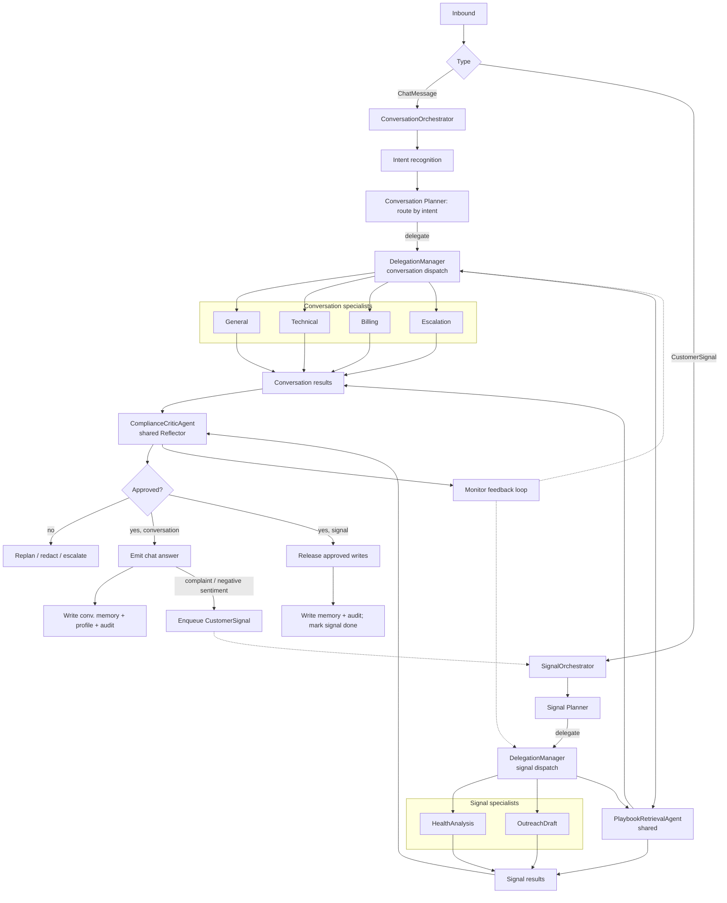

# Agent Implementation Plan

> Implementation blueprint for the CustomerAgent backend (`apps/`, `packages/`) and the ReactJS
> frontend. Read alongside `README.md` for system context and `CLAUDE.md` for run/build rules.
> This is a single source-of-truth design document: it describes the **target** system, contracts,
> and data flow. Concrete signatures live in the code.
>
> Temporal and Langfuse are **deferred** until the stack is proven runnable end to end.

---

## 1. Scope

The agent engine handles all AI-driven decision-making and action execution in the platform:

- Run customer-facing chat turns (interactive, low-latency).
- Detect and react to customer-success signals (usage/health drops, renewal risk, negative
  sentiment) proactively.
- Extract durable user profiles from conversation and persist them for health analysis.
- Retrieve tenant playbooks via RAG (pgvector ANN) so answers and outreach follow business rules.
- Execute side-effecting tools safely (email/Slack) only after compliance approval.

Out of scope for this round (deferred): Temporal long-waits, Langfuse tracing depth, LangGraph
durable workflows, advanced tools (QBR, CRM writes, calendar).

---

## 2. Architecture: Two Top-Level Systems, One Shared Runtime, Disjoint Specialists

The platform runs **two** top-level agent systems because proactive automation and customer
conversation have different latency, memory, safety, and output needs. They share a runtime but use
**disjoint specialist subagents** — the only specialist both may use is playbook retrieval.

| System                     | Input                                    | Purpose                               | Style                    |
| -------------------------- | ---------------------------------------- | ------------------------------------- | ------------------------ |
| `SignalOrchestrator`       | `SignalAgentInput` / `CustomerSignal`    | Proactive customer-success automation | Async/background P-E-R   |
| `ConversationOrchestrator` | `ConversationAgentInput` / `ChatMessage` | Customer-facing chat turns            | Low-latency P-E-R        |

Both subclass `BaseOrchestrator` and run the same **Planner → Executor → Reflector (P-E-R)**
lifecycle. Only domain-specific pieces differ (planner input, memory scope, external-write support,
specialist set).

### 2.1 Planner → Executor → Reflector

| Phase     | Owner (signal)          | Owner (conversation)       | Shared responsibility                                                 |
| --------- | ----------------------- | -------------------------- | --------------------------------------------------------------------- |
| Planner   | `SignalOrchestrator`    | `ConversationOrchestrator` | Build an `OrchestratorPlan` of role-based `SubagentTask` objects      |
| Executor  | `DelegationManager`     | `DelegationManager`        | Spin up scoped ephemeral subagents (local ReAct), in dependency batches |
| Reflector | `ComplianceCriticAgent` | `ComplianceCriticAgent`    | Review `SubagentResult`s before any output, write, or memory mutation |

The orchestrator owns the request end to end: tenant config + constraints, memory selection and
durable writes, planning and sequencing, cross-subagent context packing, final approval, emission,
and persistence. Subagents are ephemeral, single-turn workers that never own the outcome.

### 2.2 Specialist subagents (disjoint sets)

| Role                     | Signal | Conversation | Purpose                                                              |
| ------------------------ | ------ | ------------ | -------------------------------------------------------------------- |
| `HealthAnalysisAgent`    | Yes    | **No**       | Analyze health score, usage trend, tickets, NPS, renewal + profile risk |
| `OutreachDraftAgent`     | Yes    | **No**       | Draft customer-safe proactive email/Slack (apology, renewal, at-risk) |
| `GeneralAgent`           | No     | Yes          | Default conversational answer; fallback for other specialists         |
| `TechnicalAgent`         | No     | Yes          | Troubleshooting / error diagnosis chat answers                        |
| `BillingAgent`           | No     | Yes          | Billing / refund / invoice / subscription chat answers                |
| `EscalationAgent`        | No     | Yes          | Handle explicit escalation / critical urgency turns (hand-off framing)|
| `PlaybookRetrievalAgent` | Yes    | Yes          | Retrieve + rank tenant playbooks so answers/outreach follow the rules |
| `ComplianceCriticAgent`  | Yes    | Yes          | Reflector: review aggregated results before writes/output            |

Subagents receive only their objective, local params, allowed-tool list, memory slice, injected
skills, and dependency markdown; they run an internal ReAct loop and return a structured
`SubagentResult`, then are discarded. They must not write long-term memory, emit final
customer-visible output, mutate external services directly, or read unrelated tenant/global context.

The `DelegationManager`, ReAct loop, reducer, and critic are **shared code**, but each orchestrator
dispatches only to its **own** specialist set. Conversation never reaches Health/Outreach; signal
never reaches General/Technical/Billing/Escalation. Playbook retrieval is the single shared
specialist. The two paths converge only at the shared Reflector (critic).



### 2.3 Deviations from the reference project (EchoMind)

- **pgvector, not ChromaDB.** All retrieval and memory vectors live in Postgres/pgvector via
  `packages/knowledge_service`. There is no ChromaDB anywhere.
- **LLM gateway, not direct SDK.** All LLM calls go through `apps/agent_service/src/agent/llm_client.py`
  (interim shim over OpenRouter, OpenAI-compatible). Caching/circuit reuse `packages/llm_gateway`.
- **Multi-tenant + English-only.** Every domain object carries `tenant_id`; all prompts/skills are
  English. Conversation agents are adapted from the reference General/Technical/Billing agents.
- **Real embeddings with offline fallback.** OpenAI-compatible `qwen/qwen3-embedding-8b` (1536-dim)
  through OpenRouter, falling back to a deterministic local hash vector when unavailable.

---

## 3. File Layout (target)

```
apps/agent_service/src/agent/
├── llm_client.py                 # thin llm_gateway/OpenRouter client (all phases)
├── conversation/
│   ├── conversation_orchestrator.py  # ConversationOrchestrator: chat turns + signal bridge
│   ├── conversation_planner.py       # intent-routed plan (general/tech/billing/escalation + playbook)
│   ├── intent.py                     # three-way fused intent recognition (LLM + embedding + pattern)
│   ├── chat_handler.py               # handle_chat_turn() wrapper
│   ├── streaming.py                  # streaming-safe emission with final critic gate
│   └── subagents/                    # conversation-ONLY specialists (playbook is shared, see subagents/)
│       ├── general.py
│       ├── technical.py
│       ├── billing.py
│       └── escalation.py
│   # (customer_chat.py is removed; replaced by the four routed roles above)
├── signal/
│   ├── signal_orchestrator.py    # SignalOrchestrator: async CustomerSignal workflows
│   ├── signal_planner.py         # signal-specific plan (health→playbook→outreach)
│   └── signal_reducer.py         # proactive action candidates + escalation
├── subagents/                    # signal specialists + shared playbook + factory
│   ├── base.py                   # BaseSubagent protocol + ReActSubagent
│   ├── health_analysis.py        # signal-only
│   ├── outreach_draft.py         # signal-only
│   ├── playbook_retrieval.py     # shared (signal + conversation)
│   ├── compliance_critic.py      # shared Reflector
│   └── __init__.py               # domain-aware role→subagent factory
├── orchestrator/
│   ├── base.py                   # shared P-E-R base
│   ├── reducer.py                # SubagentResult aggregation
│   └── policy.py                 # approval/guardrail + per-role tool policy
└── runtime/
    ├── react_loop.py             # shared ReAct primitive
    ├── delegation.py             # orchestrator→subagent dispatch, parallel batches
    ├── context.py                # context packing + memory slices + budgets
    ├── prompts.py                # subagent system-prompt builder (+ skill injection)
    ├── tool_caller.py / tool_dispatch.py  # tool execution (internal vs MCP-action boundary)
    ├── skills.py                 # dynamic skill loading + injection (SkillManager)
    ├── monitor.py                # performance monitor + routing-penalty feedback loop
    └── mcp/
        ├── tool_layer.py         # validate / cache / circuit / fallback wrapper
        └── retrieval.py          # query rewrite + parallel recall + rerank over pgvector

apps/agent_service/src/signals/
├── normalizer.py                 # raw payload → CustomerSignal (idempotency/dedup keys)
├── queue.py                      # enqueue/dedupe/dequeue signals (Redis or in-memory)
└── detectors.py                  # renewal-risk + low-health detectors over the DB

apps/api_gateway/src/
├── app.py                        # FastAPI app: lifespan, CORS, health, skills, route mounts
└── routes/
    ├── chat.py                   # POST /chat/turn (tenant-scoped, optional SSE)
    └── signals.py                # POST /signals/scan, POST /signals, GET /signals, GET /customers

packages/agent/src/
├── types.py                      # CustomerSignal, SessionContext, AgentResponse, LLMUsage
├── config.py                     # AgentConfig per tenant
├── chat_types.py                 # ChatMessage, ChatRequest, ChatResponse
├── orchestration_types.py        # AgentInput variants, OrchestratorPlan, ComplianceReview, FinalDecision
├── subagent_types.py             # AgentRole (+ general/technical/billing/escalation), SubagentTask, ...
└── memory.py                     # three-tier conversation memory + profile distillation

packages/knowledge_service/src/  # embed.py (real+fallback), retrieve.py, ingest.py (pgvector)
packages/tool_system/src/        # registry.py + tools/ (query_health, query_playbooks, send_email, send_slack)

skills/<tenant>/<skill>/SKILL.md  # tenant-scoped hot-loadable skills (front matter + body)
scripts/seed_playbooks.py         # chunk → embed → store playbook markdown into pgvector

frontend/                         # Vite + React: Chat view + Signal dashboard (built last)
```

Domain rule: `CustomerSignal` lives in `types.py`; `ChatMessage` lives in `chat_types.py`. They are
separate domain objects and meet only through `AgentInput` in `orchestration_types.py`.

---

## 4. Data Models & Database

All Python types use Pydantic v2. Database schema lives in
`infra/docker/packages/db/scripts/init.sql` (auto-run on first Postgres init; **re-init required**
after the embedding-dimension change below).

### 4.1 Orchestrator/subagent contracts

| Model                   | Created by           | Consumed by                   | Purpose                                                 |
| ----------------------- | -------------------- | ----------------------------- | ------------------------------------------------------- |
| `OrchestratorPlan`      | Planner              | Delegation manager            | Ordered role-based subagent sequence                    |
| `SubagentTask`          | Planner              | Ephemeral subagent            | Scoped objective, tool boundary, dependency contract    |
| `SubagentContextPacket` | Delegation manager   | Ephemeral subagent            | Tenant-safe local context, memory slice, prior markdown |
| `SubagentResult`        | Ephemeral subagent   | Reducer + critic              | Structured result, markdown summary, tool evidence      |
| `ComplianceReview`      | Reflector            | Orchestrator                  | Approval, redactions, findings, blocked writes          |
| `FinalDecision`         | Orchestrator         | API/worker caller             | Approved response/action payload only                   |

`AgentRole` gains conversation roles: `GENERAL`, `TECHNICAL`, `BILLING`, `ESCALATION`. Existing
`HEALTH_ANALYSIS`, `OUTREACH_DRAFT`, `PLAYBOOK_RETRIEVAL`, `COMPLIANCE_CRITIC` remain. `CUSTOMER_CHAT`
is removed (its `customer_chat.py` deleted) and replaced by the four routed conversation roles. The
role→subagent factory (`subagents/__init__.py`) is **domain-aware**: it exposes the conversation set
(general/technical/billing/escalation + playbook) to `ConversationOrchestrator` and the signal set
(health/outreach + playbook) to `SignalOrchestrator`, so neither can instantiate the other's
specialists.

### 4.2 Schema changes

- `knowledge_chunks.embedding` → **`VECTOR(1536)`** (was 1024) to match `qwen/qwen3-embedding-8b` (1536-dim).
  HNSW cosine index preserved. **Requires** `docker compose down -v` to recreate the volume.
- New **`customer_profiles`** table (RLS, tenant-scoped, one row per customer):
  `tenant_id, customer_id (unique per tenant), preferences JSONB, sentiment_signals JSONB,
  risk_signals JSONB, communication_preferences JSONB, last_intent, last_sentiment, updated_at`.
  Upserted from conversation profile distillation; read by `query_health`.
- New **`signals`** table (dashboard-facing durable record):
  `tenant_id, customer_id, type, severity, payload JSONB, status
  (queued/processing/done/failed), source (detector/chat_bridge/manual), created_at, processed_at`.

---

## 5. Retrieval, Embeddings & Playbook RAG

### 5.1 Embeddings (`packages/knowledge_service/src/embed.py`)

`embed_text()` calls the OpenAI-compatible `/embeddings` endpoint (`OPENROUTER_BASE_URL`,
`EMBEDDING_MODEL=qwen/qwen3-embedding-8b`, 1536-dim) via `AsyncOpenAI`. On any error or
missing key it logs once and falls back to `local_embedding(text, dims=1536)` — a deterministic
character n-gram hash vector — so retrieval, intent fusion, and tests always run offline.

### 5.2 MCP tool layer + retrieval optimization (`runtime/mcp/`)

Every subagent tool call passes through `tool_layer.py`: JSON-schema validation → cache check
(reusing `llm_gateway` semantics) → circuit-breaker check → execute with timeout → record stats →
fallback on failure/open-circuit. For retrieval tools (`query_playbooks`), `retrieval.py` runs the
full chain: LLM query rewrite → parallel recall over pgvector → merge/dedupe → LLM rerank → top-K,
with an explicit empty-but-successful fallback when nothing matches.

### 5.3 Playbook seeding (`scripts/seed_playbooks.py`)

Tenant playbooks are authored as markdown under `skills/<tenant>/`. The seed script chunks each
markdown file, embeds each chunk (§5.1), and `store_document(..., collection="playbooks")` into
`knowledge_chunks`. After seeding, `query_playbooks` returns real ANN matches. At least one at-risk
/ renewal-save playbook is seeded for `demo-tenant`.

---

## 6. Dynamic Skills

A skill is a hot-loadable business-rule block that augments a subagent's system prompt. Skills are
tenant-scoped files at `skills/<tenant>/<skill>/SKILL.md` with minimal front matter (`name`,
`description`, `keywords`, `agents`, `enabled`) and a markdown body. `SkillManager`
(`runtime/skills.py`) discovers/loads them (tolerant of per-file errors), supports `reload()` for
hot-reload, and `prompt_for(message, role)` injects only matching skills within a length budget.
Injected at prompt-build time in `runtime/prompts.py`; skills are advisory — system role and safety
boundaries always win. Both orchestrators share one skill mechanism.

---

## 7. Intent Recognition (Conversation Only)

`agent/conversation/intent.py` runs at the start of each conversation turn (three-way fused: LLM
semantic + embedding similarity + keyword pattern, weighted vote, `OTHER` below threshold). It
derives an `IntentCategory`, `UrgencyLevel`, and extracted entities. The signal system does not use
intent — it is triggered by typed backend events.

### 7.1 Intent → conversation routing (the reference three-layer routing, adapted)

The planner maps intent+urgency to a specialist role set:

| Intent / condition                         | Route to                          |
| ------------------------------------------ | --------------------------------- |
| `GREETING`, `FEEDBACK`, `QUERY` (low urg.) | `GeneralAgent` (fast path)        |
| `TECHNICAL`                                | `TechnicalAgent` (+playbook if rule-bound) |
| `BILLING`, `ACCOUNT`                       | `BillingAgent` (+playbook if rule-bound)   |
| `ESCALATION` or `urgency == CRITICAL`      | `EscalationAgent`                 |
| Compound (e.g. technical + billing)        | **Parallel** specialists, merged  |
| Anything else                              | `GeneralAgent`                    |

A `playbook` task (depends-on) is added when the turn looks policy/rule-bound so playbook
instructions reach the answer. If a specialist path is unavailable/downgraded, the run degrades to
`GeneralAgent`. The critic still gates every final answer.

---

## 8. Memory & User Profile

### 8.1 Three-tier conversation memory (`packages/agent/src/memory.py`)

| Tier         | Store                          | Contents                                    | Lifetime  |
| ------------ | ------------------------------ | ------------------------------------------- | --------- |
| Working      | Redis                          | Most recent N messages of the live session  | 24h TTL   |
| Episodic     | pgvector (`knowledge_service`) | LLM-compressed summaries of past conversation | Persistent |
| User profile | Postgres `customer_profiles` + pgvector | Distilled long-term preferences + risk/sentiment | Persistent |

`runtime/context.py` fuses tiers for the planner and conversation specialists, bounded by a context
budget. When working memory exceeds a threshold, older messages are LLM-summarized (summary kept,
raw messages moved to episodic).

### 8.2 Profile persisted to Postgres (feeds health analysis)

`ConversationMemory.update_profile` distills the profile from the conversation and **upserts the
structured `customer_profiles` row** (in addition to the pgvector `user_profile` collection).
`query_health` `LEFT JOIN`s `customer_profiles` and returns profile-derived `sentiment` and
`risk_signals`, so `HealthAnalysisAgent` uses chat-learned signals during proactive analysis. The
profile slice given to signal subagents is tenant-scoped, read-only, and PII-masked.

---

## 9. Multi-Agent Routing & Parallel Collaboration

Routing is planner-driven (not a standalone router), and each system routes **within its own
specialist set**. Intent (conversation) or signal type (signal) maps to a role set;
performance-aware routing avoids roles/tools the monitor has downgraded; fallback routing degrades
to a safe default (`GeneralAgent` for conversation; the health→playbook path with a text-only
recommendation, skipping outreach, for signal). `DelegationManager` executes the plan in
dependency-aware batches — independent tasks in a readiness batch run concurrently; dependent tasks
wait for `depends_on` and receive upstream markdown/data. Compound requests fan out to parallel
specialists whose results the reducer merges before the critic reviews.

---

## 10. Monitor Auto-Downgrade Feedback Loop

`runtime/monitor.py` collects lightweight per-role/tool stats (total, success, latency, consecutive
failures) inline during execution, applies sliding-window anomaly detection, and converts poor
performance into a per-role/tool **routing penalty** written back to routing state. On the next run,
performance-aware routing prefers healthier roles and the MCP layer avoids open-circuit tools.
Penalties decay as performance recovers. Both orchestrators feed the same monitor.

---

## 11. Signal System

Proactive customer-success automation, triggered by typed backend events — never inferred chat
intent.

### 11.1 Triggers & detectors (`apps/agent_service/src/signals/`)

- **`renewal_risk`** — `detectors.py` scans `customers.renewal_date` within N days.
- **`low_health`** — scans `customers.health_score` below a threshold.
- **`negative_sentiment`** — enqueued by the conversation→signal bridge (§12.3) when a chat turn is a
  complaint / negative sentiment / escalation.
- **Manual** — `POST /signals` accepts an explicit signal payload.

Detectors run on demand via `POST /signals/scan` (manual or cron). No Temporal, no hidden background
threads. Every enqueue also writes a `signals` row for the dashboard.

### 11.2 Flow

1. Ingestion normalizes the payload into a `CustomerSignal`, applies idempotency/dedup, enqueues it
   (`signals/queue.py`), and records a `signals` row.
2. `SignalOrchestrator` loads tenant config, constraints, account memory + the shared profile slice.
3. `signal_planner.py` builds an `OrchestratorPlan`: typically `HealthAnalysisAgent` →
   `PlaybookRetrievalAgent` → `OutreachDraftAgent` (for `negative_sentiment`, the outreach is an
   apology). Critic review is always required before any write.
4. `DelegationManager` runs subagents in dependency batches; write tools are returned as **proposed**
   action packets, not executed.
5. `ComplianceCriticAgent` reviews aggregated results + proposed writes.
6. The reducer produces a `FinalDecision`. On approval the orchestrator releases approved writes
   through the tool-gateway (approval + idempotency enforced), writes durable memory/audit, and
   marks the `signals` row `done`.

---

## 12. Conversation System

Synchronous, customer-facing chat, triggered by a customer message.

### 12.1 Flow

1. `apps/api_gateway` `POST /chat/turn` (tenant-scoped) calls `handle_chat_turn()`.
2. Intent recognition classifies intent, urgency, entities.
3. `ConversationOrchestrator` loads tenant config, constraints, and the fused three-tier memory.
4. `conversation_planner.py` routes by intent to General/Technical/Billing/Escalation (fast path for
   greetings/feedback), adds a playbook task when rule-bound, and fans out in parallel for compound
   turns. Critic review always required.
5. `DelegationManager` runs the specialists; skills injected; playbook retrieval uses the MCP chain.
6. `ComplianceCriticAgent` reviews before the answer is committed.
7. On approval the orchestrator returns/streams the answer, writes conversation memory, upserts the
   profile (§8.2), and — if warranted — fires the signal bridge (§12.3).

### 12.2 Streaming vs critic approval

Streaming must not expose unapproved text. Use conservative streaming (stream progress/draft, commit
the final answer only after critic approval) or sentence-level moderation. The committed answer
always passes the critic first. Non-streaming is the default until this is proven.

### 12.3 Conversation → signal bridge

When a chat turn reveals proactive follow-up (negative sentiment, complaint, escalation, churn/
expansion cues), `ConversationOrchestrator.on_approved` enqueues a `CustomerSignal`
(source=`chat_bridge`, e.g. `negative_sentiment`) so the signal system can analyze / apologize /
email. The conversation response stays bounded and never sends outreach inline.

---

## 13. Integration Points

- **Chat endpoint** (`apps/api_gateway/src/routes/chat.py`): authenticated, tenant-scoped; optional
  SSE; PII masking applies to input before the LLM.
- **Signals endpoints** (`routes/signals.py`): `POST /signals/scan` (run detectors), `POST /signals`
  (manual), `GET /signals` (dashboard), `GET /customers` (dashboard).
- **Signal worker** (`rq_worker.py`): drains the queue, normalizes to `SignalAgentInput`, calls
  `run_signal_agent()`, updates the `signals` row.
- **Tool gateway** (`apps/tool_gateway`): MCP server exposing only side-effecting action tools
  (`send_email`, `send_slack`) with approval + idempotency; internal read tools run in-process.
- **LLM client**: all LLM calls go through `llm_client.py` (interim) / `packages/llm_gateway`.

---

## 14. Deployment (Docker)

All services run as Docker Compose services on `postgres_network`, env from `infra/docker/.env` +
per-service env:

| Service        | Image/build                              | Port | Role                                  |
| -------------- | ---------------------------------------- | ---- | ------------------------------------- |
| `postgres`     | `pgvector/pgvector:pg14`                 | 5433 | DB (+ pgvector, RLS, init.sql)        |
| `redis`        | `redis:7-alpine`                         | 6379 | working memory, queue, dedupe         |
| `tool-gateway` | `apps/tool_gateway/Dockerfile`           | 8002 | MCP action sandbox                    |
| `api-gateway`  | `apps/api_gateway/Dockerfile` (new)      | 8000 | FastAPI: chat + signals + dashboard API |
| `agent-worker` | `apps/agent_service/Dockerfile` (new)    | —    | signal queue drain                    |

Temporal and Langfuse services stay in compose but are **not** required for the app to run in this
round. `start.sh` brings the stack up; a fresh DB (`down -v`) is required once for the 1536-dim
change.

---

## 15. Frontend (built last)

`frontend/` — Vite + React, two views:

- **Chat** — calls `POST /chat/turn` (non-streaming first, SSE after); shows the routed
  specialist/intent and the reply.
- **Dashboard** — customers table (health score, renewal date), signals list (type/severity/status/
  source), a **Run scan** button hitting `/signals/scan`, and a skills viewer.

Dev via `npm run dev` proxying to `:8000`; optional compose service later.

---

## 16. Implementation Order

1. **DB schema** — `init.sql`: `VECTOR(1536)`, `customer_profiles`, `signals`; `down -v` + `start.sh`.
2. **Embeddings** — real OpenAI-compatible `embed_text` + 1536-dim fallback.
3. **Profile → PG** — `update_profile` upserts `customer_profiles`; `query_health` joins it.
4. **Conversation split** — new `conversation/subagents/` (general/technical/billing/escalation);
   rewrite `conversation_planner.py` to intent-routing + playbook; domain-aware subagent factory.
5. **Signal triggers** — `detectors.py`, conversation→signal bridge, `signals` table writes,
   `negative_sentiment` handling in `signal_planner.py`.
6. **Playbook RAG** — author playbook markdown + `scripts/seed_playbooks.py`; verify ANN retrieval.
7. **Wire the API** — implement `api_gateway/src/app.py` + `routes/signals.py`; worker drain.
8. **Dockerize** — Dockerfiles + compose services for `api-gateway` and `agent-worker`.
9. **Verify** (§17) — gate before the frontend.
10. **Frontend** — chat + dashboard, smoke-tested against the running API.

---

## 17. Verification Gate (must pass before frontend)

1. `docker compose -f infra/docker/docker-compose.yml down -v && ./start.sh` — fresh 1536-dim DB.
2. `python -m pytest tests/ -v` — existing suite green + new tests (profile upsert, detectors,
   conversation intent routing, playbook retrieval non-empty after seed, embedding fallback).
3. `python scripts/seed_playbooks.py`, then `query_playbooks` → non-empty ANN matches.
4. `POST /chat/turn` for billing / technical / complaint messages → correct specialist,
   critic-approved reply, `customer_profiles` row upserted; a complaint enqueues a `negative_sentiment`
   signal + `signals` row.
5. `POST /signals/scan` → renewal/low-health signals enqueued; worker drains → approved apology/
   outreach action result; `signals` row → `done`.
6. Only then build and smoke-test the frontend.

---

## 18. Invariants

- Signal and conversation are separate top-level systems on one shared runtime, with **disjoint**
  specialist sets; playbook retrieval is the only specialist both may use.
- Subagents stay ephemeral and bounded; they never emit final output or write durable memory.
- Write actions are proposed by subagents and emitted only by the orchestrator after critic approval,
  with approval + idempotency enforced at the tool gateway.
- Conversation memory is three-tier (Redis + pgvector); the signal system consumes only the shared
  user-profile tier (now also persisted in `customer_profiles`).
- All retrieval and vectors use pgvector via `knowledge_service`; there is no ChromaDB.
- Embeddings are 1536-dim (real API) with a deterministic offline fallback; the DB vector column
  matches.
- All LLM calls go through the LLM client/gateway; caching and circuit breaking are reused.
- Dynamic skills are tenant-scoped and advisory; system role and safety boundaries always win.
- Signal detectors are explicit/API-driven; no hidden schedulers until Temporal lands.
- Temporal and Langfuse remain deferred until the stack is proven runnable end to end.
