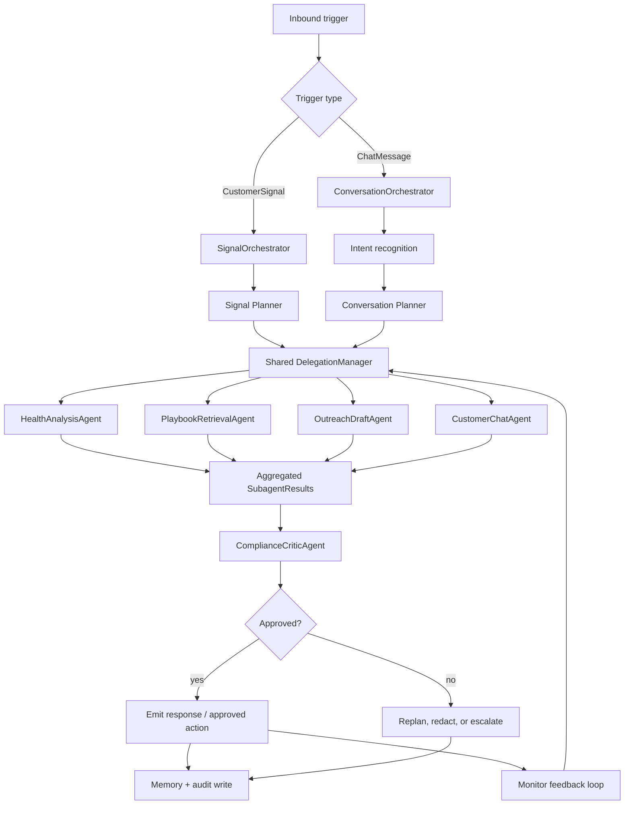

# Agent Implementation Plan

> This document maps the agent engine design onto the existing Python-based CustomerAgent codebase.
> It is the implementation blueprint for `apps/agent_service/` and `packages/agent/`. Read it
> alongside `README.md` for full system context. This revision is design-first: it describes
> contracts, responsibilities, and data flow in prose and tables. Concrete signatures live in the
> code itself, not in this plan.

---

## 1. Scope

The agent engine handles all AI-driven decision-making and action execution in the platform.
Its responsibilities:

- Classify incoming customer signals (usage drops, support tickets, NPS changes, renewal dates).
- Decide what action to take (send email, post Slack, schedule meeting, update CRM, generate QBR).
- Execute tools safely (sandboxed external API calls via tool gateway).
- Evaluate outcomes and follow up or escalate.
- Persist execution state for long-running workflows (48-hour waits, human-in-the-loop approvals).

What is NOT in scope here (handled by other packages):

- The HTTP gateway that receives webhooks and enqueues jobs (`apps/api_gateway`).
- The LLM gateway that routes, limits, and caches LLM calls (`packages/llm_gateway`).
- The tool sandbox that runs external API calls (`apps/tool_gateway`, `packages/tool_system`).
- The session state machine (`packages/session`).
- The observability layer (`packages/observability`).

---


## 2. Architecture: Two Top-Level Systems on One Shared Runtime

The platform runs two top-level agent systems because signal automation and customer conversation
have different latency, memory, safety, and output requirements.


| Top-level system           | Primary input                            | Primary purpose                          | Runtime style                   |
| -------------------------- | ---------------------------------------- | ---------------------------------------- | ------------------------------- |
| `SignalOrchestrator`       | `SignalAgentInput` / `CustomerSignal`    | Proactive customer-success automation    | Async/background P-E-R run      |
| `ConversationOrchestrator` | `ConversationAgentInput` / `ChatMessage` | Interactive customer-facing conversation | Low-latency/streaming P-E-R run |


They are separate orchestration systems but share the same runtime primitives: `OrchestratorPlan`,
`SubagentTask`, `SubagentResult`, `DelegationManager`, the ephemeral subagent `ReActLoop`,
`ComplianceCriticAgent`, the MCP tool layer, the skill loader, memory and audit infrastructure, and
Langfuse tracing conventions. This avoids a confusing generic orchestrator while also avoiding
duplicated agent infrastructure.

### Planner - Executor - Reflector (P-E-R)

Both systems run the same lifecycle:


| P-E-R phase | Signal system owner     | Conversation system owner  | Shared responsibility                                                            |
| ----------- | ----------------------- | -------------------------- | -------------------------------------------------------------------------------- |
| Planner     | `SignalOrchestrator`    | `ConversationOrchestrator` | Build an `OrchestratorPlan` of role-based `SubagentTask` objects                 |
| Executor    | `DelegationManager`     | `DelegationManager`        | Spin up scoped ephemeral subagents with local ReAct loops, in dependency batches |
| Reflector   | `ComplianceCriticAgent` | `ComplianceCriticAgent`    | Evaluate `SubagentResult` objects before output, writes, or streaming completion |


The top-level orchestrator owns the request end to end: tenant configuration and multi-tenant
constraints, memory selection and durable memory writes, planning and subagent sequencing,
cross-subagent context packing and result reduction, and final approval, emission, and persistence.

Subagents are not durable agents and do not own the customer outcome. They are lightweight,
single-turn workers created only during the Executor phase.

### Why Two Top-Level Systems


| Dimension            | `SignalOrchestrator`                                                        | `ConversationOrchestrator`                      |
| -------------------- | --------------------------------------------------------------------------- | ----------------------------------------------- |
| Trigger              | Backend/system event                                                        | Customer message or chat turn                   |
| Sender               | Webhook, scheduled detector, CRM/billing sync, analytics job, CSM dashboard | Authenticated chat endpoint                     |
| Latency target       | Seconds to minutes                                                          | Sub-second first token when streaming           |
| Memory               | Account memory, signal history, and shared user profile                     | Full three-tier conversation memory required    |
| Output               | Draft outreach, Slack alert, CRM update, escalation, QBR/refund workflow    | Customer-facing chat response                   |
| Side-effect risk     | Wrong proactive action or external mutation                                 | Bad customer-facing answer or unsafe disclosure |
| Long-running support | Common; can hand off to LangGraph/Temporal                                  | Rare; should stay bounded and responsive        |


### Capability Map

The six reference capabilities map onto our stack as follows. Chinese source names are given once
for traceability; all implementation is English-only and uses our own modules (Redis, pgvector via
`packages/knowledge_service`, `packages/llm_gateway`, `packages/tool_system`,
`packages/observability`).


| Capability (source)   | English name in this plan            | Where it lives                                                      | Signal       | Conversation |
| --------------------- | ------------------------------------ | ------------------------------------------------------------------- | ------------ | ------------ |
| 三路融合意图识别              | Three-way fused intent recognition   | `agent/conversation/intent.py`                                      | No           | Yes          |
| 查询改写 + 重排 + fallback  | Query rewrite + rerank + fallback    | MCP tool layer (`agent/runtime/mcp/`) over `tool_system` + pgvector | Partly       | Yes          |
| Redis + ChromaDB 三级记忆 | Redis + pgvector three-tier memory   | `packages/agent/src/memory.py` + `agent/runtime/context.py`         | Profile only | Yes          |
| 多 Agent 路由和自动并行协作     | Multi-agent routing + parallelism    | Planner routing + `DelegationManager`                               | Yes          | Yes          |
| 动态 Skills 加载与注入       | Dynamic skill loading + injection    | `agent/runtime/skills.py` + tenant `SKILL.md` files                 | Yes          | Yes          |
| Monitor 自动降权闭环        | Monitor auto-downgrade feedback loop | `agent/runtime/monitor.py` + `packages/observability`               | Yes          | Yes          |


Key deviations from the reference project, per project direction:

- The reference stores memory in ChromaDB. We use pgvector (Postgres, from `pgvector`) through
`packages/knowledge_service`. There is no ChromaDB anywhere.
- Three-tier memory belongs to the conversation system. The signal system does not chat, so it does
not need working/episodic conversation memory. It only consumes the shared user profile tier
(see the memory section) because behavioral preferences learned in chat are useful for outreach
analysis (for example `OutreachDraftAgent`).
- The reference uses the Anthropic SDK directly. We always route LLM calls through
`packages/llm_gateway`, reusing its `circuit.py` (circuit breaker) and `cache.py` (caching)
instead of re-implementing them inside the tool layer.
- Playbooks are not seeded yet. The retrieval path is built now; real playbook content is added
later. Retrieval must degrade gracefully when the knowledge base is empty.


### Subagent Isolation

Neither orchestrator runs raw low-level tools from its own context window. During the Executor
phase it delegates work to dedicated sub-nodes. Each `SubagentTask` specifies a role, objective,
allowed tools, local input, dependency IDs, and output contract.


| Subagent role            | Used by signal? | Used by conversation? | Purpose                                                            |
| ------------------------ | --------------- | --------------------- | ------------------------------------------------------------------ |
| `HealthAnalysisAgent`    | Yes             | Sometimes             | Analyze account health, usage trend, tickets, NPS, renewal risk    |
| `PlaybookRetrievalAgent` | Yes             | Sometimes             | Retrieve and rank relevant CS playbooks, policies, and KB docs     |
| `OutreachDraftAgent`     | Yes             | Rarely                | Draft customer-safe proactive email/Slack/CRM text                 |
| `CustomerChatAgent`      | Rarely          | Yes                   | Interpret chat intent and compose conversational answer candidates |
| `ComplianceCriticAgent`  | Yes             | Yes                   | Review aggregated results before writes or customer-visible output |


Subagents are spin-up, tear-down entities. The orchestrator builds a scoped `SubagentTask` and
tenant-safe context packet; the subagent receives only its objective, local params, allowed tool
list, memory slice, injected skills, and dependency markdown; it runs an internal ReAct loop and
returns a structured `SubagentResult`; then it is discarded. Subagents must not write long-term
memory, emit final customer-visible output, mutate external services directly, or access unrelated
tenant/global context. All durable side effects are gated by the orchestrator and the Reflector.




### Runtime Decision Matrix


| Scenario                                               | Runtime                                                       | Reason                                                           |
| ------------------------------------------------------ | ------------------------------------------------------------- | ---------------------------------------------------------------- |
| Usage drop, renewal risk, NPS drop, support escalation | `SignalOrchestrator` P-E-R                                    | Async proactive automation with account memory and action policy |
| Customer-facing chat turn                              | `ConversationOrchestrator` P-E-R                              | Low-latency conversational loop with required memory             |
| Chat asks account-health question                      | `ConversationOrchestrator` -> chat + health subagents         | Conversation stays top-level owner; specialists supply evidence  |
| Proactive outreach from signal                         | `SignalOrchestrator` -> health/playbook/draft subagents       | Specialist work isolated; final action centrally approved        |
| Complex multi-step QBR generation                      | LangGraph nodes call orchestrator/subagents for bounded work  | Needs checkpoint, long-running execution, replay                 |
| Human-in-the-loop refund approval                      | LangGraph + orchestrator-approved action packets              | Interrupt + checkpoint required                                  |
| Long wait steps ("wait 48h for reply")                 | Temporal owns wait; `SignalOrchestrator` handles active steps | Process crash resilience                                         |


We deliberately do not use Mastra. The P-E-R runtime, delegation manager, and ReAct loop are
implemented directly in Python, keeping the system explicit and auditable. LangGraph is used only
for workflows needing checkpoint + interrupt; it owns durability, not active reasoning.

---


## 3. File Layout

```
apps/agent_service/src/agent/
├── llm_client.py                 # thin llm_gateway client used by all phases
├── registry.py                   # orchestrator/subagent registry
├── signal/
│   ├── signal_orchestrator.py    # SignalOrchestrator: async CustomerSignal workflows
│   ├── signal_planner.py         # signal-specific plan creation
│   └── signal_reducer.py         # proactive action candidates + escalation
├── conversation/
│   ├── conversation_orchestrator.py  # ConversationOrchestrator: chat turns
│   ├── conversation_planner.py       # chat-specific plan creation (fast path aware)
│   ├── intent.py                     # three-way fused intent recognition
│   ├── chat_handler.py               # handle_chat_turn() wrapper
│   └── streaming.py                  # streaming-safe emission with final critic gate
├── orchestrator/
│   ├── base.py                   # shared P-E-R base/protocols
│   ├── reducer.py                # SubagentResult aggregation helpers
│   └── policy.py                 # approval/guardrail + per-role tool policy
├── subagents/
│   ├── base.py                   # BaseSubagent protocol + ReActSubagent
│   ├── health_analysis.py
│   ├── playbook_retrieval.py
│   ├── outreach_draft.py
│   ├── customer_chat.py
│   └── compliance_critic.py
└── runtime/
    ├── react_loop.py             # shared ReAct primitive used by subagents
    ├── delegation.py             # orchestrator -> subagent dispatch, parallel batches
    ├── context.py                # context packing + memory slices + budgets
    ├── prompts.py                # subagent system-prompt builder
    ├── tool_caller.py            # tool dispatcher (in-process now, gateway later)
    ├── skills.py                 # dynamic skill loading + injection (SkillManager)
    ├── monitor.py                # performance monitor + routing-penalty feedback loop
    └── mcp/
        ├── tool_layer.py         # MCP-style call wrapper: validate, cache, circuit, fallback
        └── retrieval.py          # query rewrite + parallel recall + rerank over pgvector

packages/agent/src/
├── types.py                      # CustomerSignal, SessionContext, AgentResponse, LLMUsage
├── config.py                     # AgentConfig per tenant
├── chat_types.py                 # ChatMessage, ChatRequest, ChatResponse
├── orchestration_types.py        # AgentInput variants, OrchestratorPlan, ComplianceReview, FinalDecision
├── subagent_types.py             # AgentRole, SubagentTask, SubagentContextPacket, SubagentResult
└── memory.py                     # three-tier conversation memory + shared user profile

skills/                           # tenant-editable skill files, one dir per skill
└── <skill_name>/SKILL.md         # front-matter (name, description, keywords, agents) + body
```

Domain rule: `CustomerSignal` lives in `types.py`; `ChatMessage` lives in `chat_types.py`. They are
separate domain objects and meet only through `AgentInput` in `orchestration_types.py`.

---


## 4. Data Models

All types use Pydantic v2 for validation, serialization, and JSON Schema generation (the schema is
passed to the LLM for tool-calling parameter validation). Types are already implemented in
`packages/agent/src/`; this section documents intent, not signatures.

### Domain separation

- `CustomerSignal` is a business event that triggers `SignalOrchestrator`.
- `ChatMessage` is a conversation turn that triggers `ConversationOrchestrator`.
- `AgentDispatchInput` is optional glue at the API/worker routing layer only. Business logic
operates on `SignalAgentInput` or `ConversationAgentInput`, never a vague generic input.


### Orchestrator/subagent contracts


| Model                   | Created by           | Consumed by                   | Purpose                                                 |
| ----------------------- | -------------------- | ----------------------------- | ------------------------------------------------------- |
| `OrchestratorPlan`      | Planner phase        | Delegation manager            | Ordered role-based subagent sequence                    |
| `SubagentTask`          | Orchestrator planner | Ephemeral subagent            | Scoped objective, tool boundary, dependency contract    |
| `SubagentContextPacket` | Delegation manager   | Ephemeral subagent            | Tenant-safe local context, memory slice, prior markdown |
| `SubagentResult`        | Ephemeral subagent   | Orchestrator reducer + critic | Structured result, markdown summary, tool evidence      |
| `ComplianceReview`      | Reflector phase      | Orchestrator                  | Approval, redactions, policy findings, blocked writes   |
| `FinalDecision`         | Orchestrator         | API/workflow caller           | Approved response/action payload only                   |


Notes on the current type shapes:

- `SubagentTask.skill` holds the role-specific instruction block. The dynamic skill loader may
prepend additional tenant skill blocks at prompt-build time (see the skills section).
- `SubagentContextPacket` carries `memory_excerpt`, `dependency_markdown` (for the LLM), and
`dependency_data` (for tool calls and the critic). It also carries the shared user profile slice
when available.
- `AgentConfig` is per tenant, loaded from the tenants DB table and cached in Redis with a 5-minute
TTL. It selects `model` (workers) and `planner_model` (planner/critic) independently so tenants
can tune the cost/quality tradeoff.

---


## 5. MCP Tool Layer and Retrieval Optimization

The MCP tool layer (`agent/runtime/mcp/`) is a thin, auditable wrapper around
`packages/tool_system`. It is where the reference project's "query rewrite + rerank + fallback"
capability lives, adapted to our stack. Every tool call from a subagent's ReAct loop and from the
MCP retrieval path goes through this layer.

### 5.1 Call wrapper (`mcp/tool_layer.py`)

Responsibilities on each call, in order:

1. Parameter validation against the tool's JSON Schema (from `tool_system` registry).
2. Cache check. Caching is delegated to `packages/llm_gateway/cache.py` semantics (Redis-backed),
  not a new in-process cache, so behavior is consistent platform-wide.
3. Circuit-breaker check. We reuse `packages/llm_gateway/circuit.py` rather than re-implementing a
  breaker. When open, the layer short-circuits to the fallback.
4. Execution with timeout, via `tool_caller` (in-process now, tool gateway later).
5. On success: record stats for the monitor, write cache if the tool is cacheable.
6. On failure or open circuit: return a meaningful fallback result instead of a raw error, and
  record the failure for the monitor's downgrade loop.


### 5.2 Retrieval optimization (`mcp/retrieval.py`)

For retrieval-class tools (`query_playbooks`, later `query_knowledge_base`) the layer runs the full
optimization chain to solve poor recall and poor ranking:

1. Query rewrite. The LLM (via `llm_gateway`) expands the original query into a few
  different-angle sub-queries, deduplicated with the original.
2. Parallel recall. All sub-queries hit the pgvector-backed retriever
  (`packages/knowledge_service/retrieve.py`) concurrently.
3. Merge + dedupe by content hash.
4. Rerank. The LLM scores merged candidates by true relevance and returns the top-K.
5. Fallback. If every sub-query returns nothing (expected while playbooks are unseeded), the layer
  returns an explicit empty-but-successful result with a reason, so subagents can proceed without
   crashing. This satisfies the "ignore that we have no playbooks yet" constraint: the path exists
   and degrades cleanly.

Retrieval uses pgvector everywhere; there is no ChromaDB. Embeddings are produced through
`packages/knowledge_service/embed.py`.

### 5.3 Tools

Tools live in `packages/tool_system/src/tools/` and are registered in the tool registry. The runtime
references them by name. Write tools are always proposed as action packets by subagents and emitted
only by the orchestrator after critic approval.


| Tool ID                | Description                                                              | Class | External call            |
| ---------------------- | ------------------------------------------------------------------------ | ----- | ------------------------ |
| `query_health`         | Query a customer's health score, usage trend, tickets, NPS, MRR, renewal | Read  | Internal DB              |
| `query_playbooks`      | Retrieve + rank relevant playbook(s) for a signal or question            | Read  | pgvector + DB            |
| `send_email`           | Send a personalized email                                                | Write | tool gateway -> SendGrid |
| `send_slack`           | Send a Slack DM to a CSM                                                 | Write | tool gateway -> Slack    |
| `update_crm`           | Write a note/update to CRM (Phase 2)                                     | Write | tool gateway -> CRM      |
| `schedule_meeting`     | Send a calendar invite (Phase 2)                                         | Write | tool gateway -> Calendar |
| `query_knowledge_base` | Semantic search over tenant docs via pgvector (Phase 2)                  | Read  | pgvector                 |


Tool description rules: state preconditions ("call query_health first"), state what not to do ("do
not include raw PII"), and document every field. Vague descriptions cause wrong tool selection.

---


## 6. Dynamic Skills

A skill is a hot-loadable business capability description that augments a subagent's system prompt.
Skills hold tenant-specific talking points, handling procedures, compliance boundaries, and
troubleshooting SOPs that operations staff need to adjust without a code deploy. This is the
reference project's dynamic skill loading and injection capability, adapted to our multi-tenant,
English-only design.

### 6.1 Skill files

Skills are stored as tenant-scoped files under `skills/<skill_name>/SKILL.md`. Each file has simple
front matter (`name`, `description`, `keywords`, `agents`, `enabled`) followed by a Markdown body.
We deliberately parse a minimal front matter format instead of adding a YAML dependency. Skills must
be tenant-scoped: a skill loaded for one tenant is never injected for another.

### 6.2 SkillManager (`runtime/skills.py`)

Responsibilities:

- Discover and load skill files for a tenant, tolerant of per-file parse errors (one bad file does
not break the rest).
- `reload()` for runtime hot-reload, triggered by an operations action; no process restart.
- `prompt_for(message, agent_role)` builds the injected skill block for a given request:
  - A skill with no `agents` list applies to all roles; otherwise only to listed roles.
  - A skill with no `keywords` is always injected; otherwise only when a keyword matches.
  - Total injected length is capped so skills never crowd out the main context.


### 6.3 Injection point

Skills are injected at subagent prompt-build time in `runtime/prompts.py`. The final subagent system
prompt is the role skill (from the subagent class) plus any matched tenant skill blocks plus the
standard ephemeral-subagent guardrails. Injected skills are advisory: if they conflict with system
role or safety boundaries, the system role and safety boundaries win, and the prompt says so
explicitly. Both orchestrators use the same skill loader, so signal and conversation runs share one
skill mechanism.

---


## 7. Intent Recognition (Conversation Only)

Intent recognition (`agent/conversation/intent.py`) runs at the start of a conversation turn. It is
the reference project's three-way fused intent recognition, kept in the conversation system only —
the signal system is triggered by typed backend events and does not need to infer intent.

### 7.1 Three-way fusion

Three strategies run and are combined by weighted vote:

1. LLM semantic understanding (primary weight) via `llm_gateway`. Few-shot classification into an
  intent category, with confidence and a short reasoning string.
2. Embedding similarity (secondary weight) using `knowledge_service` embeddings against a small set
  of per-category example templates. When embeddings are unavailable, its weight shifts to the
   other two strategies.
3. Keyword pattern match (tie-break weight), synchronous and zero-latency, as a safety net.

The LLM and embedding strategies run concurrently. If the combined top score is below a confidence
threshold, intent falls back to `OTHER`. The recognizer also derives an urgency level and extracts
entities (order id, product, amount, error code, etc.) to seed planning.

### 7.2 How intent drives planning

The recognized intent, urgency, and entities feed the conversation planner. Intent enables the
conversation fast path: a greeting or a simple FAQ routes straight to `CustomerChatAgent` with no
specialist fan-out, while an account-health or billing question triggers specialist subagents. High
urgency or an explicit escalation intent flags the turn for escalation handling. A per-turn intent
cache avoids recomputing intent for repeated identical messages.

---


## 8. Memory


### 8.1 Three-tier conversation memory (conversation system)

Conversation memory (`packages/agent/src/memory.py`) mirrors the reference project's three-tier
design, but on Redis + pgvector instead of Redis + ChromaDB:


| Tier         | Store                          | Contents                                   | Lifetime       |
| ------------ | ------------------------------ | ------------------------------------------ | -------------- |
| Working      | Redis                          | Most recent N messages of the live session | TTL (e.g. 24h) |
| Episodic     | pgvector (`knowledge_service`) | Compressed summaries of past conversation  | Persistent     |
| User profile | pgvector (`knowledge_service`) | Distilled long-term preferences + entities | Persistent     |


`runtime/context.py` fuses the tiers into one context slice for the conversation planner and for
`CustomerChatAgent`, ordered by importance and recency and bounded by an explicit context budget.
When working memory grows past a threshold, older messages are summarized by the LLM; the summary is
kept and the raw messages move into the episodic tier to prevent context bloat.

### 8.2 Shared user profile

The user profile tier is distilled from conversations (preferences, recurring issues, key entities).
Per project direction, this profile is shared beyond conversation: the signal system reads it as a
bounded, read-only slice inside the `SubagentContextPacket`, because behavioral preferences learned
in chat improve proactive analysis. Concretely, `OutreachDraftAgent` and `HealthAnalysisAgent` may
receive the profile slice to tailor outreach and risk assessment.

Boundaries: the profile slice is tenant-scoped, read-only for subagents, PII-masked before it
reaches the LLM, and carries source and timestamp attribution. The signal system consumes only this
profile tier — it does not read working or episodic conversation memory, which are chat-specific.

### 8.3 What the signal system uses

The signal system uses account memory and signal history (proactive-automation context) plus the
shared user profile slice. It does not maintain working/episodic conversation memory.

---


## 9. Multi-Agent Routing and Parallel Collaboration

This is the reference project's routing and parallel-collaboration capability, adapted to our
planner-driven design. Instead of a standalone router class, routing decisions are made by the
planner and executed by the `DelegationManager`.

### 9.1 Routing (planner)

The planner selects which subagent roles handle a request:

- Intent/signal routing: for conversation, the recognized intent maps to a starting role set
(billing question -> chat + playbook, health question -> chat + health analysis). For signal, the
signal type maps to a role set (usage drop -> health -> playbook -> outreach draft).
- Performance-aware routing: when the monitor has downgraded a role or tool (see the monitor
section), the planner and delegation manager prefer healthier alternatives and avoid degraded
paths.
- Fallback routing: if a specialist path is unavailable, the run degrades to a safe default
(`CustomerChatAgent` for conversation) rather than failing.


### 9.2 Parallel collaboration (delegation)

`DelegationManager` executes the plan in dependency-aware batches. Independent `SubagentTask`
objects in the same readiness batch run concurrently; dependent tasks wait for their `depends_on`
predecessors and receive the upstream markdown/data injected into their context packet. A complex
request that spans two domains (for example a chat turn that is both a technical problem and a
billing dispute) fans out to multiple specialists in parallel and the reducer merges their results
before the critic reviews them.

---


## 10. Monitor Auto-Downgrade Feedback Loop

The monitor (`agent/runtime/monitor.py`) implements the reference project's "use the monitor to
watch online performance" capability as a closed loop, integrated with
`packages/observability` (Langfuse + metrics) rather than a separate Prometheus stack.

### 10.1 Collection

Subagent roles and tools update lightweight runtime stats on every call (total, success, latency,
consecutive failures) via the MCP tool layer and the delegation manager. The monitor samples these
periodically. Because the stats are updated inline during execution, the monitor needs no extra
instrumentation beyond what `observability` already traces.

### 10.2 Anomaly detection and alerts

The monitor applies sliding-window z-score detection to spot metric spikes (success-rate drops,
latency surges) and raises severity-tagged alerts. Threshold breaches are logged and traced through
`observability`; an optional webhook can notify operators.

### 10.3 The downgrade loop

This is the closed loop: the monitor converts poor online performance (low success rate, high
latency, repeated failures, open circuit) into a routing penalty per role/tool and writes it back to
the routing state. On the next run, performance-aware routing prefers healthier roles and the MCP
layer avoids tools whose circuit is open. When performance recovers, penalties decay and normal
routing resumes. The monitor also emits actionable suggestions (for example "role X success rate is
low; check its skill prompt or add capacity") for operators.

Both orchestrators feed the same monitor, so degraded performance detected during signal runs also
protects conversation runs and vice versa.

---


## 11. Signal System

The signal system drives proactive customer-success automation. It is triggered by typed backend
events, never by inferred chat intent.

### 11.1 Flow

1. Ingestion normalizes a webhook, scheduled detector, analytics job, or CRM/billing sync into a
  `CustomerSignal`, applies idempotency/dedup keys, and enqueues it for the RQ worker.
2. `SignalOrchestrator` loads tenant config, tenant constraints, account memory + signal history,
  and the shared user profile slice.
3. The signal planner builds an `OrchestratorPlan` of role subagents (typically
  `HealthAnalysisAgent` -> `PlaybookRetrievalAgent` -> `OutreachDraftAgent`), always requiring
   critic review before any write or customer-visible output.
4. `DelegationManager` runs the subagents in dependency batches. Skills are injected per subagent.
  Retrieval subagents use the MCP retrieval chain. Write tools are returned as proposed action
   packets, not executed.
5. `ComplianceCriticAgent` reviews the aggregated results and proposed writes.
6. The reducer produces a `FinalDecision`. On approval the orchestrator emits approved outputs and
  writes durable memory and audit; monitor stats update either way.


### 11.2 Capabilities used

Routing + parallel collaboration, dynamic skills, MCP retrieval (rewrite + rerank + fallback), the
shared user profile memory slice, and the monitor loop. It does not use intent recognition or
working/episodic conversation memory.

---


## 12. Conversation System

The conversation system handles synchronous, customer-facing chat. It is triggered by a customer
message and runs multi-turn with streamed responses.

### 12.1 Flow

1. The authenticated, tenant-scoped chat endpoint (`apps/api_gateway`) receives a turn and calls
  `handle_chat_turn()`.
2. Intent recognition classifies intent, urgency, and entities.
3. `ConversationOrchestrator` loads tenant config, constraints, and the fused three-tier memory
  context.
4. The conversation planner uses the fast path for simple turns (`CustomerChatAgent` only) and adds
  specialists (`HealthAnalysisAgent`, `PlaybookRetrievalAgent`) only when the turn needs account
   facts or playbook-backed advice. It always requires critic review before final output.
5. `DelegationManager` runs the subagents; skills are injected; retrieval uses the MCP chain.
6. `ComplianceCriticAgent` reviews before the final answer is committed.
7. On approval the orchestrator returns/streams the answer and writes conversation memory (and
  updates the user profile); monitor stats update either way.


### 12.2 Streaming vs critic approval

True token streaming risks exposing unsafe text before the critic approves. Use conservative
streaming: stream progress or an internal draft, and commit the final answer only after critic
approval; or apply sentence-level moderation before emitting chunks. The final response must always
pass the critic before it is committed to memory or external channels.

### 12.3 Capabilities used

Intent recognition, three-way routing + parallelism, dynamic skills, MCP retrieval, full three-tier
memory, and the monitor loop.

### 12.4 Conversation-to-signal bridge

When a chat turn reveals proactive follow-up work (churn risk, expansion opportunity), the
conversation response stays bounded and a separate `CustomerSignal` is queued for the signal system.
Conversation never runs proactive outreach inline.

---


## 13. Durable Workflows (LangGraph / Temporal)

For workflows needing checkpoint + interrupt, use LangGraph (`refund` approval with
human-in-the-loop, `qbr` generation). LangGraph owns durability; its nodes call the orchestrator or
shared subagents for bounded reasoning work and never replace the P-E-R control loop. For long waits
(for example a 48-hour reply window), Temporal owns the wait while `SignalOrchestrator` handles the
active steps. Recommendation: Temporal for waits over one hour, LangGraph for human-approval
interrupts.

---


## 14. Integration Points

- Signal RQ worker (`rq_worker.py`): normalize the queued payload into `SignalAgentInput`, call
`run_signal_agent()`, and log the run.
- Chat endpoint (`apps/api_gateway/src/routes/chat.py`): authenticated and tenant-scoped; streams
the reply as SSE when requested; enforces per-tenant rate limiting; PII masking applies to input
before it reaches the LLM.
- Tool gateway: a single `POST /run` HTTP API for sandboxed tool execution; both the MCP tool layer
(for write tools) and LangGraph activities call it once gateways land.
- LLM gateway: all LLM calls go through `packages/llm_gateway`; the agent never calls a provider
directly. Reuse its routing, caching, and circuit breaker.
- Observability: Langfuse traces per orchestrator run, per subagent, and per critic review; token
totals recorded per phase; monitor alerts and penalties traced.

---


## 15. Implementation Phases

Interim approach: the Target Phase calls the LLM provider through a thin `llm_client` shim over
`packages/llm_gateway` and executes tools in-process. The dedicated LLM Gateway and Tool Gateway are
deferred, but the architecture is preserved by separating the two orchestrators while sharing the
runtime, subagents, and critic.

### Target Phase — Core Agent

Done (shared foundations, runtime, subagents):

- [x] `packages/agent/src/` types: signal, conversation, orchestration, subagent, chat, config.
- [x] `apps/agent_service/src/agent/llm_client.py` — `llm_gateway` client with tracing.
- [x] `packages/tool_system/src/registry.py` and core tools: `query_health`, `query_playbooks`,
  `send_email`, `send_slack` (executed in-process for now).
- [x] `agent/orchestrator/base.py`, `reducer.py`, `policy.py` — shared P-E-R base.
- [x] `agent/runtime/react_loop.py`, `delegation.py`, `context.py`, `prompts.py`, `tool_caller.py`.
- [x] Subagents: `health_analysis`, `playbook_retrieval`, `outreach_draft`, `customer_chat`,
  `compliance_critic`.

New capability work (this revision):

- [x] `agent/runtime/mcp/tool_layer.py` — validate/cache/circuit/fallback wrapper reusing
  `llm_gateway` cache + circuit; route subagent tool calls through it.
- [x] `agent/runtime/mcp/retrieval.py` — query rewrite + parallel recall + rerank + empty-safe
  fallback over `knowledge_service` (pgvector).
- [x] `agent/runtime/skills.py` — `SkillManager` (load, hot-reload, tenant-scoped `prompt_for`);
  wire injection into `runtime/prompts.py`; add `skills/<name>/SKILL.md` layout.
- [x] `agent/runtime/monitor.py` — stats collection, z-score anomaly detection, routing-penalty
  feedback loop, integrated with `packages/observability`.
- [x] Wire performance-aware routing: monitor penalties consumed by planner/delegation.

Signal system:

- [x] `agent/signal/signal_orchestrator.py`, `signal_planner.py`, `signal_reducer.py`.
- [x] `signals/normalizer.py`, `signals/queue.py` (idempotency/dedup); `rq_worker.py` calls
  `run_signal_agent()`.
- [x] Provide the shared user profile slice to signal subagents via the context packet.

Conversation system:

- [x] `agent/conversation/intent.py` — three-way fused intent recognition.
- [x] `packages/agent/src/memory.py` — three-tier memory (Redis working, pgvector episodic +
  profile) and `runtime/context.py` fusion + budgets.
- [x] `agent/conversation/conversation_orchestrator.py`, `conversation_planner.py` (fast path),
  `chat_handler.py`, `streaming.py`.
- [x] `apps/api_gateway/src/routes/chat.py` — authenticated, tenant-scoped streaming endpoint.

Observability and tests:

- [x] Langfuse tracing for both orchestrators, all subagents, MCP calls, and monitor events.
- [x] Unit tests: intent fusion/voting, MCP rewrite+rerank+fallback (incl. empty KB), skill
  matching/injection, memory tiering + compression, monitor penalty loop, planners, reducer, critic.
- [ ] Integration tests: signal -> approved draft/action; chat -> approved response with memory
  write; conversation specialist delegation; conversation-to-signal bridge.


### Implementation reflection (2026-07-09)

What landed in this revision:

- **Shared runtime extensions without breaking Target Phase foundations.** `BaseOrchestrator`,
  `DelegationManager`, `ReActLoop`, subagents, reducer, and policy remain the control plane. New work
  plugs in as layers: MCP tool dispatch (`tool_layer.py` + `tool_dispatch.py`), retrieval optimizer,
  `SkillManager`, `PerformanceMonitor`, and role-aware memory fusion in `context.py`.
- **Reference-project capabilities adapted, not copied.** Intent fusion, skills, MCP
  rewrite/rerank/fallback, three-tier memory, and monitor downgrade loops follow the reference
  project's behavior but use CustomerAgent modules: pgvector stubs via `knowledge_service`, cache/circuit
  via `llm_gateway`, Redis/in-memory fallbacks for local tests, and English-only tenant skill files
  under `skills/<tenant>/`.
- **Two top-level orchestrators on one runtime.** `SignalOrchestrator` and
  `ConversationOrchestrator` subclass `BaseOrchestrator` and differ only in planner input, memory
  scope (profile-only vs full three-tier), and external-write support. Signal ingestion adds
  `signals/normalizer.py`, `signals/queue.py`, and `rq_worker.py`.
- **Degraded-mode first.** Empty playbook KB, missing Redis, and tool failures return structured
  fallbacks so P-E-R runs complete instead of crashing. This matches the “playbooks not seeded yet”
  constraint.

Target Phase compatibility check:

- **No conflicts found** with the existing Target Phase checklist. Both orchestrators inherit the same
  P-E-R lifecycle, reuse existing subagents/critic, and call through the same delegation contract.
  `execute_tasks()` gained optional `memory_context` and monitor-aware role gating; existing subagent
  classes did not need signature changes.
- **Residual gaps (expected, not regressions):** end-to-end integration tests with a live LLM critic,
  conversation-to-signal bridge enqueue, pgvector-backed retrieval once playbooks are seeded, and full
  Langfuse span coverage beyond the existing `llm_client` shim.

Verification:

```bash
wsl -e bash -lc "cd /mnt/d/OVERALL_NOTEBOOK/agent/no_name/CustomerAgent && source .venv/bin/activate && export PYTHONPATH=\$PWD && python -m pytest tests/test_new_capabilities.py -v"
```

All 9 unit/smoke tests in `tests/test_new_capabilities.py` pass (intent vote, skills, memory, monitor
penalties, planners, signal dedupe, MCP empty-KB fallback, orchestrator inheritance).


### Future Plan — Gateways

- [ ] `packages/llm_gateway` `AgentChatCompletions` with billing + tracing replacing the shim.
- [ ] `packages/llm_gateway/router.py` per-request model routing.
- [ ] `apps/tool_gateway/src/index.py` sandboxed `POST /run`; migrate write tools to it; MCP layer
  routes `requires_sandbox` tools over HTTP.


### Phase 2 — Advanced Capabilities

- [ ] Signal detectors: usage-drop, renewal-risk, NPS-change, support-ticket risk.
- [ ] Advanced tools: `query_knowledge_base`, `generate_qbr`, `schedule_meeting`, `escalate_to_csm`,
  `update_crm`.
- [ ] LangGraph `refund.py` (interrupt + Postgres checkpointer) and `qbr.py` (checkpoint).
- [ ] Seed real tenant playbooks into pgvector; validate the retrieval chain end to end.
- [ ] Multi-tenant config loading from DB (replace hardcoded loaders).


### Phase 3 — Production Hardening

- [ ] Token accounting per tenant/model; rate limiting per tenant/tool.
- [ ] PII masking middleware before tool calls and before profile injection.
- [ ] Audit log: every subagent run and orchestrator decision persisted.
- [ ] Replan loop with attempt limit and alerting.
- [ ] Load testing: 100 concurrent runs; measure p95 per phase.

---


## 16. Open Questions

1. Per-role models: keep `model` (workers) and `planner_model` (planner/critic) split; consider a
  cheaper model for intent and the critic.
2. Tool dispatch latency: HTTP to the tool gateway adds latency; consider a Redis stream if it
  becomes a concern.
3. Memory retention: how many days of episodic history per customer, and profile refresh cadence.
4. Replan threshold: `max_replan_attempts` default is 2 before human escalation.
5. Long waits: Temporal for waits over one hour, LangGraph interrupt for human approval.
6. User profile sharing scope: confirm exactly which signal subagents receive the profile slice
  (currently `OutreachDraftAgent` and `HealthAnalysisAgent`) and the masking applied.
7. Skill precedence: when multiple tenant skills match one turn, confirm ordering and the total
  injection budget relative to memory context.

---


## 17. Invariants

- Signal and conversation remain separate top-level systems on one shared runtime.
- Subagents stay ephemeral and bounded; they never emit final output or write durable memory.
- Write actions are proposed by subagents and emitted only by the orchestrator after critic
approval.
- Conversation memory is three-tier (Redis + pgvector); the signal system consumes only the shared
user profile tier.
- All retrieval uses pgvector via `knowledge_service`; there is no ChromaDB.
- All LLM calls go through `llm_gateway`; caching and circuit breaking are reused, not duplicated.
- Dynamic skills are tenant-scoped and advisory; system role and safety boundaries always win.
- The monitor loop is the single source of performance-based routing penalties for both systems.

