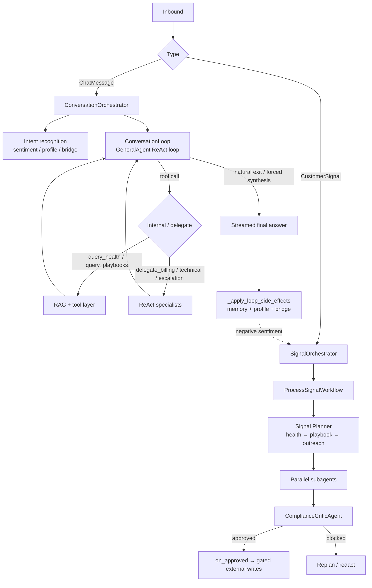

# Agent Implementation Plan

> Implementation blueprint for the CustomerAgent backend (`apps/`, `packages/`) and the ReactJS
> frontend. Read alongside `README.md` for system context and `CLAUDE.md` for run/build rules.
> This is the single source-of-truth design document: it describes the **implemented** system,
> its contracts, and data flow. Concrete signatures live in the code, which is authoritative
> where the two ever diverge.

---

## 1. Scope

The agent engine handles all AI-driven decision-making and action execution in the platform:

- Run customer-facing chat turns (interactive, low-latency, streaming).
- Detect and react to customer-success signals (usage/health drops, renewal risk, negative
  sentiment) proactively.
- Extract durable user profiles from conversation and persist them for health analysis.
- Retrieve tenant playbooks via RAG (pgvector ANN) so answers and outreach follow business rules.
- Run NPS and QBR campaigns with gated email delivery.
- Execute side-effecting tools safely (email) only after compliance approval.

Out of scope / deferred: Temporal **durable long-waits** (`packages/session`, e.g. "wait 48h then
follow up"), Langfuse tracing depth, LangGraph durable workflows, and the richer tools that are
still deterministic stubs (`check_human_availability`, `process_refund`, `escalate_to_human`).

---

## 2. Architecture: Two Top-Level Systems, One Shared Runtime, Disjoint Specialists

The platform runs **two** top-level agent systems because proactive automation and customer
conversation have different latency, memory, safety, and output needs. They share a runtime but
use **disjoint specialist subagents** — the only specialist both may use is playbook retrieval.

| System | Input | Purpose | Lifecycle |
|---|---|---|---|
| `ConversationOrchestrator` | `ConversationAgentInput` / `ChatMessage` | Customer-facing chat turns | **Orchestrator-Workers** (GeneralAgent ReAct loop) |
| `SignalOrchestrator` | `SignalAgentInput` / `CustomerSignal` | Proactive customer-success automation | **P-E-R over Temporal** (deterministic planner + critic) |

Both subclass `BaseOrchestrator` (`apps/agent_service/src/agent/orchestrator/base.py`), which owns
the request end to end: tenant config + constraints, memory selection and durable writes, and the
shared execution/response-assembly machinery. The two systems **diverge** in lifecycle and critic:

- **Conversation** runs a single `GeneralAgent` bounded ReAct loop; it **embeds** its compliance
  rules in a `SKILL.md` and self-checks its draft (no separate critic LLM call). Its
  `build_plan` is an unused stub.
- **Signal** keeps the deterministic `Planner → Executor → Reflector` lifecycle with a separate
  `ComplianceCriticAgent` that gates every outgoing write.

### 2.1 Conversation path — Orchestrator-Workers

`ConversationOrchestrator` drives a `ConversationLoop`
(`apps/agent_service/src/agent/conversation/conversation_loop.py`) — a single `GeneralAgent`
running a bounded ReAct loop (`MAX_REACT_LOOPS = 6`). The GeneralAgent:

1. receives the customer message directly,
2. reasons, then calls internal tools (`query_health`, `query_playbooks`) and specialist
   **delegate tools** (`delegate_billing`, `delegate_technical`, `delegate_escalation`) as needed,
3. is its own critic — the compliance/PII/tenant/tone/grounding rules are embedded in its
   `skills/demo-tenant/general_support/SKILL.md`,
4. produces the final customer-facing reply itself, streamed token-by-token.

The loop terminates in exactly one of two ways, and both end with a real, model-authored,
streamed reply:

- **Natural exit** — the model returns a response with no tool calls.
- **Forced Synthesis** — at `MAX_REACT_LOOPS` without a tool-free answer, all tools are stripped
  and a system directive commands an immediate final answer from the information gathered (a
  single terminal LLM call, so it cannot loop again).

Intent recognition still runs at the start of each turn (see §7), but its output feeds the
**sentiment label, profile distillation, and the conversation→signal bridge** — not routing.
Delegation is decided by the GeneralAgent. Full design: `note/conversation_system.md`.

### 2.2 Signal path — P-E-R over Temporal

`SignalOrchestrator` (`apps/agent_service/src/agent/signal/signal_orchestrator.py`) runs the
deterministic P-E-R lifecycle, with Temporal owning durable orchestration (retries, dedupe,
status transitions) around it:

1. **Planner** — `signal_planner.py::build_signal_plan` builds a deterministic
   `health_analysis → playbook_retrieval → outreach_draft` chain.
2. **Executor** — dependency-aware parallel subagents.
3. **Reflector** — `ComplianceCriticAgent` (always on; `supports_external_writes = True`).
4. **`on_approved`** — persist profile, then release compliance-approved external writes through
   the tool-gateway MCP.

Temporal workflows (`apps/temporal_worker/src/workflows.py`, `nps_workflows.py`, `qbr_workflows.py`)
wrap each signal (`ProcessSignalWorkflow`), each scan (`TenantSignalScanWorkflow`), and each NPS
(`NpsCampaignWorkflow`) / QBR (`GenerateTenantQbrWorkflow`) campaign. Full design:
`note/signal_system.md`.

### 2.3 Specialist subagents (disjoint sets)

| Role | Signal | Conversation | Purpose |
|---|---|---|---|
| `GeneralAgent` | — | **Orchestrator** | Runs the ReAct loop; answers greetings/direct lookups itself |
| `BillingAgent` | — | Yes (via `delegate_billing`) | Billing / refund / invoice / subscription turns |
| `TechnicalAgent` | — | Yes (via `delegate_technical`) | Troubleshooting / error-diagnosis turns |
| `EscalationAgent` | — | Yes (via `delegate_escalation`) | Explicit escalation / critical-urgency turns |
| `HealthAnalysisAgent` | Yes | **No** | Analyze health score, usage trend, tickets, NPS, renewal + profile risk |
| `OutreachDraftAgent` | Yes | **No** | Draft customer-safe proactive outreach (apology, renewal, at-risk) |
| `NpsOutreachAgent` | Yes | **No** | NPS survey creation, candidate selection, NPS aggregation |
| `QbrReportAgent` | Yes | **No** | QBR narrative from the portfolio snapshot |
| `PlaybookRetrievalAgent` | Yes | Yes | Retrieve + rank tenant playbooks (the only shared specialist) |
| `ComplianceCriticAgent` | Yes | **No** (embedded in GeneralAgent SKILL.md) | Reflector: review results before writes/output |

Conversation delegates are surfaced to the GeneralAgent as tools, not as subagents invoked by a
planner. Subagents receive only their objective, local params, allowed-tool list, memory slice,
injected skills, and dependency markdown; they run an internal ReAct loop and return a structured
`SubagentResult`, then are discarded. They never write long-term memory, emit final
customer-visible output, or read unrelated tenant/global context.


```mermaid
flowchart TD
    A[Inbound] --> B{Type}
    B -->|ChatMessage| C[ConversationOrchestrator]
    B -->|CustomerSignal| S[SignalOrchestrator]

    %% ---- Conversation path: GeneralAgent ReAct ----
    C --> I[Intent recognition<br/>sentiment / profile / bridge]
    C --> CL[ConversationLoop<br/>GeneralAgent ReAct loop]
    CL -->|tool call| T{Internal / delegate}
    T -->|query_health / query_playbooks| RAG[RAG + tool layer]
    T -->|delegate_billing / technical / escalation| SP[ReAct specialists]
    SP --> CL
    RAG --> CL
    CL -->|natural exit / forced synthesis| STR[Streamed final answer]
    STR --> SE[_apply_loop_side_effects<br/>memory + profile + bridge]

    %% ---- Signal path: P-E-R over Temporal ----
    S --> TW[ProcessSignalWorkflow]
    TW --> SP2[Signal Planner<br/>health → playbook → outreach]
    SP2 --> EX[Parallel subagents]
    EX --> CC[ComplianceCriticAgent]
    CC -->|approved| OA[on_approved → gated external writes]
    CC -->|blocked| RR[Replan / redact]

    SE -.negative sentiment.-> S
```

### 2.4 Deviations from the reference project (EchoMind)

- **pgvector, not ChromaDB.** All retrieval and memory vectors live in Postgres/pgvector via
  `packages/knowledge_service`.
- **LLM gateway, not direct SDK.** All LLM calls go through `apps/agent_service/src/agent/llm_client.py`
  (interim shim over OpenRouter, OpenAI-compatible). Caching/circuit reuse `packages/llm_gateway`.
- **Multi-tenant + English-only.** Every domain object carries `tenant_id`; all prompts/skills are
  English.
- **Real embeddings with offline fallback.** `qwen/qwen3-embedding-8b` (1536-dim) through
  OpenRouter, falling back to a deterministic local hash vector when unavailable.

---

## 3. File Layout

```
apps/agent_service/src/agent/
├── llm_client.py                     # thin llm_gateway/OpenRouter client (all phases, + real streaming)
├── conversation/
│   ├── conversation_orchestrator.py  # ConversationOrchestrator: run/run_stream + signal bridge
│   ├── conversation_loop.py          # ConversationLoop (GeneralAgent ReAct, MAX_REACT_LOOPS=6)
│   ├── delegates.py                  # delegate_billing / _technical / _escalation tools
│   ├── intent.py                     # three-way fused intent recognition (sentiment/profile/bridge)
│   ├── chat_handler.py               # handle_chat_turn() wrapper
│   ├── streaming.py                  # SSE adapter (streams LLMClient deltas)
│   └── subagents/                    # conversation-ONLY specialists (billing/technical/escalation)
├── signal/
│   ├── signal_orchestrator.py        # SignalOrchestrator: P-E-R CustomerSignal workflows
│   ├── signal_planner.py             # deterministic health→playbook→outreach plan
│   └── signal_reducer.py             # proactive action candidates + escalation
├── subagents/                        # signal specialists + shared playbook + critic + factory
│   ├── base.py                       # BaseSubagent protocol + ReActSubagent
│   ├── health_analysis.py            # signal-only
│   ├── outreach_draft.py             # signal-only
│   ├── nps_outreach.py               # signal-only (NPS survey/aggregation)
│   ├── qbr_report.py                 # signal-only (QBR narrative)
│   ├── playbook_retrieval.py         # shared (signal + conversation)
│   ├── compliance_critic.py          # signal Reflector
│   └── __init__.py                   # domain-aware role→subagent factory
├── orchestrator/
│   ├── base.py                       # shared base (config/memory/delegation/reduce/assemble)
│   ├── reducer.py                    # SubagentResult aggregation
│   └── policy.py                     # approval/guardrail + per-role tool policy
└── runtime/
    ├── react_loop.py                 # shared ReAct primitive (+ embedded tool-call JSON recovery)
    ├── delegation.py                 # orchestrator→subagent dispatch, parallel batches
    ├── context.py                    # context packing + memory slices + budgets
    ├── prompts.py                    # subagent system-prompt builder (+ skill injection)
    ├── tool_caller.py / tool_dispatch.py  # tool execution (internal vs MCP-action boundary)
    ├── skills.py                     # dynamic skill loading + injection (SkillManager)
    ├── monitor.py                    # performance monitor + routing-penalty feedback loop
    └── mcp/
        ├── tool_layer.py             # validate / cache / circuit / fallback wrapper
        └── retrieval.py              # query rewrite + parallel recall + rerank over pgvector

apps/agent_service/src/signals/
├── normalizer.py                     # raw payload → CustomerSignal (idempotency/dedup keys)
├── queue.py                          # enqueue/dedupe/dequeue signals
├── detectors.py                      # renewal-risk/low-health/usage/ticket/sentiment detectors
└── records.py                        # durable signals rows (dashboard)

apps/temporal_worker/src/             # Temporal worker (replaces the old rq_worker Redis poller)
├── worker.py                         # worker + schedule creation (scan/NPS/QBR)
├── workflows.py                      # ProcessSignalWorkflow, TenantSignalScanWorkflow
├── nps_workflows.py / nps_activities.py   # NPS campaign workflow + activities
├── qbr_workflows.py / qbr_activities.py   # QBR generation + delivery
├── email_delivery.py                 # send_approved_email (shared NPS/QBR delivery helper)
└── client.py / temporal.py           # Temporal client + connection

apps/tool_gateway/src/                # MCP action sandbox
├── index.py                          # streamable-HTTP MCP server
├── service.py                        # approval → idempotency → schema → send gating
├── approval.py / idempotency.py      # approval + idempotency primitives
├── email_providers.py                # mock / console / google providers
└── contracts.py / providers.py

apps/api_gateway/src/
├── app.py                            # FastAPI app: lifespan, CORS, health, skills, route mounts
└── routes/
    ├── chat.py                       # POST /chat/turn (tenant-scoped, SSE)
    └── signals.py                    # POST /signals/scan, POST /signals, GET /signals, GET /customers

packages/agent/src/
├── types.py                          # CustomerSignal, SessionContext, AgentResponse, LLMUsage
├── config.py                         # AgentConfig per tenant
├── chat_types.py                     # ChatMessage, ChatRequest, ChatResponse
├── orchestration_types.py            # AgentInput variants, OrchestratorPlan, ComplianceReview, FinalDecision
├── subagent_types.py                 # AgentRole, SubagentTask, ...
└── memory.py                         # three-tier conversation memory + profile distillation

packages/knowledge_service/src/       # embed.py (real+fallback), retrieve.py, ingest.py (pgvector)
packages/tool_system/src/             # registry.py + tools/ (query_health, query_playbooks, send_email, notify_csm, ...)
skills/<tenant>/<skill>/SKILL.md      # tenant-scoped hot-loadable skills (front matter + body)
scripts/seed_playbooks.py             # chunk → embed → store playbook markdown into pgvector
frontend/                             # Vite + React: Chat view + Signal dashboard
```

---

## 4. Data Models & Database

All Python types use Pydantic v2. Database schema lives in
`infra/docker/packages/db/scripts/init.sql` (auto-run on first Postgres init).

### 4.1 Orchestrator/subagent contracts

| Model | Created by | Consumed by | Purpose |
|---|---|---|---|
| `OrchestratorPlan` | Planner (signal) | Delegation manager | Ordered role-based subagent sequence |
| `SubagentTask` | Planner (signal) | Ephemeral subagent | Scoped objective, tool boundary, dependency contract |
| `SubagentContextPacket` | Delegation manager | Ephemeral subagent | Tenant-safe local context, memory slice, prior markdown |
| `SubagentResult` | Ephemeral subagent | Reducer + critic | Structured result, markdown summary, tool evidence |
| `ComplianceReview` | Reflector (signal) | Orchestrator | Approval, redactions, findings, blocked writes |
| `FinalDecision` | Orchestrator | API/worker caller | Approved response/action payload only |

The conversation path does not build an `OrchestratorPlan` — the GeneralAgent decides its own tool
sequence. Its `SubagentTask`/`OrchestratorPlan` types exist but are unused on the conversation side.

### 4.2 Schema

- `knowledge_chunks.embedding` → **`VECTOR(1536)`** to match `qwen/qwen3-embedding-8b` (HNSW cosine
  index preserved; a fresh volume is required after the dimension change).
- **`customer_profiles`** (RLS, tenant-scoped, one row per customer): preferences, sentiment/risk
  signals, communication preferences, last intent/sentiment, updated_at. Upserted from conversation
  profile distillation; read by `query_health`.
- **`signals`** (dashboard-facing durable record): tenant_id, customer_id, type, severity, payload,
  status (queued/processing/done/failed), source (detector/chat_bridge/nps_detractor/manual),
  created_at, processed_at.

---

## 5. Retrieval, Embeddings & Playbook RAG

### 5.1 Embeddings (`packages/knowledge_service/src/embed.py`)

`embed_text()` calls the OpenAI-compatible `/embeddings` endpoint
(`EMBEDDING_MODEL=qwen/qwen3-embedding-8b`, 1536-dim) via `AsyncOpenAI`. On any error or missing
key it logs once and falls back to `local_embedding(text, dims=1536)` — a deterministic character
n-gram hash vector — so retrieval, intent fusion, and tests always run offline.

### 5.2 MCP tool layer + retrieval optimization (`runtime/mcp/`)

Every tool call passes through `tool_layer.py`: JSON-schema validation → cache check → circuit-breaker
check → execute with timeout → record stats → fallback on failure/open-circuit. For retrieval tools,
`retrieval.py` runs: LLM query rewrite → parallel recall over pgvector → merge/dedupe → LLM rerank →
top-K, with an explicit empty-but-successful fallback when nothing matches.

### 5.3 Playbook seeding (`scripts/seed_playbooks.py`)

Tenant playbooks are authored as markdown under `skills/<tenant>/playbooks/`. The seed script chunks
each file, embeds each chunk (§5.1), and stores it into `knowledge_chunks` (collection
`playbooks`). After seeding, `query_playbooks` returns real ANN matches.

---

## 6. Dynamic Skills

A skill is a hot-loadable business-rule block that augments a subagent's system prompt — or, for the
conversation GeneralAgent, embeds its compliance + delegation rules. Skills are tenant-scoped files
at `skills/<tenant>/<skill>/SKILL.md` with minimal front matter (`name`, `description`, `keywords`,
`agents`, `enabled`) and a markdown body. `SkillManager` (`runtime/skills.py`) discovers/loads them,
supports `reload()`, and injects matching skills within a length budget. Skills are advisory —
system role and safety boundaries always win.

---

## 7. Intent Recognition (Conversation)

`agent/conversation/intent.py` runs at the start of each conversation turn (three-way fused: LLM
semantic + embedding similarity + keyword pattern, weighted vote, `OTHER` below threshold). It
derives an `IntentCategory`, `UrgencyLevel`, and extracted entities.

Its output now feeds **three** things in `conversation_orchestrator.py`:

1. **Sentiment label** — coarse sentiment for the profile update.
2. **Profile data** — `last_intent` / `last_sentiment` and extracted entities for the
   `customer_profiles` upsert.
3. **Conversation→signal bridge** — `_should_bridge_to_signal` enqueues a `negative_sentiment`
   signal when the intent is `COMPLAINT` / `ESCALATION` or urgency is `HIGH`.

It does **not** drive routing — delegation is decided by the GeneralAgent in its ReAct loop. The
signal system does not use intent (it is triggered by typed backend events).

---

## 8. Memory & User Profile

### 8.1 Three-tier conversation memory (`packages/agent/src/memory.py`)

| Tier | Store | Contents | Lifetime |
|---|---|---|---|
| Working | Redis | Most recent N messages of the live session | 24h TTL |
| Episodic | pgvector (`knowledge_service`) | LLM-compressed summaries of past conversation | Persistent |
| User profile | Postgres `customer_profiles` + pgvector | Distilled long-term preferences + risk/sentiment | Persistent |

`runtime/context.py` fuses tiers for the orchestrators, bounded by a context budget.

### 8.2 Profile persisted to Postgres (feeds health analysis)

`ConversationMemory.update_profile` distills the profile from the conversation and upserts the
structured `customer_profiles` row. `query_health` `LEFT JOIN`s it and returns profile-derived
`sentiment` and `risk_signals`, so `HealthAnalysisAgent` uses chat-learned signals. The profile
slice given to signal subagents is tenant-scoped, read-only, and PII-masked.

---

## 9. Multi-Agent Routing & Parallel Collaboration

- **Conversation** — routing is *agent-decided*: the GeneralAgent selects `delegate_*` tools by
  domain (billing/technical/escalation) and answers simple/direct turns itself. Performance-aware
  tool layer avoids open-circuit tools; a delegate failure degrades to a safe fallback answer.
- **Signal** — routing is *planner-driven*: the deterministic `health → playbook → outreach` chain
  is executed by `DelegationManager` in dependency-aware batches (independent tasks run
  concurrently; dependent tasks wait for `depends_on`).

The monitor (§10) feeds both, downgrading unhealthy roles/tools.

---

## 10. Monitor Auto-Downgrade Feedback Loop

`runtime/monitor.py` collects lightweight per-role/tool stats (total, success, latency, consecutive
failures) inline during execution, applies sliding-window anomaly detection, and converts poor
performance into a per-role/tool routing penalty. On the next run, performance-aware routing prefers
healthier roles and the MCP layer avoids open-circuit tools. Penalties decay as performance recovers.
Both orchestrators feed the same monitor.

---

## 11. Signal System

Proactive customer-success automation, triggered by typed backend events — never inferred chat
intent.

### 11.1 Triggers & detectors (`apps/agent_service/src/signals/`)

| Detector | Signal type | Default threshold |
|---|---|---|
| renewal risk | `renewal_risk` | `renewal_date` within 60 days |
| low health | `low_health` | `health_score` < 50 |
| usage decline | `usage_decline` | active users drop > 30% |
| composite risk | `renewal_usage_risk` (critical) | usage decline + imminent renewal |
| ticket spike | `support_ticket_spike` | recent tickets ≥ 5 |
| negative sentiment | `negative_sentiment` | profile `risk_signals` / negative `last_sentiment` |

Additional trigger sources: the conversation→signal bridge (→ `negative_sentiment`), NPS detractor
scores (→ `nps_detractor`), and manual `POST /signals`. Detectors run on demand via
`POST /signals/scan` (Temporal `TenantSignalScanWorkflow`) or on the scan schedule.

### 11.2 Flow

1. Ingestion normalizes the payload into a `CustomerSignal`, applies idempotency/dedup, and records
   a `signals` row.
2. `ProcessSignalWorkflow` drives `SignalOrchestrator`: load config → `build_signal_plan`
   (`health_analysis → playbook_retrieval → outreach_draft`) → execute in batches.
3. `ComplianceCriticAgent` reviews aggregated results + proposed writes (always on).
4. The reducer produces a `FinalDecision`; `on_approved` releases approved writes through the
   tool-gateway (approval + idempotency enforced), writes durable memory/audit, and marks the
   `signals` row `done`.

---

## 12. Conversation System

Synchronous, customer-facing chat, triggered by a customer message. See
`note/conversation_system.md` for the full redesign.

### 12.1 Flow

1. `POST /chat/turn` (tenant-scoped) → `handle_chat_turn()` → `ConversationOrchestrator.run` /
   `run_stream`.
2. Intent recognition runs (§7) for sentiment/profile/bridge.
3. `ConversationLoop` (GeneralAgent) runs the bounded ReAct loop: reason → call internal tools
   (`query_health`, `query_playbooks`) and/or delegate tools (`delegate_billing` / `_technical` /
   `_escalation`) → repeat, until a tool-free answer (natural exit) or the step cap (Forced
   Synthesis).
4. The final answer is streamed token-by-token through `LLMClient.stream()`.
5. `_apply_loop_side_effects` records the turn to memory, **fire-and-forgets** the profile update
   (a failure there is swallowed and never fails the turn), and — if warranted — fires the
   conversation→signal bridge (§12.3).

### 12.2 Streaming

`LLMClient.stream()` uses `stream=True` and forwards provider deltas as they arrive; intermediate
reasoning/tool steps are never streamed. The SSE adapter (`streaming.py`) maps them to
`status`/`token`/`done`/`error` events. The old cosmetic streaming (buffer then re-chunk) was
removed.

### 12.3 Conversation → signal bridge

When a turn reveals proactive follow-up (negative sentiment, complaint, escalation),
`_apply_loop_side_effects` enqueues a `CustomerSignal` (source `chat_bridge`, e.g.
`negative_sentiment`) so the signal system can analyze / apologize / notify the CSM. The
conversation response stays bounded and never sends outreach inline.

---

## 13. Integration Points

- **Chat endpoint** (`apps/api_gateway/src/routes/chat.py`): authenticated, tenant-scoped; SSE;
  PII masking applies to input before the LLM.
- **Signals endpoints** (`routes/signals.py`): `POST /signals/scan`, `POST /signals`, `GET /signals`,
  `GET /customers`.
- **NPS / QBR endpoints**: `POST /nps/surveys/{id}/response`, `POST /qbr/generate` (+ inline
  fallback when Temporal is down).
- **Signal worker** (`apps/temporal_worker/src/worker.py`): Temporal worker draining signal/NPS/QBR
  workflows; creates the scan/NPS/QBR schedules (env-gated tenant allowlists).
- **Tool gateway** (`apps/tool_gateway`): MCP server exposing only side-effecting action tools
  (`send_email`, `escalate_to_human`) with approval + idempotency; internal read tools run
  in-process.
- **LLM client**: all LLM calls go through `llm_client.py` (interim) / `packages/llm_gateway`.

---

## 14. Deployment (Docker)

All services run as Docker Compose services on `postgres_network`, env from `infra/docker/.env` +
per-service env:

| Service | Image/build | Port | Role |
|---|---|---|---|
| `postgres` | `pgvector/pgvector:pg14` | 5433 | DB (+ pgvector, RLS, init.sql) |
| `redis` | `redis:7-alpine` | 6379 | working memory, queue, dedupe |
| `temporal` | temporal (server) | 7233 | signal/NPS/QBR workflow orchestration |
| `tool-gateway` | `apps/tool_gateway/Dockerfile` | 8002 | MCP action sandbox |
| `api-gateway` | `apps/api_gateway/Dockerfile` | 8000 | FastAPI: chat + signals + NPS/QBR + dashboard |
| `agent-worker` | `apps/agent_service/Dockerfile` | — | Temporal worker (drain + schedules) |

`start.sh` brings the stack up; a fresh DB (`down -v`) is required once for the 1536-dim change.

---

## 15. Frontend

`frontend/` — Vite + React, two views:

- **Chat** — calls `POST /chat/turn` (SSE); shows the reply as it streams, with a graceful
  `stream_incomplete` fallback if the stream drops.
- **Dashboard** — customers table (health score, renewal date), signals list (type/severity/status/
  source), a **Run scan** button hitting `/signals/scan`, and a skills viewer.

Dev via `npm run dev` proxying to `:8000`.

---

## 16. Implementation Status

The migration is complete and verified. Chronology of the major pieces:

1. **DB schema** — `VECTOR(1536)`, `customer_profiles`, `signals` (fresh volume applied).
2. **Embeddings** — real OpenAI-compatible `embed_text` + 1536-dim fallback.
3. **Profile → PG** — `update_profile` upserts `customer_profiles`; `query_health` joins it.
4. **Conversation migration** — `conversation_loop.py` + `delegates.py` (GeneralAgent ReAct);
   removed `conversation_planner.py` / `llm_planner.py` / `capability_catalog.py`.
5. **Signal finalization** — detectors, conversation→signal bridge, NPS + QBR workflows, gated
   `send_email` delivery, Temporal schedules.
6. **Tool gateway** — MCP action sandbox (approval + idempotency + email providers).
7. **Security hardening** — embedded tool-call JSON recovery in `react_loop.py` (no raw tool-call
   leakage to customers).
8. **Frontend** — chat + dashboard, smoke-tested against the running API.

---

## 17. Verification Gate

1. `docker compose -f infra/docker/docker-compose.yml down -v && ./start.sh` — fresh 1536-dim DB.
2. `python -m pytest tests/ -v` — full suite green (offline + live-backend tiers).
3. `python scripts/seed_playbooks.py`, then `query_playbooks` → non-empty ANN matches.
4. `python scripts/verify_e2e.py` — RAG, `query_health`, chat, signal bridge, detector + worker
   drain (all three checks).
5. `python scripts/smoke_live_api.py` — live OpenRouter smoke: intent + refund/escalation turns.
6. Frontend smoke-tested against the running API.

---

## 18. Invariants

- Signal and conversation are separate top-level systems on one shared runtime, with **disjoint**
  specialist sets; playbook retrieval is the only specialist both may use.
- The conversation path is Orchestrator-Workers (GeneralAgent ReAct) with **no separate critic LLM
  call**; the signal path keeps the deterministic planner + `ComplianceCriticAgent`.
- Subagents stay ephemeral and bounded; they never emit final output or write durable memory.
- Write actions are proposed by subagents and emitted only by the orchestrator after compliance
  approval, with approval + idempotency enforced at the tool gateway.
- Conversation memory is three-tier (Redis + pgvector); the signal system consumes only the shared
  user-profile tier (also persisted in `customer_profiles`).
- All retrieval and vectors use pgvector via `knowledge_service`; there is no ChromaDB.
- Embeddings are 1536-dim (real API) with a deterministic offline fallback; the DB vector column
  matches.
- All LLM calls go through the LLM client/gateway; caching and circuit breaking are reused.
- Dynamic skills are tenant-scoped and advisory; system role and safety boundaries always win.
- Signal orchestration runs on Temporal (workflows + schedules); the only remaining deferred pieces
  are durable long-waits, Langfuse tracing depth, and the `check_human_availability` /
  `process_refund` / `escalate_to_human` prototype stubs.
