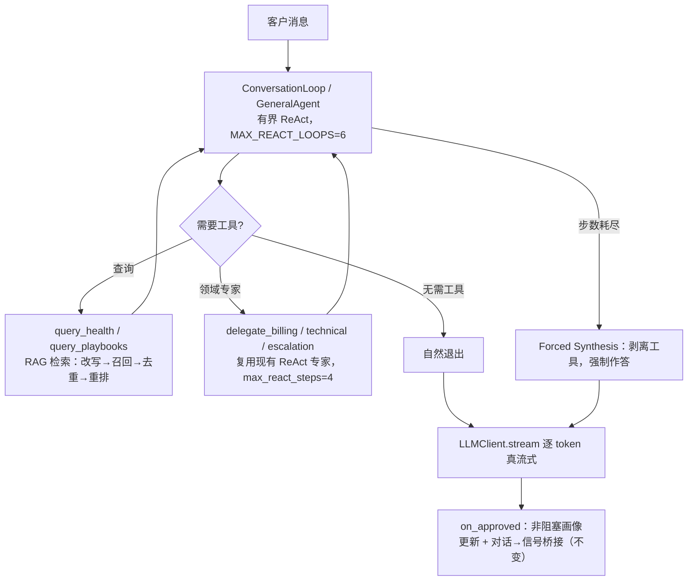

# 对话系统（Conversation System）

> 面向客户的实时聊天系统。客户发来一条消息，系统经过意图识别、角色路由、子代理执行、
> 合规审查后，返回（或流式返回）一条合规、有据可依的回复，并把该轮沉淀进客户画像。
>
> 本文档先描述**当前已接线的架构**（Planner → Executor → Reflector），再引入一套
> **用于降低延迟的新架构**（GeneralAgent / Orchestrator-Workers，代码已就绪但尚未接入）。

---

## 1. 系统定位与职责

对话系统是"客户成功自动化平台"两条顶层主线之一（另一条是信号系统），负责**同步、低延迟**的
客户会话。它：

- 只读回答客户，**不直接对外写**（`supports_external_writes=False`），不发送邮件、不升级到真人；
- 通过**合规守门（Compliance Critic）**保证输出不泄露租户数据 / PII / 密钥，不做出无依据承诺；
- 在回复之后**异步**沉淀客户画像，并在客户表达负面情绪时**桥接**到信号系统做后续跟进。

---

## 2. 当前架构（现状）

### 2.1 请求入口

```
POST /chat/turn   ──►   routes/chat.py::chat_turn
                          │
                          ├─ stream=false ─► handle_chat_turn() ─► run_conversation_agent()
                          └─ stream=true  ─► stream_approved_response()  (SSE)
```

- `apps/api_gateway/src/routes/chat.py`：租户鉴权 + `X-Tenant-Id` 校验。
- `apps/agent_service/src/agent/conversation/chat_handler.py`：把请求包装成
  `ConversationAgentInput` 后交给编排器。
- `apps/agent_service/src/agent/conversation/conversation_orchestrator.py`：
  `ConversationOrchestrator` 继承 `BaseOrchestrator`，是对话的顶层编排器。

### 2.2 生命周期：Planner → Executor → Reflector

`ConversationOrchestrator` 与 `SignalOrchestrator` 共享同一个 `BaseOrchestrator.run()`
（`apps/agent_service/src/agent/orchestrator/base.py`），流程如下：

```
Planner      build_plan()        意图识别 + 角色路由 → OrchestratorPlan
Executor     execute_tasks()     依赖感知并行地运行各子代理
Reflector    _reflect()          合规审查（可对低风险计划跳过）
Finalize     finalize_decision() 门控是否真正"发出"回复
on_approved                      记忆写入 + 异步画像更新 + 信号桥接
```

对话编排器只实现领域钩子（`load_config` / `load_tenant_constraints` /
`load_memory_excerpt` / `build_plan` / `on_approved`），共享生命周期**不重复实现**。

### 2.3 意图识别（Intent Recognition）

`apps/agent_service/src/agent/conversation/intent.py` 在每轮对话开始时执行，对一句话做
**三路融合投票**：

| 策略 | 权重 | 说明 |
|---|---|---|
| LLM 语义分类 | 0.70 | 用 mini 模型（`OPENROUTER_MINI_MODEL`，回退 `worker_model`）做意图分类 |
| 本地 embedding 相似度 | 0.20 | 与模板向量做余弦相似度 |
| 关键词模式匹配 | 0.10 | 硬编码关键词表（manager/refund/error …） |

产出 `IntentCategory`（query / greeting / complaint / technical / billing / account /
escalation / feedback / request / other）、`UrgencyLevel`（LOW/MEDIUM/HIGH/CRITICAL）与
`entities`（订单号 / 产品 / 金额 / 错误码 + `preferences` / `risk_signals` /
`sentiment_signals` 等画像信号）。

> ⚠️ 意图识别本身就有 **2 次 LLM 调用**：一次分类、一次实体抽取（`_extract_entities`），
> 即使是"你好"这种问候语也照跑。这是当前架构的延迟来源之一。

### 2.4 规划器（Planner）：LLM 角色选择 + 确定性回退

`apps/agent_service/src/agent/conversation/conversation_planner.py::build_conversation_plan`
把"意图"映射成一张子代理计划（`OrchestratorPlan`）：

1. **快路径**：`greeting / feedback / query` 且 urgency ≤ MEDIUM → 只用 `GeneralAgent`，
   且 `requires_critic=False`（低风险，可跳过合规审查与 LLM 规划器）。
2. 否则 `_select_roles()`：
   - **强制升级**（可信代码，不看模型）：`CRITICAL` 或 `escalation` → 直接 `EscalationAgent`；
   - **LLM 规划器**（`llm_planner.py::select_roles`）：让 mini 模型从**白名单角色**里选 1~2 个
     专家（general/technical/billing/escalation），12s 超时、置信度 < 0.5 或输出非法即回退；
   - **确定性回退**（`_route_roles`）：按意图 + 关键词路由（如 billing 关键词 → BillingAgent，
     复合轮次并行 fan-out）。
3. `_assemble_plan()`：需要时加一个 `playbook`（政策/规则检索）任务作为前置依赖，多个回答任务
   相互独立以便并行。

**安全护栏全部由代码强制**：固定角色白名单、CRITICAL/升级强制、每角色工具授予表
（`_ROLE_TOOLS`）、回答角色数上限（`MAX_ANSWER_ROLES=2`）。LLM 永远不选工具、依赖或 fan-out。

### 2.5 执行器（Executor）：临时子代理并行

`apps/agent_service/src/agent/runtime/delegation.py::execute_tasks` 按**依赖感知批次**运行
子代理（`asyncio.gather` 每批并发；`depends_on` 就绪才执行）：

| 角色 | 领域 | 允许工具 | 说明 |
|---|---|---|---|
| `GeneralAgent` | 对话 | query_health, query_playbooks | 默认回答 / 兜底 |
| `TechnicalAgent` | 对话 | query_health, query_playbooks | 故障 / 报错 / 登录认证 |
| `BillingAgent` | 对话 | + process_refund | 账单 / 退款 / 发票 / 订阅 |
| `EscalationAgent` | 对话 | + check_human_availability | 人工 / 经理 / 法规威胁 / 紧急 |
| `PlaybookRetrievalAgent` | 共享 | query_playbooks | RAG 政策检索（依赖前置） |

每个子代理是一个有界的 ReAct 循环（回答任务最多 **3 步**、最多 900 token），临时创建、
用完即弃，无长期记忆、无持久副作用。对话与信号系统的专家集合**互斥**，共享运行时但
不能互相实例化对方专家。

### 2.6 反思器（Reflector）：合规守门

`apps/agent_service/src/agent/subagents/compliance_critic.py::run_compliance_critic`
在对外输出前审查聚合结果（租户隔离 / PII / 密钥 / 越权承诺 / 事实依据 / 语气），用
planner 模型，输出结构化 `ComplianceReview`。

- 当 `skip_critic_for_simple=True` 且计划低风险（general/technical、无 billing/escalation、
  无政策、非 CRITICAL）时，**跳过这次 LLM 审查**（已在下文中作为延迟优化之一）。
- 审查不通过：带合规约束**重试一次**；再不过则回退到固定安全话术（`SAFE_COMPLIANCE_FALLBACK`）。

### 2.7 审批副作用（on_approved）

`conversation_orchestrator.py::on_approved` 只在决策动作等于哨兵
`EMITTED_ACTION`（"可发出"）时执行：

1. 写对话记忆（用户 + 助手消息）；
2. **非阻塞**画像更新（`asyncio.create_task` fire-and-forget，失败不拖慢回复）；
3. **对话 → 信号桥接**：complaint / escalation / high-urgency 轮次入队一个信号
   （`negative_sentiment`，升级类转 `nps_detractor`），交给信号系统做后续分析/道歉/通知 CSM。
   聊天回答本身保持有界，不内联外呼。

### 2.8 流式输出

`apps/agent_service/src/agent/conversation/streaming.py::stream_approved_response` 当前是
**伪流式**：先 `await` 完整响应，再把整段文本切成 40 字符一个的"假 token"事件。
真正的逐 token 流式在新架构里才实现（见 §3）。

### 2.9 当前架构的延迟瓶颈

每轮对话是一条**串行 LLM 调用链**，每个环节都是一次（或多次）往返：

```
意图分类(LLM) → 实体抽取(LLM) → [LLM 角色规划] → 每个子代理 ReAct 步骤(LLM) → 合规审查(LLM)
     1                 2              3(快路径跳过)        ≥1 次/子代理              1(简单计划跳过)
```

- 一次普通技术/账单轮次，最坏约 **5~7 次 LLM 往返**（意图 2 + 规划 1 + 子代理 ≥1 + 审查 1）；
- 网络抖动（本机到 OpenRouter DNS 不稳）时，单次调用可能触发 30s 超时 + 重试，绝对延迟被网络放大；
- 伪流式导致**首字延迟（TTFB）等于整段生成时间**，用户体验差；
- 子代理是"先全部拉起再跑"的规划式 fan-out，简单轮次也可能被过度路由。

---

## 3. 新架构：降低延迟的 GeneralAgent / Orchestrator-Workers

> 目标：用**更少的 LLM 往返** + **真流式** 显著降低每轮延迟与首字延迟，同时**不牺牲**合规
> 与租户隔离。

### 3.1 核心思想

把"**规划器选出专家 → 并行拉起子代理 → 独立合规审查**"这条多 LLM 流水线，收敛成一个
**单一编排者（GeneralAgent）** 的有界 ReAct 循环：

- 客户消息直接交给 GeneralAgent；
- 它自己推理，需要时才**按需调用**内部只读工具（`query_health` / `query_playbooks`）与
  三个**专家委托工具**（`delegate_billing` / `delegate_technical` / `delegate_escalation`）；
- 它**自己做自己的审查员**——合规/PII/租户/语气/事实规则直接内嵌在它的 `SKILL.md` 里，
  不再有独立的合规 LLM 调用；
- 它自己产出最终回复，并**逐 token 真流式**返回。

相关代码（已就绪）：

| 关注点 | 文件 |
|---|---|
| 编排循环（自然退出 + 强制合成 + 流式） | `apps/agent_service/src/agent/conversation/conversation_loop.py` |
| 专家委托工具（把专家变成工具） | `apps/agent_service/src/agent/conversation/delegates.py` |
| 真流式 | `apps/agent_service/src/agent/llm_client.py`（`LLMClient.stream`） |
| SSE 适配 | `apps/agent_service/src/agent/conversation/streaming.py`（改造后） |
| 内嵌合规 + 委托规则 | `skills/demo-tenant/general_support/SKILL.md` |

### 3.2 架构图



### 3.3 与当前架构的对比

| 维度 | 当前（Planner→Executor→Reflector） | 新架构（GeneralAgent / Orchestrator-Workers） |
|---|---|---|
| 意图/实体识别 | 2 次独立 LLM 调用 | 移除（编排者直接理解） |
| 角色路由 | 独立 LLM 规划器（+ 确定性回退） | 移除（编排者自行决定是否委托） |
| 专家调用 | 规划式：先拉起再跑 | 按需：`delegate_*` 工具，需要才调 |
| 合规审查 | 独立 ComplianceCritic LLM 调用 | 内嵌在编排者 SKILL.md，自己自检 |
| 每轮 LLM 调用 | 5~7 次 | **2~3 次**（推理步骤 + 1 次流式合成） |
| 流式 | 伪流式（缓冲后重切块） | 真流式（`stream=True` 逐 token） |
| 兜底 | 合规重试 + 固定话术 | Forced Synthesis（剥离工具强制作答） |

### 3.4 延迟收益

1. **去掉独立合规审查调用**：历史评测里 `llm` 阶段（合规审查）占比从 **34.9% → 0%**。
2. **去掉意图/实体/规划器 LLM 调用**：普通轮次从 5~7 次往返降到 2~3 次。
3. **真流式**：首字延迟（TTFB）从"等于整段生成时间"降到"第一个 token 的到达时间"。
4. **双调用折叠**：推理步骤若已写出最终答案（`markdown` 非空），直接复用，**再省一次合成调用**。
5. **步骤内并发工具调用**：同一推理步骤里的多个工具（如 `query_health` + `delegate_billing`）
   用 `asyncio.gather` 并发，墙钟时间是其中最慢的一次，而非之和。
6. **有界性兜底**：`MAX_REACT_LOOPS=6` 内自然退出，否则 Forced Synthesis 保证每轮都有
   真实、有界的回复，不崩溃、不返回硬编码字符串。

### 3.5 安全与边界保持不变

新架构不是"砍掉安全"，而是把安全**内嵌**并保持原有边界：

- **工具层**：所有调用仍走 `dispatch_tool_call` → `MCPToolLayer`（熔断 / TTL 缓存 / 超时 /
  JSONSchema 校验 / 回退 / ToolStats），`delegate_*` 继承同一套韧性。
- **RAG 检索**：`query_playbooks` 仍走 `retrieve_with_optimization`（改写 → 并行召回 → 去重 → 重排）。
- **租户隔离**：`tenant_id`/`customer_id` 由会话上下文注入（`_inject_identity`），**绝不信任模型入参**。
- **合规规则**：从独立 Critic 的提示词迁移进 `general_support/SKILL.md`，编排者在发送前自检；
  信号系统路径的 `ComplianceCriticAgent` **保持不变**。
- **外部写禁入**：对话路径 `supports_external_writes` 仍为 `False`，委托专家拥有自己的
  工具白名单（billing 才有 `process_refund` 等）。

### 3.6 迁移/落地要点

- 目前 `conversation_loop.py` / `delegates.py` 与测试 `tests/test_conversation_loop.py`
  **已就绪但未接入运行路径**：`chat_handler.py` 仍走 `run_conversation_agent` →
  `ConversationOrchestrator.run()`。
- 落地时需把 `handle_chat_turn`（及 `stream_approved_response`）切到 `ConversationLoop.run_stream()`，
  并保留 `on_approved` 的非阻塞画像更新 + 信号桥接契约。
- 建议用 `CONVERSATION_LLM_PLANNER=0` 之类的开关做 A/B，或保留确定性路由作为回退，
  待稳定网络上重跑延迟评测确认增量。

---

## 4. 小结

- **当前架构**是"意图 → LLM 规划 → 子代理并行 → 合规审查"的**多 LLM 串行流水线**，安全、
  可回退，但每轮 5~7 次 LLM 往返 + 伪流式，延迟高。
- **新架构**把流水线收敛成**单一 GeneralAgent 的有界 ReAct 循环**：按需委托专家、
  内嵌合规、真流式，把每轮 LLM 调用降到 2~3 次、去掉独立审查调用，从而降低延迟与首字延迟。
- 两者的工具边界、RAG、租户隔离、信号桥接契约保持一致，风险可控。
