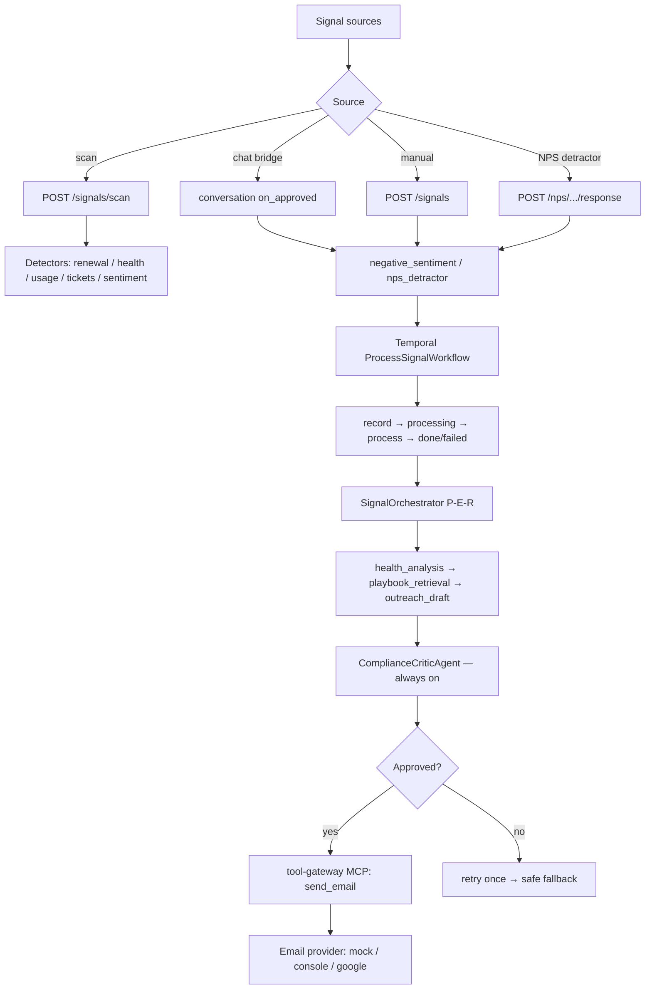

# Signal System

> Proactive customer-success automation. It does not serve live customer chat; it is driven by
> **typed backend events** — health-score drops, imminent renewals, usage declines, NPS detractors,
> negative sentiment learned in chat — which are analyzed, drafted, and compliance-reviewed before
> the system proactively initiates customer outreach or notifies the assigned CSM.
>
> This document covers the full signal system (sources, detectors, processing orchestration, NPS,
> QBR, email) and lists what is still simplified / stubbed.

---

## 1. Positioning

- One of the platform's two top-level systems, alongside the conversation system. Both share one
  runtime (`BaseOrchestrator`) but use **disjoint specialist sets**.
- Unlike the conversation system, `SignalOrchestrator.supports_external_writes = True` — it **may
  write externally** (email / CSM notify), so the compliance critic is **always on**
  (`skip_critic_for_simple=False`).
- **Temporal workflows** own durable orchestration (retries, dedup, state machine), replacing the
  early Redis-polling worker.

---

## 2. Signal sources (4 triggers)

| Source | Entry | Notes |
|---|---|---|
| Dashboard scan | `POST /signals/scan` → `TenantSignalScanWorkflow` | Runs all detectors; one `ProcessSignalWorkflow` per signal |
| Manual | `POST /signals` | Explicit signal payload |
| Conversation → signal bridge | conversation `on_approved` | complaint / escalation / high-urgency chat → `negative_sentiment` (escalation → `nps_detractor`) |
| NPS detractor | `POST /nps/surveys/{id}/response` | score 0-6 → `nps_detractor` signal |

---

## 3. Detectors

`apps/agent_service/src/signals/detectors.py` is **pure SQL scanning** over `customers` /
`customer_profiles`, emitting signal payloads (degrades to empty on DB failure, never crashes):

| Detector | Signal type | Trigger (default threshold) |
|---|---|---|
| Renewal risk | `renewal_risk` | `renewal_date` within N days (default 60) |
| Low health | `low_health` | `health_score` < threshold (default 50) |
| Usage decline | `usage_decline` | active-user drop > 30% |
| Composite risk | `renewal_usage_risk` (critical) | usage decline + imminent renewal |
| Ticket spike | `support_ticket_spike` | recent ticket count ≥ 5 |
| Negative sentiment | `negative_sentiment` | `customer_profiles` risk_signals or negative `last_sentiment` |

---

## 4. Processing orchestration (Temporal + P-E-R)

### 4.1 Temporal workflows

`apps/temporal_worker/src/workflows.py`:

```
ProcessSignalWorkflow:  record_signal_queued → mark_signal_processing
                        → process_signal → mark_signal_done / mark_signal_failed
                        (transient failures retried, up to 4x exponential backoff)
TenantSignalScanWorkflow: run_all_detectors → one child workflow per signal
                        (deterministic child id + reject-duplicate; overlapping scans don't reprocess)
```

### 4.2 SignalOrchestrator (P-E-R)

`apps/agent_service/src/agent/signal/signal_orchestrator.py` subclasses `BaseOrchestrator`:

1. **Planner** (`signal_planner.py::build_signal_plan`) — deterministically builds the
   `health_analysis → playbook_retrieval → outreach_draft` dependency chain.
2. **Executor** — runs subagents in dependency-aware batches.
3. **Reflector** — `ComplianceCriticAgent` review (always on for the signal path).
4. **on_approved** — persists profile, then releases compliance-approved external writes through the
   tool-gateway MCP path.

### 4.3 Signal subagents (specialists)

| Role | Domain | Allowed tools | Responsibility |
|---|---|---|---|
| `HealthAnalysisAgent` | signal | query_health | read-only health/risk summary |
| `PlaybookRetrievalAgent` | shared | query_playbooks | RAG policy retrieval |
| `OutreachDraftAgent` | signal | (none, draft only) | draft apology/renewal/save email; **propose only, never send** |
| `NpsOutreachAgent` | signal | query_health, query_nps_history, create_nps_survey, calculate_tenant_nps | NPS campaign decisions + invite draft |
| `QbrReportAgent` | signal/reporting | query_tenant_portfolio, query_tenant_nps, query_renewal_pipeline, query_signal_summary | QBR narrative (explains numbers, never computes them) |

---

## 5. Feature modules

### 5.1 NPS (Net Promoter Score)

`packages/knowledge_service/src/nps.py` + `apps/temporal_worker/src/nps_workflows.py`:

- **Survey invite**: `NpsCampaignWorkflow` → `select_nps_candidates` (skips recently-surveyed and
  missing-email customers) → `create_and_send_survey` (create + send the invite through the gated
  `send_email` path; marks sent only on success).
- **Score submission**: `POST /nps/surveys/{id}/response` — **scores enter only via the API, never
  through an LLM**.
- **Deterministic classification**: promoter 9-10 / passive 7-8 / detractor 0-6 (`classify_score`).
- **Detractor follow-up**: detractor (0-6) → `nps_detractor` signal → notify CSM (never auto-reply
  to the customer).
- **Aggregate NPS**: `GET /nps/tenant` → `calculate_nps` (`%promoter - %detractor`, deterministic,
  never stored on the customer row).

### 5.2 QBR (Quarterly Business Review)

`packages/knowledge_service/src/qbr.py` + `apps/temporal_worker/src/qbr_workflows.py` +
`apps/agent_service/src/agent/reporting/reporting_orchestrator.py`:

- **Trigger**: `POST /qbr/generate` → `GenerateTenantQbrWorkflow` (inline fallback if Temporal down).
- **Rule**: **SQL computes facts, the LLM only explains** (`aggregate_portfolio` is deterministic).
- **Aggregate snapshot**: customer count, MRR/ARR, health distribution, renewal pipeline
  (30/60/90d), NPS, open signals.
- **Narrative**: `QbrReportAgent` writes the executive summary (wins / risks / recommendations /
  renewal outlook / CSM priorities).
- **Compliance**: narrative is critic-reviewed before persistence.
- **Delivery**: `resolve_qbr_recipient` (CSM-first) → `deliver_qbr_email` sends the report through
  the gated `send_email` path and marks delivered (marks `failed` on send failure).

### 5.3 Email

- **Tool boundary**: `send_email` is an `MCP_ACTION` tool, executed **only** through the
  `apps/tool_gateway` process; the internal path refuses it.
- **Gating** (`apps/tool_gateway/src/service.py`): approval check (`approval_id`) → idempotency
  (`idempotency_key`) → schema validation → real send.
- **Providers** (`apps/tool_gateway/src/email_providers.py`, selected by `EMAIL_PROVIDER`):
  | Mode | Behavior |
  |---|---|
  | `mock` (default) | no side effect, fake id |
  | `console` | logs only |
  | `google` | real delivery via CSM Gmail OAuth |
- **Google integration** (`routes/integrations.py` + `email_providers.py`): CSM authorizes their
  Gmail; the refresh token is **encrypted per-user** (never returned / traced); sends mint a
  short-lived access token to call the Gmail API; **fails closed** (raises, retries) with no
  credentials — never silently drops mail.
- **CSM notify** (`packages/tool_system/src/tools/notify_csm.py`): `nps_detractor` rewrites email to
  `EMAIL_FROM` (the platform's own CSM mailbox) — **notify CSM only, never reply to the customer**.
- **Shared gated path** (`apps/temporal_worker/src/email_delivery.py::send_approved_email`): NPS
  invites and QBR delivery reuse the same "approval persist → gated MCP gateway → provider"
  `send_email` path instead of mocking / only stamping status.

### 5.4 External-write safety

- Subagents only **propose** (`proposed_external_writes`); `outreach_draft` has
  `DEFAULT_ALLOWED_TOOLS == []` (by design).
- Writes are released only when `finalize_decision` yields the
  `emit_or_execute_approved_payload` sentinel; the gateway is **tenant-authoritative** and does not
  trust the draft's `tenant_id`.

---

## 6. What's still simplified / stubbed

Open items for future iterations:

1. ~~NPS invite email was mocked~~ → **resolved**: sent through the gated `send_email` path.
2. ~~QBR delivery only recorded status~~ → **resolved**: delivered through the gated `send_email` path.
3. **NPS candidate selection** — now skips recently-surveyed (`NPS_RECENT_SURVEY_DAYS`) and
   missing-email customers; still no richer policy (e.g. "only healthy enough", engagement-based
   prioritization).
4. ~~No scheduling~~ → **resolved (needs tenant allowlist)**: `worker.py` can create Temporal
   schedules for scan (`SIGNAL_SCAN_TENANTS`), NPS (`NPS_CAMPAIGN_TENANTS`), and QBR
   (`QBR_TENANTS`); disabled by default (empty allowlist) until explicitly configured.
5. **Detector coverage is limited**: renewal/health/usage/tickets/sentiment only; no churn-prediction
   model, expansion/upsell signals, or finer product-usage behavior signals.
6. **Escalation + refund are deterministic stubs**: `escalate_to_human`, `check_human_availability`
   (always unavailable), `process_refund` (always succeeds) are prototypes with `TODO(gate)` markers —
   no real human/refund integration.
7. **Signal planner is deterministic/hard-coded**: `build_signal_plan` always runs
   health→playbook→outreach; only `_outreach_objective` branches by signal type. No semantic
   planning or per-signal tool selection.
8. **Temporal long-waits unused**: `packages/session` "wait 48h then escalate" durable-wait helpers
   are not wired; no post-expiry auto-follow-up.
9. **Detractor loop is notify-only**: detractor triggers an internal alert; no automatic save
   outreach loop, no closed-loop metric (did the CSM follow up, was the account saved).
10. **Single email provider**: Gmail + mock + console only; no generic SMTP/Outlook, no
    bounce/unsubscribe/delivery-rate receipt tracking.
11. **QBR recipient CSM-first**: `resolve_qbr_recipient` now orders CSM-first; still no multi-CSM
    fan-out or per-customer ownership routing.
12. **Report send not independent of generation**: QBR generation + delivery are coupled in one
    workflow; a true "review then send" gate is not yet a separate step.

---

## 7. Architecture overview



---

## 8. Summary

The signal system implements a complete closed loop: **multi-source trigger → detect/normalize →
Temporal durable orchestration → SignalOrchestrator (P-E-R) → compliance review → gated external
write (email / CSM notify)**, plus NPS scoring/aggregation, QBR generation, gated email delivery for
survey invites and QBR reports, and scheduling for scan/NPS/QBR. The main remaining gaps are in
**detector/planner depth, real human + refund integration, and Temporal long-wait follow-up**.
