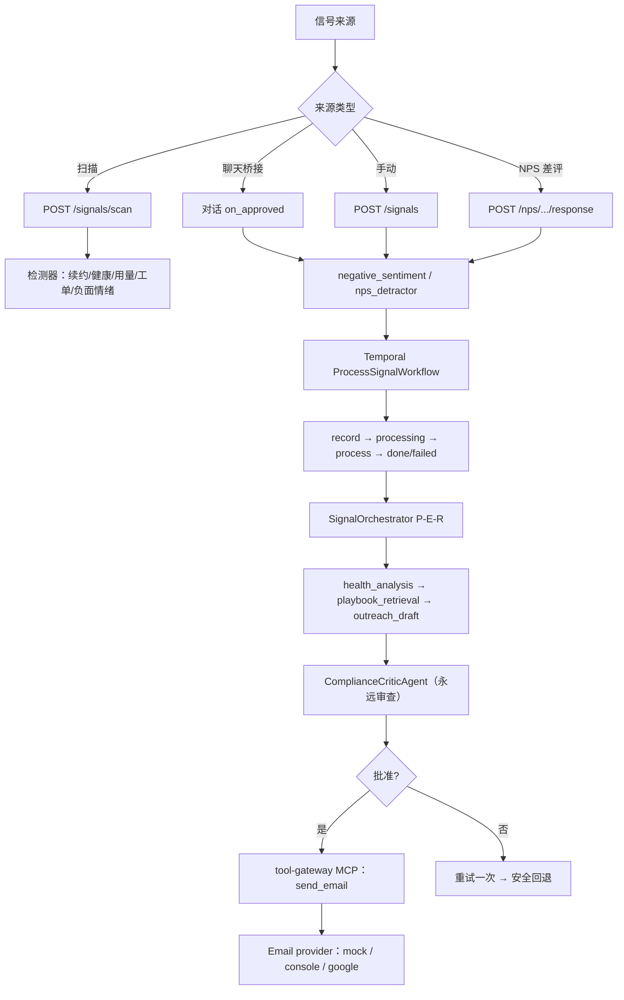

# 信号系统（Signal System）

> 面向"主动式客户成功"的后台自动化系统。它不接客户实时消息，而是由**类型化的后端事件**
> 触发——健康分下滑、续约临近、用量下降、NPS 差评、聊天中的负面情绪等——经过分析、
> 起草、合规审查后，主动发起客户挽回或 CSM（客户成功经理）通知。
>
> 本文档梳理信号系统的**全部功能**（来源、检测器、处理编排、NPS、QBR、邮件发送），并指出
> 当前**缺失 / 待完善**之处。

---

## 1. 系统定位

- 与对话系统并列为平台两条顶层主线，共享同一运行时（`BaseOrchestrator`），但专家集合**互斥**。
- 区别于对话系统：`SignalOrchestrator.supports_external_writes = True`——**可以对外写**（发邮件、
  通知 CSM），因此**合规审查永远开启**（`skip_critic_for_simple=False`）。
- 由 **Temporal 工作流**负责持久化编排（重试、去重、状态机），取代了早期的 Redis 轮询 worker。

---

## 2. 信号来源（4 种触发）

| 来源 | 入口 | 说明 |
|---|---|---|
| 仪表盘扫描 | `POST /signals/scan` → `TenantSignalScanWorkflow` | 运行全部检测器，每个信号派生一个 `ProcessSignalWorkflow` |
| 手动触发 | `POST /signals` | 显式传入信号 payload |
| 对话→信号桥接 | 对话 `on_approved` | 聊天里 complaint / escalation / high-urgency → `negative_sentiment`（升级转 `nps_detractor`） |
| NPS 差评 | `POST /nps/surveys/{id}/response` | 0-6 分 → `nps_detractor` 信号 |

---

## 3. 检测器（Detectors）

`apps/agent_service/src/signals/detectors.py` 是**纯 SQL 扫描**，对 `customers` /
`customer_profiles` 产出信号 payload（DB 故障时优雅降级为空，不崩溃）：

| 检测器 | 信号类型 | 触发条件（默认阈值） |
|---|---|---|
| 续约风险 | `renewal_risk` | `renewal_date` 在 N 天内（默认 60） |
| 低健康分 | `low_health` | `health_score` < 阈值（默认 50） |
| 用量下降 | `usage_decline` | 活跃用户数跌幅 > 30% |
| 复合风险 | `renewal_usage_risk`（critical） | 用量下降 + 续约临近 |
| 工单激增 | `support_ticket_spike` | 近期工单数 ≥ 5 |
| 负面情绪 | `negative_sentiment` | `customer_profiles` 含 risk_signals 或 last_sentiment 为负面 |

---

## 4. 处理编排（Temporal + P-E-R）

### 4.1 Temporal 工作流

`apps/temporal_worker/src/workflows.py`：

```
ProcessSignalWorkflow：record_signal_queued → mark_signal_processing
                        → process_signal → mark_signal_done / mark_signal_failed
                        （瞬时失败自动重试，最多 4 次指数退避）
TenantSignalScanWorkflow：run_all_detectors → 每个信号起一个子工作流
                        （确定性子 ID + reject-duplicate，重叠扫描不重复处理）
```

### 4.2 SignalOrchestrator（P-E-R）

`apps/agent_service/src/agent/signal/signal_orchestrator.py` 继承 `BaseOrchestrator`：

1. **Planner**（`signal_planner.py::build_signal_plan`）：确定性构建
   `health_analysis → playbook_retrieval → outreach_draft` 的依赖链；
2. **Executor**：依赖感知并行运行子代理；
3. **Reflector**：`ComplianceCriticAgent` 审查（信号路径**永远审查**）；
4. **on_approved**：持久化画像 → 释放合规批准的外部写（经 tool-gateway MCP）。

### 4.3 信号子代理（专家）

| 角色 | 领域 | 允许工具 | 职责 |
|---|---|---|---|
| `HealthAnalysisAgent` | 信号 | query_health | 只读健康/风险摘要 |
| `PlaybookRetrievalAgent` | 共享 | query_playbooks | RAG 政策检索 |
| `OutreachDraftAgent` | 信号 | （无工具，仅起草） | 起草致歉/续约/挽回邮件，**只提议不发送** |
| `NpsOutreachAgent` | 信号 | query_health, query_nps_history, create_nps_survey, calculate_tenant_nps | NPS 问卷外呼决策 + 邀请草稿 |
| `QbrReportAgent` | 信号/报告 | query_tenant_portfolio, query_tenant_nps, query_renewal_pipeline, query_signal_summary | QBR 叙事（只解释数字，不算数字） |

---

## 5. 功能模块详解

### 5.1 NPS（净推荐值）

`packages/knowledge_service/src/nps.py` + `apps/temporal_worker/src/nps_workflows.py`：

- **问卷下发**：`NpsCampaignWorkflow` → `select_nps_candidates`（选候选客户）→
  `create_and_send_survey`（建问卷 + 经门控 `send_email` 路径发送邀请邮件，发送成功才标记已发）。
- **评分提交**：`POST /nps/surveys/{id}/response`，**评分只经 API 进入系统（绝不经过 LLM）**。
- **确定性分类**：promoter 9-10 / passive 7-8 / detractor 0-6（`classify_score`）。
- **差评联动**：detractor（0-6）→ 入队 `nps_detractor` 信号 → 通知 CSM 跟进（**不自动回客户**）。
- **聚合 NPS**：`GET /nps/tenant` → `calculate_nps`（`%promoter - %detractor`，确定性计算，
  从不存到客户行）。

### 5.2 QBR（季度业务回顾）

`packages/knowledge_service/src/qbr.py` + `apps/temporal_worker/src/qbr_workflows.py` +
`apps/agent_service/src/agent/reporting/reporting_orchestrator.py`：

- **触发**：`POST /qbr/generate` → `GenerateTenantQbrWorkflow`（Temporal 不可用时内联回退）。
- **规则**：**SQL 算事实，LLM 只解释**（`aggregate_portfolio` 确定性聚合，绝不交给 LLM 算数）。
- **聚合快照**：客户数、MRR/ARR、健康分布、续约管道（30/60/90 天）、NPS、未闭环信号。
- **叙事生成**：`QbrReportAgent` 从快照写执行摘要（胜点 / 风险 / 建议 / 续约展望 / CSM 优先项）。
- **合规审查**：叙事在持久化前过 `ComplianceCriticAgent`。
- **投递**：`resolve_qbr_recipient` 解析收件 CSM → `deliver_qbr_email` 经门控 `send_email`
  路径发送报告并标记已投递（发送失败则标记 `failed`）。

### 5.3 邮件发送（Email）

- **工具边界**：`send_email` 是 `MCP_ACTION` 工具，**只经 `apps/tool_gateway` 独立进程执行**，
  内部路径拒绝执行。
- **门控**（`apps/tool_gateway/src/service.py`）：审批校验（`approval_id`）→ 幂等（`idempotency_key`）
  → schema 校验 → 才真正发送。
- **提供方**（`apps/tool_gateway/src/email_providers.py`，由 `EMAIL_PROVIDER` 选择）：
  | 模式 | 行为 |
  |---|---|
  | `mock`（默认） | 无副作用，返回假 ID |
  | `console` | 只写日志 |
  | `google` | 真实投递：用 CSM 的 Gmail OAuth |
- **Google 集成**（`routes/integrations.py` + `email_providers.py`）：CSM 授权连接自己的 Gmail，
  refresh token **加密后按用户存储**（永不回传/入 trace），发送时换取短效 access token 调
  Gmail API；无凭据时**失败关闭**（抛错重试，绝不静默丢信）。
- **CSM 通知**（`packages/tool_system/src/tools/notify_csm.py`）：`nps_detractor` 一律把邮件
  重写到 `EMAIL_FROM`（平台自己的 CSM 邮箱），**只通知 CSM，绝不回客户**。
- **复用门控路径**（`apps/temporal_worker/src/email_delivery.py::send_approved_email`）：
  NPS 问卷邀请邮件与 QBR 报告投递现在都复用同一套「审批持久化 → 门控 MCP 网关 → 提供方」
  的 `send_email` 路径发送，而不是 mock / 仅记录状态。

### 5.4 外部写入安全门控

- 子代理只**提议**（`proposed_external_writes`），不直接执行；`outreach_draft` 的
  `DEFAULT_ALLOWED_TOOLS == []`（设计如此）。
- 只有 `finalize_decision` 得到 `emit_or_execute_approved_payload` 哨兵，才在 `on_approved`
  释放；网关**以租户为权威**，不信任草稿里的 tenant_id。

---

## 6. 缺失 / 待完善（What's Lacking）

以下是当前实现里明确"第一版简化 / 桩实现 / 未接线"之处，均可作为后续迭代方向：

1. ~~**NPS 问卷邀请邮件是 mock 的**~~ → **已解决**：`create_and_send_survey` 现在经门控
   `send_email` 路径真正发送邀请邮件（`EMAIL_PROVIDER=mock/console/google`），发送成功才标记已发。

2. ~~**QBR 报告邮件是"记录投递"而非"真发送"**~~ → **已解决**：`deliver_qbr_email` 现在复用
   合规门控的 `send_email` 路径真正投递报告并标记状态，发送失败则标记 `failed`。

3. **NPS 候选人选择过于朴素**：`select_nps_candidates` 是"取前 50 个客户"，没有
   "跳过近期已调查 / 只挑足够健康"等策略。

4. ~~**无定时调度**~~ → **已解决（需配置租户白名单）**：`apps/temporal_worker/src/worker.py`
   可为扫描（`SIGNAL_SCAN_TENANTS`）、NPS 外呼（`NPS_CAMPAIGN_TENANTS`）、QBR
   （`QBR_TENANTS`）创建 Temporal Schedule；默认不启用（白名单为空），需显式配置才自动触发。

5. **检测器覆盖有限**：只有续约/健康/用量/工单/负面情绪，**没有流失预测模型、增购/扩展信号、
   更细粒度的产品使用行为信号**。

6. **升级与退款仍是确定性桩**：`escalate_to_human`、`check_human_availability`（恒返回不可用）、
   `process_refund`（恒成功）都是**原型桩**，没有接真实人工/退款系统。

7. **信号规划器是确定性硬编码**：`build_signal_plan` 固定走 health→playbook→outreach，
   只有 `_outreach_objective` 一个字符串开关，**没有语义规划 / 按信号类型动态选工具**。

8. **未使用 Temporal 长等待**：`packages/session` 的"等 48h 再升级"这类 durable 长等待助手
   尚未接入；没有"到期后自动跟进提醒"。

9. **差评闭环只有"通知 CSM"**：detractor 只发内部告警，**没有自动挽回外呼回路**，也没有
   闭环度量（CSM 是否已跟进、是否挽回成功）。

10. **邮件提供方单一**：只有 Gmail + mock + console，无通用 SMTP / Outlook 等其他渠道；
    无退信/退订/送达率等**回执跟踪**。

11. **QBR 收件人只取第一个 CSM**：`resolve_qbr_recipient` 只返回 `recipients[0]`，没有
    多 CSM 分发 / 按客户归属路由。

12. **报告发送未独立于生成**：QBR 生成与投递耦合在一个工作流里，草稿虽可先审后发，
    但"审阅后才投递"的独立闸门尚未真正落地为单独一步。

---

## 7. 架构总览



---

## 8. 小结

信号系统已具备一条完整闭环：**多来源触发 → 检测/归一化 → Temporal 持久化编排 →
SignalOrchestrator（P-E-R）→ 合规审查 → 门控式外部写（邮件 / CSM 通知）**，并落地了
NPS 评分/聚合、QBR 生成、问卷邀请与 QBR 报告的门控式邮件投递、以及扫描/NPS/QBR 的定时调度。
当前主要的"缺"集中在**检测器/规划器/人工与退款集成的深度**、以及**Temporal 长等待跟进**
（到期自动提醒）上。
